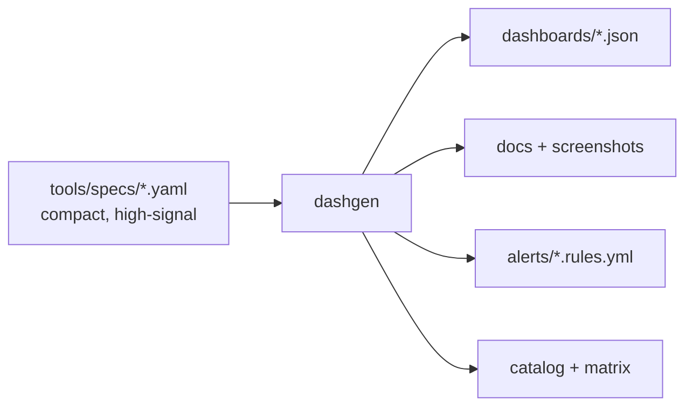

<div align="center">

# 📊 grafana-dashboards

**One of the most comprehensive collections of production-ready Grafana dashboards on GitHub.**

100+ dashboards that *answer operational questions* — Linux, Kubernetes, Docker, OpenStack, the monitoring stack, databases and cloud — each generated from a spec, with docs, screenshots, alerts and recording rules.

[](https://github.com/devopsaitoolkit/grafana-dashboards/actions/workflows/ci.yml)
[](https://github.com/devopsaitoolkit/grafana-dashboards/actions/workflows/docs.yml)
[](./LICENSE)
[](https://grafana.com)
[](./promql/)
[](./CONTRIBUTING.md)

</div>

---

Most Grafana dashboards online are metric dumps — a wall of gauges that look busy and
tell you nothing at 3am. These are different: every dashboard **leads with the
headline signal** (saturation, errors, capacity headroom) and is built to answer a
real question — *is the cluster healthy? which hypervisor is full? are the queues
growing? which disk fills first?*

> ⭐ **If this saves you time in an incident, star the repo** — it helps other engineers find it.

## Why this repository

- **Answers questions, not metric dumps.** USE for resources, RED for services;
  the first row tells on-call whether to dig in.
- **Generated, so it's consistent.** Every dashboard is compiled from a compact
  [spec](./tools/specs/) — identical units, thresholds, templating and **portable
  datasource handling** (`${DS_PROMETHEUS}` / `${DS_LOKI}`, never a hardcoded UID).
- **Batteries included.** Each dashboard ships a **doc page**, an **annotated
  screenshot**, **recommended alerts**, and a **Production lessons** note. Plus a
  PromQL cookbook, recording rules and datasource provisioning.
- **Backend-agnostic.** Standard PromQL runs on **Prometheus, VictoriaMetrics and
  Mimir**; Loki for logs, Tempo for traces.
- **CI-validated.** A strict validator enforces schema, units, datasource templating
  and "no URLs/credentials in dashboard JSON" on every commit.

## Quick start

```bash
git clone https://github.com/devopsaitoolkit/grafana-dashboards.git
cd grafana-dashboards

# Import one dashboard via the UI: Dashboards → Import → upload a JSON, pick your datasource.
# Or via the API:
export GRAFANA_URL=https://grafana.example.com GRAFANA_TOKEN=glsa_xxx
scripts/import-dashboard.sh dashboards/linux/cpu.json

# Or provision the whole library as code:
scripts/provision.sh /var/lib/grafana/dashboards
```

See [docs/provisioning.md](./docs/provisioning.md) and
[docs/prometheus-setup.md](./docs/prometheus-setup.md).

## What's inside

| Area | Contents |
|------|----------|
| 📊 [`dashboards/`](./dashboards/) | 100+ dashboards by domain (generated JSON) |
| 🧩 [`tools/`](./tools/) | The `dashgen` generator + the YAML specs (source of truth) |
| 🚨 [`alerts/`](./alerts/) · [`recording-rules/`](./recording-rules/) | Prometheus alert & recording rules |
| 🔌 [`datasources/`](./datasources/) | Grafana datasource provisioning (Prometheus/VM/Mimir/Loki/Tempo) |
| 📚 [`promql/`](./promql/) | A PromQL cookbook — 90+ explained queries |
| 📖 [`docs/`](./docs/) | Design, provisioning, variables, alerting, performance + guides |
| 🖼️ [`screenshots/`](./screenshots/) | Annotated schematic of every dashboard |
| 🔧 [`scripts/`](./scripts/) | import, export, backup, restore, diff, provision, screenshot |

## Dashboard catalog

Browse the full, always-up-to-date list in **[docs/catalog.md](./docs/catalog.md)**
and the **[compatibility matrix](./docs/compatibility-matrix.md)**. Highlights:

| Domain | Examples |
|--------|----------|
| [Linux](./dashboards/linux/) | CPU, memory, disk I/O, filesystem, network, load, systemd, PSI pressure |
| [Kubernetes](./dashboards/kubernetes/) | cluster overview, nodes, pods, workloads, API server, etcd, scheduler, CoreDNS, ingress, PV/PVC |
| [Docker](./dashboards/docker/) · [cAdvisor](./dashboards/cadvisor/) | containers, engine hosts, images/volumes, networks, compose stacks |
| [OpenStack](./dashboards/openstack/) | Nova hypervisor capacity, VM density, Neutron, Cinder, Glance, Keystone, RabbitMQ, MariaDB/Galera, HAProxy, Placement, Heat, OVS |
| [Monitoring](./dashboards/prometheus/) | Prometheus, Alertmanager, VictoriaMetrics, Mimir, Loki, Tempo |
| [Databases](./dashboards/postgres/) | PostgreSQL, MySQL/InnoDB, Redis (keyspace, replication) |
| [Web](./dashboards/nginx/) | NGINX, Apache |
| [Cloud](./dashboards/aws/) | VMware vSphere, AWS EC2/RDS, Azure VMs, GCP Compute/GKE |

## How it works



You edit a **spec**, run `make build`, and the generator produces the dashboard JSON,
its documentation, an annotated screenshot, and Prometheus alert rules — all
consistent by construction. See [docs/authoring-specs.md](./docs/authoring-specs.md).

```bash
pip install pyyaml jsonschema
make build      # compile specs → dashboards, docs, screenshots, alerts
make validate   # strict checks (schema, units, datasource templating, no URLs)
```

## Target audience

SREs · Platform & DevOps Engineers · Cloud & Infrastructure Engineers · OpenStack
operators · Kubernetes administrators · Observability teams.

## Contributing

New dashboards from real operators are what make this library great — adding one is
~20 minutes of editing a spec. See [CONTRIBUTING.md](./CONTRIBUTING.md), the
[roadmap](./ROADMAP.md), and [open a dashboard request](https://github.com/devopsaitoolkit/grafana-dashboards/issues/new?template=dashboard_request.yml).
By participating you agree to our [Code of Conduct](./CODE_OF_CONDUCT.md).

## License

[Apache-2.0](./LICENSE). Use the dashboards, rules and tooling freely.

## Further reading & free resources

This repository stands on its own. To go deeper on **AI-assisted** observability,
these free resources from the maintainers help:

- 📚 [Advanced observability guides](https://devopsaitoolkit.com/guides/)
- 🤖 [AI Incident Response Assistant](https://devopsaitoolkit.com/dashboard/incident-response)
- 📈 [Grafana & Prometheus tutorials](https://devopsaitoolkit.com/blog/)
- ✉️ [Weekly DevOps newsletter](https://devopsaitoolkit.com/newsletter)

---

<div align="center">

**Built by engineers who stare at these dashboards during real incidents.**
If it helps you, [give it a ⭐](https://github.com/devopsaitoolkit/grafana-dashboards).

</div>
