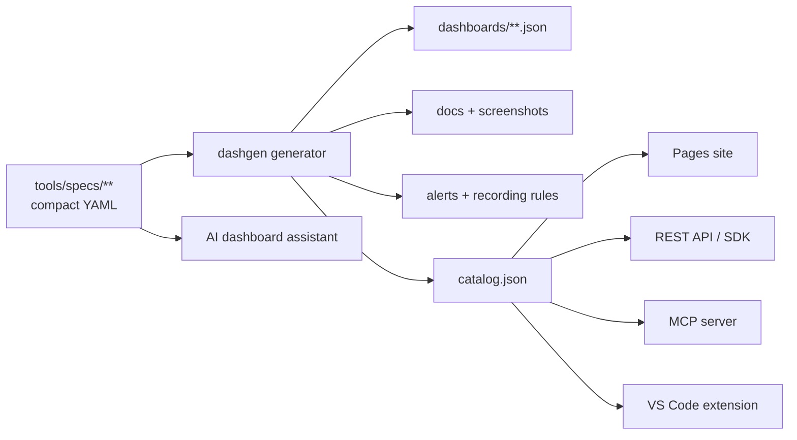

# Roadmap

This project starts as the most comprehensive open library of production Grafana
dashboards and grows toward a full observability **platform**. Everything is
generated from specs, so future tooling can read the same spec/dashboard layout.

## Now — v1.x (dashboard library)

- [x] 100+ production-ready dashboards across Linux, Kubernetes, Docker, OpenStack,
      the monitoring stack, databases, web servers and cloud
- [x] A spec-driven generator (`tools/dashgen`) — consistent units, thresholds,
      templating and datasource handling
- [x] Generated docs, annotated screenshots, alert rules and recording rules
- [x] PromQL cookbook, dashboard catalog, compatibility matrix, learning path
- [x] CI: build + strict validation + JSON Schema + markdown/spell/link checks

## Next — v2.x (packaging & reuse)

- [ ] Publish a **Grafana Cloud / grafana.com** dashboard collection
- [ ] **GitHub Pages** static catalog site with live previews
- [ ] A **composite GitHub Action** that validates any dashboard repo with our linter
- [ ] **Grafana Playlists** generated per domain (NOC rotations)
- [ ] Recording-rule **packs** matched to each dashboard for large fleets

## Later — v3.x (surfaces & intelligence)

- [ ] **Grafana Scenes** app for dynamic, code-defined versions of these dashboards
- [ ] **VS Code extension** — insert a dashboard/spec by name
- [ ] **REST API** serving the catalog + dashboard JSON
- [ ] **Dashboard generator** UI (spec → JSON in the browser)
- [ ] **MCP server** so AI agents can pull a known-good dashboard during design
- [ ] **AI dashboard assistant** — describe a system, get a spec

## Design that enables this

Want to drive one of these? Open a
[Discussion](https://github.com/devopsaitoolkit/grafana-dashboards/discussions).
