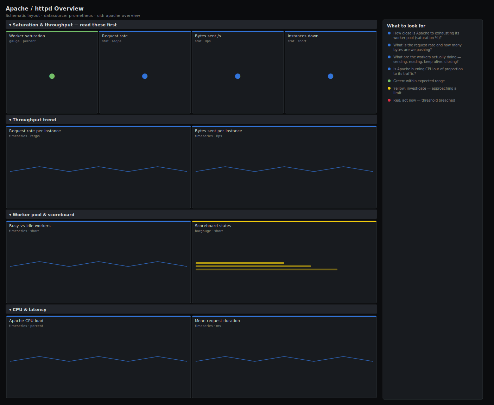

# Apache / httpd Overview

> Worker saturation, request and byte throughput, scoreboard state and CPU load for Apache httpd scraped by apache_exporter. Answers "is Apache about to run out of workers, and what are they doing?" rather than just plotting request count.

**Primary search phrase:** Apache httpd Grafana dashboard  
**Category:** `apache` · **UID:** `apache-overview` · **Datasource:** Prometheus



## Questions this dashboard answers

- How close is Apache to exhausting its worker pool (saturation %)?
- What is the request rate and how many bytes are we pushing?
- What are the workers actually doing — sending, reading, keep-alive, closing?
- Is Apache burning CPU out of proportion to its traffic?
- Which instance is the hot spot?

## Production lessons — why this dashboard exists

Apache outages are almost always **worker exhaustion**, not raw CPU. With the prefork/worker MPM a fixed `MaxRequestWorkers` cap means that once every worker is busy, new requests queue in the kernel backlog and then get refused — the request-rate graph can even *drop* while users see timeouts. This dashboard leads with busy-vs-idle worker saturation so you see the cliff coming, then uses the scoreboard to tell you *why* workers are busy (slow upstreams hold workers in the W "sending" state; many K states mean keep-alive is hoarding them).

## Data source requirements

- **Prometheus** datasource (selected at import time via `${DS_PROMETHEUS}`).
- `apache_exporter` scraping `mod_status` with `ExtendedStatus On` (`apache_up`, `apache_accesses_total`, `apache_sent_kilobytes_total`, `apache_workers{state}`, `apache_scoreboard{state}`, `apache_cpuload`, `apache_duration_ms_total`, `apache_uptime_seconds_total`).
- `apache_workers` carries `state="busy"` and `state="idle"`; the scoreboard `state` label uses the mod_status single-letter codes (W, R, K, C, …).

## Template variables

| Variable | Label | Type | Purpose |
|----------|-------|------|---------|
| `${job}` | Job | query | Prometheus scrape job for your apache_exporter targets. |
| `${instance}` | Instance | query | Apache host(s) to display; supports multi-select. |

## Panels

### Saturation & throughput — read these first

- **Worker saturation** (gauge, `percent`) — Busy workers as a percent of the total pool. Above 90% means you are about to queue and refuse requests.
- **Request rate** (stat, `reqps`) — Requests per second served across the selected instances.
- **Bytes sent /s** (stat, `Bps`) — Response throughput in bytes per second (kilobytes counter × 1024).
- **Instances down** (stat, `short`) — Apache targets reporting apache_up == 0.

### Throughput trend

- **Request rate per instance** (timeseries, `reqps`) — Per-instance requests/s — find the hot node and watch for a drop that signals worker exhaustion.
- **Bytes sent per instance** (timeseries, `Bps`) — Per-instance egress throughput in bytes per second.

### Worker pool & scoreboard

- **Busy vs idle workers** (timeseries, `short`) — The worker pool over time. When idle approaches zero you are at the MaxRequestWorkers ceiling.
- **Scoreboard states** (bargauge, `short`) — What workers are doing right now (W=sending, R=reading, K=keep-alive, C=closing, _=waiting). A wall of W means slow responses.

### CPU & latency

- **Apache CPU load** (timeseries, `percent`) — CPU percentage attributed to Apache by mod_status. Can exceed 100% across multiple cores.
- **Mean request duration** (timeseries, `ms`) — Average time per request (total duration ÷ total accesses). Rising duration with flat traffic points at slow backends.

## Import

**Grafana UI** — *Dashboards → New → Import*, upload `dashboards/apache/overview.json`, then pick your datasource when prompted.

**API:**

```bash
scripts/import-dashboard.sh dashboards/apache/overview.json
```

**Provisioning** — drop the JSON into a provisioned folder (see [provisioning guide](../../provisioning.md)).

## Recommended alerts

Ready-to-use rules ship in `alerts/apache.rules.yml`.

### ApacheWorkerSaturationHigh (`critical`)

```promql
100 * apache_workers{state="busy"} / clamp_min(sum by (job, instance) (apache_workers), 1) > 90
```

- **Fires after:** `10m`
- **Why it matters:** With almost no idle workers, Apache queues then refuses new connections — an imminent outage that raw CPU won't reveal.
- **Investigate:** Open Apache / httpd Overview; check the scoreboard — a wall of W (sending) usually means a slow backend or DB is holding workers.
- **Recovery:** Clears when busy workers fall below 90% of the pool for 5m.
- **False positives:** Brief saturation during a traffic burst that the pool absorbs — the 10m `for` filters spikes.

### ApacheDown (`critical`)

```promql
apache_up == 0
```

- **Fires after:** `5m`
- **Why it matters:** The exporter can't reach mod_status — Apache is down or unreachable and you are blind to it.
- **Investigate:** Check the httpd service and the `/server-status` handler; confirm the exporter can reach it.
- **Recovery:** Clears when apache_up returns to 1.
- **False positives:** Planned restarts — the 5m `for` covers a normal graceful restart.

### ApacheHighCPULoad (`warning`)

```promql
apache_cpuload > 85
```

- **Fires after:** `10m`
- **Why it matters:** Sustained high CPU in Apache itself (not the app) often means TLS handshakes, mod_rewrite loops or compression overwhelming the box.
- **Investigate:** Correlate with request rate; if CPU is high but traffic is flat, profile rewrite rules and TLS settings.
- **Recovery:** Clears when CPU load falls below 85% for 5m.
- **False positives:** Multi-core boxes where mod_status reports load above 100% normally — set the threshold per core count.

## Troubleshooting

| Symptom | Likely cause | First action |
|---------|--------------|--------------|
| All panels "No data" | ExtendedStatus is off, or wrong `$job`. | Set `ExtendedStatus On`, confirm `apache_accesses_total` appears in Explore, and check the job label. |
| Saturation stuck at 100% | Reporting only busy workers, or MaxRequestWorkers set very low. | Verify `apache_workers{state="idle"}` is exported; raise the worker limit if the pool is genuinely tiny. |
| Bytes panel looks 1000× off | Treating the kilobytes counter as bytes. | Keep the `× 1024` conversion as in this spec; the metric is kilobytes. |

## Performance considerations

Counters use a 5m rate window so they survive a graceful restart; gauges are read instantly. Aggregations use `by (instance|state)` to keep one series per host or worker state. The scoreboard bargauge is an instant query, so it stays cheap even with many instances.

## Customization

Set the saturation thresholds relative to your `MaxRequestWorkers` headroom. If you run the event MPM, the scoreboard semantics shift (async connections) — relabel the legend accordingly. Scope `$instance` to a tier to separate edge web nodes from internal ones.

## Related resources

- [Advanced observability guides](https://devopsaitoolkit.com/guides/)
- [Grafana & Prometheus tutorials](https://devopsaitoolkit.com/blog/)
- [AI Incident Response Assistant](https://devopsaitoolkit.com/dashboard/incident-response)
- [PromQL cookbook](../../../promql/README.md) · [Alerting guide](../../alerting.md) · [Dashboard catalog](../../catalog.md)
