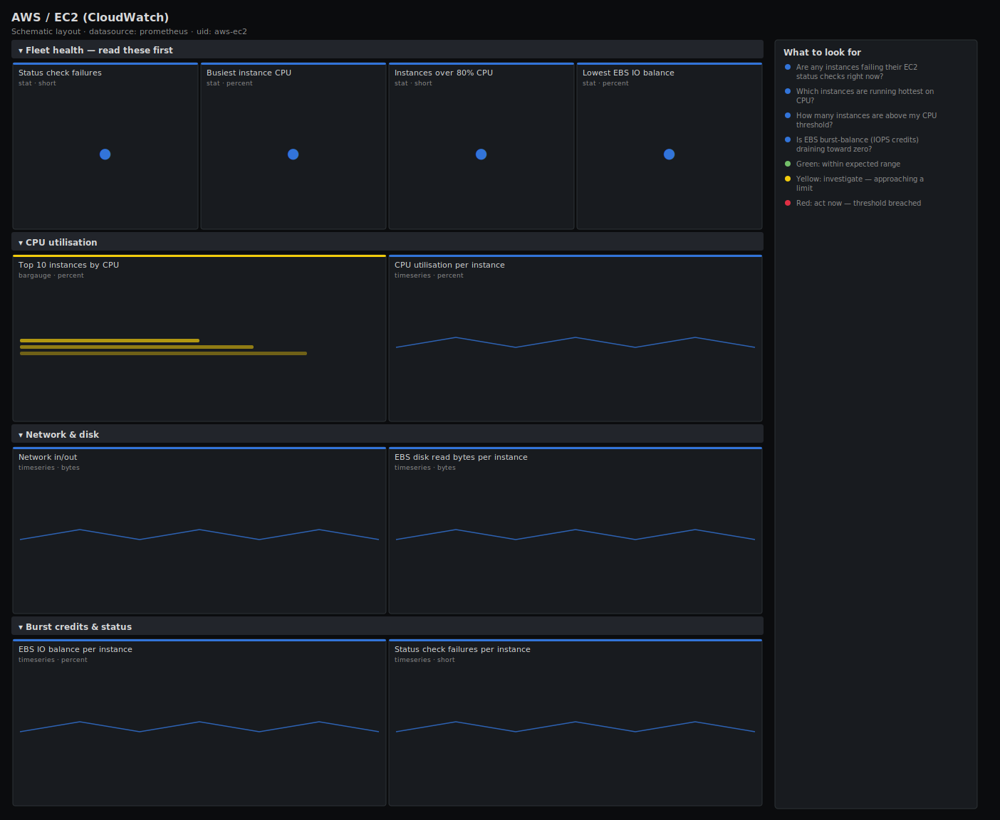

# AWS / EC2 (CloudWatch)

> CPU utilisation, network throughput, instance status checks and EBS IO credit balance for EC2 instances exported from CloudWatch. Answers "are any instances failing their status checks or running hot, and is burst credit draining?" rather than just charting average CPU.

**Primary search phrase:** AWS EC2 CloudWatch Grafana dashboard  
**Category:** `aws` · **UID:** `aws-ec2` · **Datasource:** Prometheus



## Questions this dashboard answers

- Are any instances failing their EC2 status checks right now?
- Which instances are running hottest on CPU?
- How many instances are above my CPU threshold?
- Is EBS burst-balance (IOPS credits) draining toward zero?
- Is network in/out spiking on any instance?

## Production lessons — why this dashboard exists

CloudWatch metrics are coarse (1–5 min) and pre-aggregated, so this dashboard is built for triage, not millisecond debugging. The two signals that actually page are **status-check failures** (the instance or its host is unhealthy and may need a stop/start) and **EBS IO credit depletion** on gp2/burstable volumes — when `BurstBalance`/IO-balance hits zero, disk latency spikes and the app stalls even though CPU looks fine. We lead with both, plus a top-N of CPU so you can spot the busy instances at a glance. Because the exporter samples CloudWatch on a delay, alert `for:` windows are deliberately generous.

## Data source requirements

- **Prometheus** datasource (selected at import time via `${DS_PROMETHEUS}`).
- `cloudwatch_exporter` (the Prometheus CloudWatch exporter) scraping the `AWS/EC2` and `AWS/EBS` namespaces (`aws_ec2_cpuutilization_average`, `aws_ec2_network_in_average`, `aws_ec2_network_out_average`, `aws_ec2_status_check_failed_sum`, `aws_ec2_disk_read_bytes_average`, `aws_ec2_ebsio_balance_average`).
- **Naming assumption:** the exporter lower-cases the metric and turns the CloudWatch `InstanceId` dimension into the label `instance_id`. If your config keeps `dimension_InstanceId`, adjust the label name in the queries and template variable. Network/disk `_average` values are per the configured CloudWatch period (default 300s), expressed in bytes.

## Template variables

| Variable | Label | Type | Purpose |
|----------|-------|------|---------|
| `${job}` | Job | query | Prometheus scrape job for your cloudwatch_exporter. |
| `${instance_id}` | Instance | query | EC2 instance(s) to display; supports multi-select. |

## Panels

### Fleet health — read these first

- **Status check failures** (stat, `short`) — Sum of failed EC2 status checks across the selection. Anything above zero is actionable.
- **Busiest instance CPU** (stat, `percent`) — Highest CPU utilisation across the selected instances.
- **Instances over 80% CPU** (stat, `short`) — Count of instances whose CPU is above 80% right now.
- **Lowest EBS IO balance** (stat, `percent`) — Lowest EBS IO burst-credit balance across the selection. Near zero means imminent IO throttling.

### CPU utilisation

- **Top 10 instances by CPU** (bargauge, `percent`) — The hottest instances right now — your candidates for scaling or right-sizing.
- **CPU utilisation per instance** (timeseries, `percent`) — Per-instance CPU over time. CloudWatch averages hide short spikes — read trends, not microbursts.

### Network & disk

- **Network in/out** (timeseries, `bytes`) — Bytes in and out per CloudWatch period, summed across the selection.
- **EBS disk read bytes per instance** (timeseries, `bytes`) — Per-instance EBS read volume — correlate spikes with IO-balance drops.

### Burst credits & status

- **EBS IO balance per instance** (timeseries, `percent`) — EBS IO burst-credit balance over time. A steady decline toward zero predicts IO throttling.
- **Status check failures per instance** (timeseries, `short`) — Failed status checks per instance over time — a sustained 1 means the instance needs a stop/start or replacement.

## Import

**Grafana UI** — *Dashboards → New → Import*, upload `dashboards/aws/ec2.json`, then pick your datasource when prompted.

**API:**

```bash
scripts/import-dashboard.sh dashboards/aws/ec2.json
```

**Provisioning** — drop the JSON into a provisioned folder (see [provisioning guide](../../provisioning.md)).

## Recommended alerts

Ready-to-use rules ship in `alerts/aws.rules.yml`.

### Ec2StatusCheckFailed (`critical`)

```promql
aws_ec2_status_check_failed_sum > 0
```

- **Fires after:** `5m`
- **Why it matters:** A failed status check means the instance or its underlying host is unhealthy — the workload is likely down or unreachable.
- **Investigate:** Open AWS / EC2; determine whether it is a system check (AWS host) or instance check (guest OS) failure in the console.
- **Recovery:** Clears when status checks pass for 5m.
- **False positives:** A reboot you initiated will briefly fail the check; the 5m `for` covers normal reboots.

### Ec2HighCPU (`warning`)

```promql
aws_ec2_cpuutilization_average > 90
```

- **Fires after:** `15m`
- **Why it matters:** Sustained high CPU means the instance is undersized for its load and will start dropping or delaying work.
- **Investigate:** Check whether it is steady-state or a burst; review the instance type and any autoscaling policy.
- **Recovery:** Clears when CPU falls below 90% for 10m.
- **False positives:** Batch/ETL instances that are meant to run pinned — scope the rule by tag/instance_id.

### Ec2EBSIOBalanceLow (`warning`)

```promql
aws_ec2_ebsio_balance_average < 20
```

- **Fires after:** `10m`
- **Why it matters:** Burstable EBS volumes throttle hard once credits run out, spiking disk latency while CPU still looks healthy — a confusing, app-stalling failure.
- **Investigate:** Identify the volume and its workload; check disk read/write panels for the IO that is burning credits.
- **Recovery:** Clears when IO balance recovers above 20% for 10m.
- **False positives:** A one-off bulk job (backup, import) can dip the balance briefly — the 10m `for` filters short bursts.

## Troubleshooting

| Symptom | Likely cause | First action |
|---------|--------------|--------------|
| All panels "No data" | Wrong label name, or the exporter isn't pulling the AWS/EC2 namespace. | Confirm `aws_ec2_cpuutilization_average` exists in Explore; check whether the dimension label is `instance_id` or `dimension_InstanceId` and update the queries. |
| Network values look tiny or huge | CloudWatch reports bytes per period, not per second. | Divide by your configured `period_seconds` if you want a true bytes/sec, and switch the unit to `Bps`. |
| EBS IO balance always 100 | The volumes are gp3/io2 (no burst credits) or the AWS/EBS namespace isn't scraped. | This is expected for non-burstable volumes; remove the panel or scope it to gp2 volumes. |

## Performance considerations

CloudWatch granularity is 1–5 minutes, so a 1m dashboard refresh and 6h window match the data without extra API cost — every scrape is a paid GetMetricData call, so don't over-refresh. Top-N and counts bound series with `topk`/`count`. Use metric-math or a wider period in the exporter config to reduce CloudWatch cost on large fleets.

## Customization

Adjust the 80%/90% CPU thresholds and the 20% IO-balance floor to your instance types. To watch one application, scope `$instance_id` with a regex on your naming convention, or add a tag-based dimension in the exporter so you can filter by environment. Add `aws_ec2_status_check_failed_instance_sum` / `_system_sum` panels if you split the two check types.

## Related resources

- [Advanced observability guides](https://devopsaitoolkit.com/guides/)
- [Grafana & Prometheus tutorials](https://devopsaitoolkit.com/blog/)
- [AI Incident Response Assistant](https://devopsaitoolkit.com/dashboard/incident-response)
- [PromQL cookbook](../../../promql/README.md) · [Alerting guide](../../alerting.md) · [Dashboard catalog](../../catalog.md)
