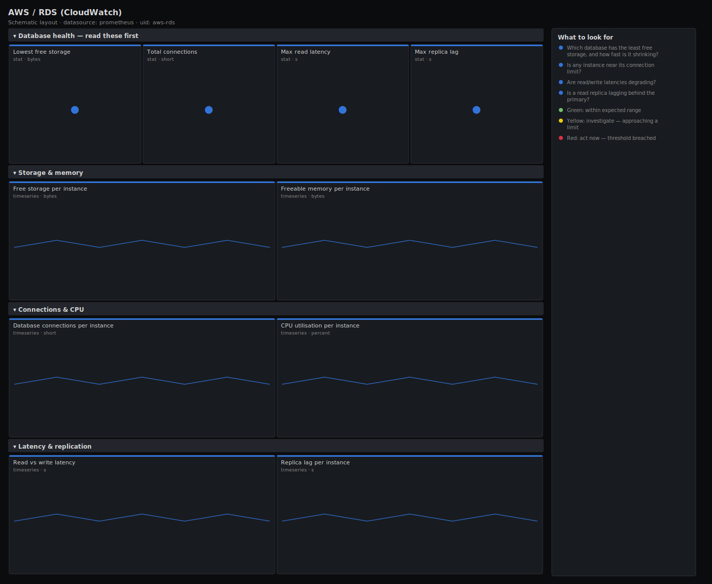

# AWS / RDS (CloudWatch)

> Free storage, connections, CPU, read/write latency, freeable memory and replica lag for RDS instances exported from CloudWatch. Answers "is any database about to run out of disk, max out connections or fall behind its replica?" rather than charting raw CloudWatch counters.

**Primary search phrase:** AWS RDS CloudWatch Grafana dashboard  
**Category:** `aws` · **UID:** `aws-rds` · **Datasource:** Prometheus



## Questions this dashboard answers

- Which database has the least free storage, and how fast is it shrinking?
- Is any instance near its connection limit?
- Are read/write latencies degrading?
- Is a read replica lagging behind the primary?
- Is freeable memory low enough to threaten the buffer cache?

## Production lessons — why this dashboard exists

The single most common RDS incident is **running out of storage** — once free space hits zero the instance goes into `storage-full` and stops accepting writes, which is a hard outage. So this dashboard leads with the tightest free storage and its trend, then connections (connection exhaustion is the next most common page) and latency. Replica lag matters whenever you read from replicas: rising lag means readers are serving stale data and a failover would lose in-flight transactions. Because CloudWatch latency is reported in **seconds**, the panels use `s` so 0.02 reads as 20 ms, not 20.

## Data source requirements

- **Prometheus** datasource (selected at import time via `${DS_PROMETHEUS}`).
- `cloudwatch_exporter` scraping the `AWS/RDS` namespace (`aws_rds_cpuutilization_average`, `aws_rds_free_storage_space_average`, `aws_rds_database_connections_average`, `aws_rds_read_latency_average`, `aws_rds_write_latency_average`, `aws_rds_freeable_memory_average`, `aws_rds_replica_lag_average`).
- **Naming assumption:** the exporter turns the `DBInstanceIdentifier` dimension into the label `dbinstance_identifier`; adjust if your config keeps `dimension_DBInstanceIdentifier`. Latency metrics are in seconds; storage and memory are in bytes; lag is in seconds.

## Template variables

| Variable | Label | Type | Purpose |
|----------|-------|------|---------|
| `${job}` | Job | query | Prometheus scrape job for your cloudwatch_exporter. |
| `${dbinstance_identifier}` | DB instance | query | RDS instance(s) to display; supports multi-select. |

## Panels

### Database health — read these first

- **Lowest free storage** (stat, `bytes`) — Least free storage across the selected instances. At zero, RDS stops accepting writes.
- **Total connections** (stat, `short`) — Sum of active database connections across the selection.
- **Max read latency** (stat, `s`) — Highest read latency across the selection (seconds — shows as ms).
- **Max replica lag** (stat, `s`) — Highest read-replica lag across the selection. Rising lag means stale reads and risky failover.

### Storage & memory

- **Free storage per instance** (timeseries, `bytes`) — Absolute free storage over time — the slope tells you how many days until full.
- **Freeable memory per instance** (timeseries, `bytes`) — Memory available for the OS and buffer cache. A steady decline foreshadows swap and slow queries.

### Connections & CPU

- **Database connections per instance** (timeseries, `short`) — Active connections per instance. A flat ceiling means you are hitting max_connections.
- **CPU utilisation per instance** (timeseries, `percent`) — Per-instance CPU. Sustained highs on a DB usually mean missing indexes or runaway queries.

### Latency & replication

- **Read vs write latency** (timeseries, `s`) — Mean read and write latency across the selection (seconds). Diverging write latency points at IO or commit pressure.
- **Replica lag per instance** (timeseries, `s`) — Read-replica lag over time. Persistent lag risks stale reads and data loss on failover.

## Import

**Grafana UI** — *Dashboards → New → Import*, upload `dashboards/aws/rds.json`, then pick your datasource when prompted.

**API:**

```bash
scripts/import-dashboard.sh dashboards/aws/rds.json
```

**Provisioning** — drop the JSON into a provisioned folder (see [provisioning guide](../../provisioning.md)).

## Recommended alerts

Ready-to-use rules ship in `alerts/aws.rules.yml`.

### RdsLowFreeStorage (`critical`)

```promql
aws_rds_free_storage_space_average < 5000000000
```

- **Fires after:** `10m`
- **Why it matters:** When free storage hits zero RDS enters storage-full and rejects writes — a hard, customer-facing outage.
- **Investigate:** Open AWS / RDS; read the free-storage slope to estimate time-to-full and check for runaway tables, logs or temp space.
- **Recovery:** Clears when free storage rises above 5GB for 10m.
- **False positives:** A large import temporarily consuming space — confirm the trend is sustained before treating it as an emergency.

### RdsHighReadLatency (`warning`)

```promql
aws_rds_read_latency_average > 0.02
```

- **Fires after:** `10m`
- **Why it matters:** Read latency above ~20 ms usually means the working set no longer fits in memory or the EBS volume is throttling — query times balloon.
- **Investigate:** Correlate with freeable memory and connections; check for a query plan regression or a burst of full scans.
- **Recovery:** Clears when read latency falls below 20 ms for 10m.
- **False positives:** Analytical/batch windows that legitimately scan large tables — scope by instance or widen the threshold.

### RdsReplicaLagHigh (`warning`)

```promql
aws_rds_replica_lag_average > 30
```

- **Fires after:** `5m`
- **Why it matters:** A lagging replica serves stale data and, on failover, loses transactions the primary already committed.
- **Investigate:** Check the primary's write throughput and the replica's CPU/IO; long-running transactions on the primary block apply.
- **Recovery:** Clears when replica lag falls below 30s for 5m.
- **False positives:** A large bulk load on the primary causes temporary lag that catches up on its own.

## Troubleshooting

| Symptom | Likely cause | First action |
|---------|--------------|--------------|
| Latency panels read 20 instead of 20ms | Using a `ms` unit on a metric that is already in seconds. | Keep the `s` unit as in this spec; CloudWatch RDS latency is in seconds. |
| Free storage panel empty | The AWS/RDS namespace or the `FreeStorageSpace` metric isn't scraped. | Add `FreeStorageSpace` to the exporter config and confirm `aws_rds_free_storage_space_average` appears in Explore. |
| Replica lag missing for some instances | Those instances are primaries, not replicas. | This is expected — `ReplicaLag` only exists on read replicas. |

## Performance considerations

CloudWatch RDS metrics are 1-minute granularity, so a 1m refresh matches the data and avoids extra GetMetricData cost. Headline panels use `min/max/sum` to collapse to a single value; per-instance panels are bounded by the `dbinstance_identifier` label. Trim the scraped metric set in the exporter to control API cost on large RDS estates.

## Customization

Set the free-storage floor to a fixed fraction of each instance's allocated storage rather than an absolute 5GB if your databases vary widely in size. Tune the 20 ms latency and 30 s lag thresholds to your SLOs, and scope `$dbinstance_identifier` to separate production from staging databases.

## Related resources

- [Advanced observability guides](https://devopsaitoolkit.com/guides/)
- [Grafana & Prometheus tutorials](https://devopsaitoolkit.com/blog/)
- [AI Incident Response Assistant](https://devopsaitoolkit.com/dashboard/incident-response)
- [PromQL cookbook](../../../promql/README.md) · [Alerting guide](../../alerting.md) · [Dashboard catalog](../../catalog.md)
