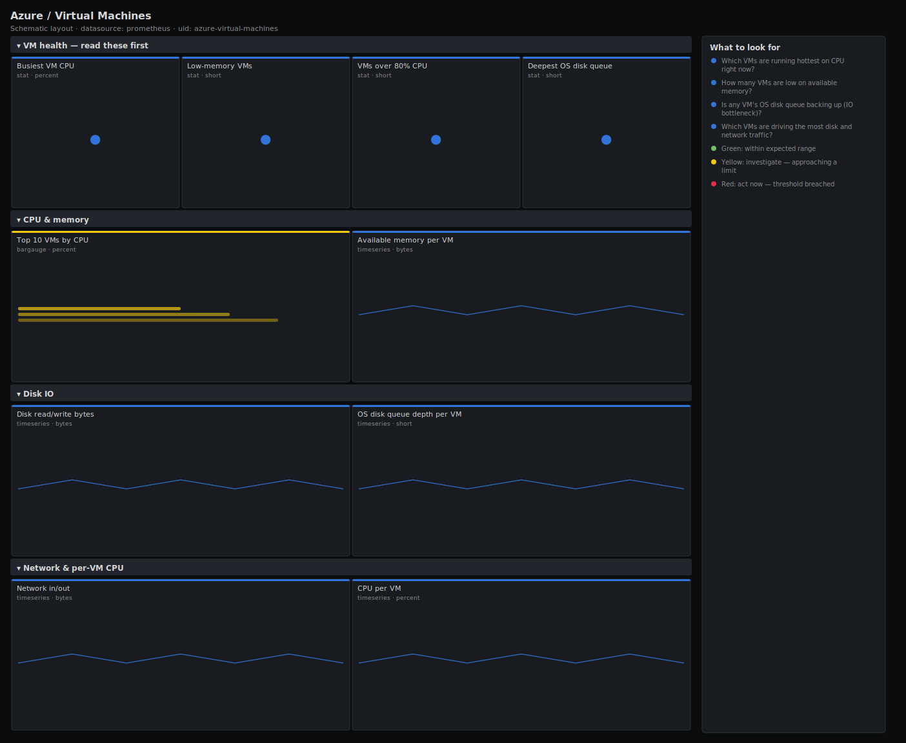

# Azure / Virtual Machines

> CPU, available memory, network throughput, disk IO and OS-disk queue depth for Azure VMs exported from Azure Monitor. Answers "which VMs are CPU-bound, low on memory, or bottlenecked on disk?" rather than just charting percentage CPU.

**Primary search phrase:** Azure virtual machines Grafana dashboard  
**Category:** `azure` · **UID:** `azure-virtual-machines` · **Datasource:** Prometheus



## Questions this dashboard answers

- Which VMs are running hottest on CPU right now?
- How many VMs are low on available memory?
- Is any VM's OS disk queue backing up (IO bottleneck)?
- Which VMs are driving the most disk and network traffic?
- Is a noisy VM consuming a resource group's headroom?

## Production lessons — why this dashboard exists

Azure Monitor exposes **available memory** rather than used memory, which trips people up: the signal you watch is available bytes falling toward zero, not a percentage climbing. The other quietly fatal metric is **OS disk queue depth** — a sustained queue above ~2 means the VM is IO-bound and every request waits on disk, even while CPU looks idle. This dashboard leads with CPU and low-memory VM count, then surfaces disk queue depth so you can tell a compute problem from a storage problem before users feel it. Azure Monitor data lags 1–3 minutes, so alert windows are generous.

## Data source requirements

- **Prometheus** datasource (selected at import time via `${DS_PROMETHEUS}`).
- `azure_metrics_exporter` scraping `Microsoft.Compute/virtualMachines` (`azure_vm_percentage_cpu_average`, `azure_vm_available_memory_bytes_average`, `azure_vm_network_in_total_total`, `azure_vm_network_out_total_total`, `azure_vm_disk_read_bytes_average`, `azure_vm_disk_write_bytes_average`, `azure_vm_os_disk_queue_depth_average`).
- **Naming assumption:** the exporter labels series with `resourceGroup` and `resourceName` (the VM name) plus `subscriptionID`. Available memory requires the Azure diagnostics/guest metrics extension — without it `azure_vm_available_memory_bytes_average` is absent. Network `_total_total` values are bytes per Azure Monitor interval.

## Template variables

| Variable | Label | Type | Purpose |
|----------|-------|------|---------|
| `${resourceGroup}` | Resource group | query | Azure resource group(s) to display. |
| `${resourceName}` | VM | query | Azure VM(s) to display; supports multi-select. |

## Panels

### VM health — read these first

- **Busiest VM CPU** (stat, `percent`) — Highest CPU percentage across the selected VMs.
- **Low-memory VMs** (stat, `short`) — Count of VMs with less than 1 GiB available memory — candidates for swap and OOM.
- **VMs over 80% CPU** (stat, `short`) — Count of VMs above 80% CPU right now.
- **Deepest OS disk queue** (stat, `short`) — Highest OS-disk queue depth across the selection. Sustained values above 2 mean IO is the bottleneck.

### CPU & memory

- **Top 10 VMs by CPU** (bargauge, `percent`) — The hottest VMs right now — your scaling and right-sizing candidates.
- **Available memory per VM** (timeseries, `bytes`) — Available bytes per VM. Azure reports available, not used — watch this fall toward zero.

### Disk IO

- **Disk read/write bytes** (timeseries, `bytes`) — Disk read and write throughput summed across the selection.
- **OS disk queue depth per VM** (timeseries, `short`) — Per-VM queue depth. A line that stays above 2 is a VM waiting on its disk — resize or switch to premium SSD.

### Network & per-VM CPU

- **Network in/out** (timeseries, `bytes`) — Bytes in and out per Azure Monitor interval, summed across the selection.
- **CPU per VM** (timeseries, `percent`) — Per-VM CPU over time — find the noisy VM behind a resource group's pressure.

## Import

**Grafana UI** — *Dashboards → New → Import*, upload `dashboards/azure/virtual-machines.json`, then pick your datasource when prompted.

**API:**

```bash
scripts/import-dashboard.sh dashboards/azure/virtual-machines.json
```

**Provisioning** — drop the JSON into a provisioned folder (see [provisioning guide](../../provisioning.md)).

## Recommended alerts

Ready-to-use rules ship in `alerts/azure.rules.yml`.

### AzureVMHighCPU (`warning`)

```promql
azure_vm_percentage_cpu_average > 90
```

- **Fires after:** `15m`
- **Why it matters:** Sustained high CPU means the VM size is too small for its load and work will start queuing.
- **Investigate:** Open Azure / Virtual Machines; confirm it is steady-state, not a burst, and review the VM SKU and any scale-set policy.
- **Recovery:** Clears when CPU falls below 90% for 10m.
- **False positives:** Batch VMs meant to run pinned — scope the rule by resource group or VM name.

### AzureVMLowMemory (`warning`)

```promql
azure_vm_available_memory_bytes_average < 536870912
```

- **Fires after:** `10m`
- **Why it matters:** Low available memory pushes the guest into swap and risks the OOM killer terminating the workload.
- **Investigate:** Identify the memory-hungry process in the guest; check whether it is a leak or genuine demand.
- **Recovery:** Clears when available memory rises above 512MiB for 10m.
- **False positives:** Caching workloads that intentionally hold memory — exclude them by resource name.

### AzureVMDiskQueueHigh (`warning`)

```promql
azure_vm_os_disk_queue_depth_average > 2
```

- **Fires after:** `10m`
- **Why it matters:** A persistently deep disk queue means the VM is IO-bound; requests wait on storage even though CPU looks fine — a commonly missed bottleneck.
- **Investigate:** Correlate with the disk read/write panels; check the disk SKU (Standard HDD/SSD vs Premium) and the VM's IOPS cap.
- **Recovery:** Clears when the queue depth falls below 2 for 10m.
- **False positives:** Short bursts during backups or large writes — the 10m `for` filters transients.

## Troubleshooting

| Symptom | Likely cause | First action |
|---------|--------------|--------------|
| Memory panels "No data" | The guest/diagnostics metrics extension isn't installed, so Available Memory Bytes isn't published. | Install the Azure Monitor agent or diagnostics extension on the VMs and enable guest metrics. |
| Labels don't match the queries | Your exporter uses different label casing (e.g. `resource_group`). | Check the actual labels in Explore and update the template variables and selectors. |
| Network values look like totals, not rates | The `_total_total` metric is bytes per Azure Monitor interval, not per second. | Divide by the interval length for a true bytes/sec and switch the unit to `Bps`. |

## Performance considerations

Azure Monitor metrics are 1-minute granularity and lag 1–3 minutes, so a 1m refresh matches the data and avoids extra API cost. Top-N and counts bound the series; per-VM panels are scoped by resource group. Limit the scraped metric and resource set in the exporter config to control Azure Monitor API throttling on large subscriptions.

## Customization

Tune the 1 GiB / 512 MiB memory thresholds to your VM sizes, and the disk-queue threshold to your disk SKU's expected depth. Scope `$resourceGroup` to separate environments, and add a `subscriptionID` variable if you scrape multiple subscriptions through one exporter.

## Related resources

- [Advanced observability guides](https://devopsaitoolkit.com/guides/)
- [Grafana & Prometheus tutorials](https://devopsaitoolkit.com/blog/)
- [AI Incident Response Assistant](https://devopsaitoolkit.com/dashboard/incident-response)
- [PromQL cookbook](../../../promql/README.md) · [Alerting guide](../../alerting.md) · [Dashboard catalog](../../catalog.md)
