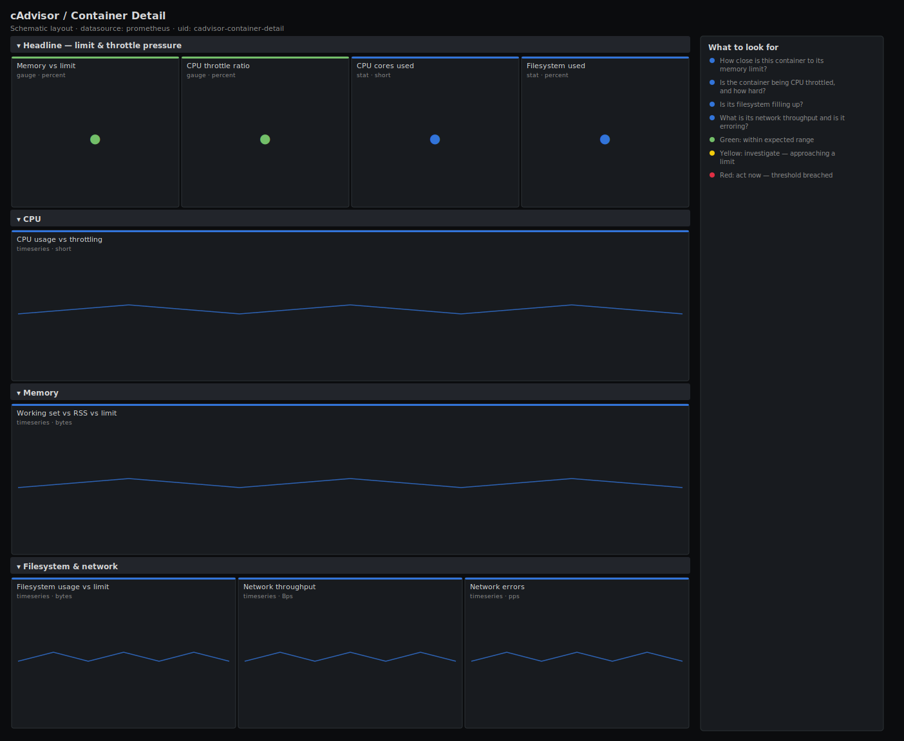

# cAdvisor / Container Detail

> Deep dive on a single container scraped by cAdvisor: CPU usage against its CFS throttling, memory working set against its limit, filesystem usage and network throughput. Open this after the overview points you at the offender to confirm whether it is throttled, leaking, or about to be OOM-killed.

**Primary search phrase:** cAdvisor container detail Grafana dashboard  
**Category:** `cadvisor` · **UID:** `cadvisor-container-detail` · **Datasource:** Prometheus



## Questions this dashboard answers

- How close is this container to its memory limit?
- Is the container being CPU throttled, and how hard?
- Is its filesystem filling up?
- What is its network throughput and is it erroring?

## Production lessons — why this dashboard exists

The two numbers that decide a container's fate are **memory-vs-limit** and **throttle ratio**, so this board leads with both as percentages — raw bytes and raw period counters bury the signal. A container at 95% of its memory limit is living on borrowed time: the next allocation triggers an OOM kill and a restart, which is why we pair the working-set line with the limit line so you can see the collision coming. Watch throttling even when CPU "usage" looks modest: a tight CFS quota throttles a bursty workload that averages well under its limit.

## Data source requirements

- **Prometheus** datasource (selected at import time via `${DS_PROMETHEUS}`).
- `cAdvisor` on the host running the container. Uses `container_cpu_usage_seconds_total`, `container_cpu_cfs_throttled_periods_total`, `container_cpu_cfs_periods_total`, `container_memory_working_set_bytes`, `container_memory_rss`, `container_spec_memory_limit_bytes`, `container_fs_usage_bytes`, `container_fs_limit_bytes` and `container_network_*` for the selected `name`.

## Template variables

| Variable | Label | Type | Purpose |
|----------|-------|------|---------|
| `${instance}` | Host | query | cAdvisor instance (Docker host) the container runs on. |
| `${name}` | Container | query | The single container to inspect. |

## Panels

### Headline — limit & throttle pressure

- **Memory vs limit** (gauge, `percent`) — Working set as a percentage of the container's memory limit. 100% means OOM.
- **CPU throttle ratio** (gauge, `percent`) — Fraction of recent CFS periods that were throttled.
- **CPU cores used** (stat, `short`) — CPU cores consumed over the last 5 minutes.
- **Filesystem used** (stat, `percent`) — Container filesystem usage as a share of its limit.

### CPU

- **CPU usage vs throttling** (timeseries, `short`) — Cores used (left) against the throttled fraction — the two together explain queueing.

### Memory

- **Working set vs RSS vs limit** (timeseries, `bytes`) — Working set is what triggers OOM; the limit line is the wall it runs into.

### Filesystem & network

- **Filesystem usage vs limit** (timeseries, `bytes`) — Disk consumed by the container against its filesystem limit.
- **Network throughput** (timeseries, `Bps`) — Receive and transmit bandwidth for this container.
- **Network errors** (timeseries, `pps`) — Receive errors for this container — non-zero means a stressed bridge or NIC.

## Import

**Grafana UI** — *Dashboards → New → Import*, upload `dashboards/cadvisor/container-detail.json`, then pick your datasource when prompted.

**API:**

```bash
scripts/import-dashboard.sh dashboards/cadvisor/container-detail.json
```

**Provisioning** — drop the JSON into a provisioned folder (see [provisioning guide](../../provisioning.md)).

## Recommended alerts

Ready-to-use rules ship in `alerts/cadvisor.rules.yml`.

### ContainerMemoryOOMRisk (`critical`)

```promql
container_memory_working_set_bytes{name!=""} / (container_spec_memory_limit_bytes{name!=""} > 0) > 0.95
```

- **Fires after:** `5m`
- **Why it matters:** Above 95% of the limit the container is one allocation from an OOM kill, which restarts it and drops in-flight requests.
- **Investigate:** Open cAdvisor / Container Detail for the container and check working set versus the limit line for a leak.
- **Recovery:** Clears when working set drops below 95% of the limit for 5m.
- **False positives:** Containers without a limit are excluded by the `> 0` guard.

### ContainerThrottledHard (`warning`)

```promql
sum by (name, instance) (rate(container_cpu_cfs_throttled_periods_total{name!=""}[5m])) / clamp_min(sum by (name, instance) (rate(container_cpu_cfs_periods_total{name!=""}[5m])), 1) > 0.5
```

- **Fires after:** `10m`
- **Why it matters:** Throttling above 50% of periods means the CFS quota is the dominant limit on the workload — latency will be poor regardless of host headroom.
- **Investigate:** Compare cores-used to the limit; a bursty workload often needs a higher quota, not more replicas.
- **Recovery:** Clears when throttling falls below 50% for 5m.
- **False positives:** Cold-start bursts; the 10m window filters them.

### ContainerFilesystemNearFull (`warning`)

```promql
sum by (name, instance) (container_fs_usage_bytes{name!=""}) / clamp_min(sum by (name, instance) (container_fs_limit_bytes{name!=""}), 1) > 0.9
```

- **Fires after:** `10m`
- **Why it matters:** A full container filesystem causes write failures that crash the app or corrupt local state.
- **Investigate:** Check what is writing inside the container — logs, temp files, an unbounded cache.
- **Recovery:** Clears when usage drops below 90% for 5m.
- **False positives:** Containers writing large temp files transiently.

## Troubleshooting

| Symptom | Likely cause | First action |
|---------|--------------|--------------|
| Memory-vs-limit panel shows "No data" | The container has no memory limit, so the `> 0` guard drops the series. | Set a limit on the container, or read the absolute working-set panel instead. |
| Throttle ratio is N/A | No CFS periods elapsed in the window (the container is idle or has no CPU limit). | Throttling only applies when a CPU quota is set; this is expected for unlimited containers. |
| Filesystem panels are empty | The container uses a volume cAdvisor does not track, or fs metrics are disabled. | Confirm cAdvisor's disk collector is enabled and the storage driver is supported. |

## Performance considerations

Scoping to one `name` keeps every query to a handful of series, so this board is cheap. Rates use a 5m window (≥4× a 15s scrape). The `clamp_min(..., 1)` guards avoid divide-by-zero when a container is idle.

## Customization

Adjust the 80/95 memory and 25/50 throttle thresholds to your tolerances. Add `container_memory_cache` to the memory panel to separate cache from working set. Use the `$name` variable plus repeat to render a row per container in a small stack.

## Related resources

- [Advanced observability guides](https://devopsaitoolkit.com/guides/)
- [Grafana & Prometheus tutorials](https://devopsaitoolkit.com/blog/)
- [AI Incident Response Assistant](https://devopsaitoolkit.com/dashboard/incident-response)
- [PromQL cookbook](../../../promql/README.md) · [Alerting guide](../../alerting.md) · [Dashboard catalog](../../catalog.md)
