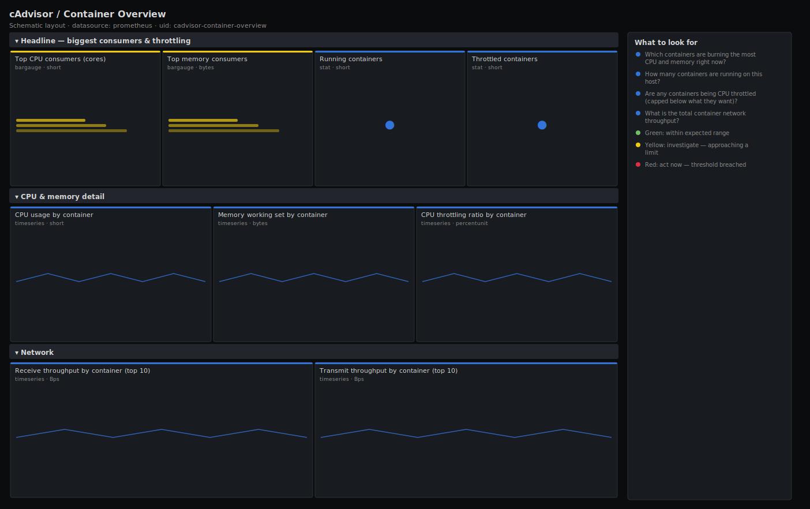

# cAdvisor / Container Overview

> Top-down view of every container on a Docker host scraped by cAdvisor: the biggest CPU and memory consumers, how many containers are running, how many are being CPU throttled, and total network throughput. The first stop when a host is busy but you do not yet know which container is to blame.

**Primary search phrase:** cAdvisor container overview Grafana dashboard  
**Category:** `cadvisor` · **UID:** `cadvisor-container-overview` · **Datasource:** Prometheus



## Questions this dashboard answers

- Which containers are burning the most CPU and memory right now?
- How many containers are running on this host?
- Are any containers being CPU throttled (capped below what they want)?
- What is the total container network throughput?

## Production lessons — why this dashboard exists

On a busy Docker host the host-level CPU graph tells you *that* you have a problem, not *which container* caused it — so this board leads with ranked top-N consumers, not aggregate lines. The metric most teams forget to watch is **CPU throttling**: a container pinned at its CFS quota looks "only 100% of its limit" while actually queueing every request, so we surface the throttled-container count next to the consumers. Always filter `name!=""` — cAdvisor emits machine and cgroup-root series with empty names that otherwise double-count everything.

## Data source requirements

- **Prometheus** datasource (selected at import time via `${DS_PROMETHEUS}`).
- `cAdvisor` on the Docker host (the `container_cpu_usage_seconds_total`, `container_memory_working_set_bytes`, `container_cpu_cfs_throttled_periods_total`, `container_network_*` and `container_last_seen` series). The `name` label carries the Docker container name; empty-name cgroup series are excluded.
- `machine_cpu_cores` (also from cAdvisor) is used to express CPU as a share of host cores.

## Template variables

| Variable | Label | Type | Purpose |
|----------|-------|------|---------|
| `${instance}` | Host | query | cAdvisor instance (the Docker host) to inspect. |

## Panels

### Headline — biggest consumers & throttling

- **Top CPU consumers (cores)** (bargauge, `short`) — Containers ranked by CPU cores used over the last 5 minutes.
- **Top memory consumers** (bargauge, `bytes`) — Containers ranked by working-set memory (the RSS the kernel cannot reclaim).
- **Running containers** (stat, `short`) — Containers seen by cAdvisor in the last scrape.
- **Throttled containers** (stat, `short`) — Containers whose CFS quota is actively capping them right now.

### CPU & memory detail

- **CPU usage by container** (timeseries, `short`) — Per-container CPU cores over time. Spot the noisy neighbour.
- **Memory working set by container** (timeseries, `bytes`) — Per-container working-set memory trend — a steady climb is a leak.
- **CPU throttling ratio by container** (timeseries, `percentunit`) — Fraction of CFS periods that were throttled — anything sustained above 25% hurts latency.

### Network

- **Receive throughput by container (top 10)** (timeseries, `Bps`) — Inbound bandwidth per container.
- **Transmit throughput by container (top 10)** (timeseries, `Bps`) — Outbound bandwidth per container.

## Import

**Grafana UI** — *Dashboards → New → Import*, upload `dashboards/cadvisor/container-overview.json`, then pick your datasource when prompted.

**API:**

```bash
scripts/import-dashboard.sh dashboards/cadvisor/container-overview.json
```

**Provisioning** — drop the JSON into a provisioned folder (see [provisioning guide](../../provisioning.md)).

## Recommended alerts

Ready-to-use rules ship in `alerts/cadvisor.rules.yml`.

### ContainerCPUThrottlingHigh (`warning`)

```promql
sum by (name, instance) (rate(container_cpu_cfs_throttled_periods_total{name!=""}[5m])) / clamp_min(sum by (name, instance) (rate(container_cpu_cfs_periods_total{name!=""}[5m])), 1) > 0.25
```

- **Fires after:** `10m`
- **Why it matters:** A throttled container is capped below the CPU it is asking for, so requests queue and tail latency rises even though host CPU may look fine.
- **Investigate:** Open cAdvisor / Container Overview, scope to the host, and check the throttling-ratio panel for the container.
- **Recovery:** Clears when the throttled fraction drops below 25% for 5m.
- **False positives:** Short bursts during cold starts — the 10m window filters them.

### ContainerMemoryNearLimit (`warning`)

```promql
container_memory_working_set_bytes{name!=""} / (container_spec_memory_limit_bytes{name!=""} > 0) > 0.9
```

- **Fires after:** `10m`
- **Why it matters:** A container above 90% of its memory limit is one allocation away from an OOM kill, which restarts it and drops in-flight work.
- **Investigate:** Check the working-set trend for a leak versus legitimate growth.
- **Recovery:** Clears when working set drops below 90% of the limit for 5m.
- **False positives:** Containers with no limit set are excluded by the `> 0` guard, so every match is a real limit breach.

### ContainerNetworkErrors (`warning`)

```promql
sum by (name, instance) (rate(container_network_receive_errors_total{name!=""}[5m])) > 0
```

- **Fires after:** `10m`
- **Why it matters:** Container NIC errors point at an overloaded bridge, a saturated host NIC, or a misbehaving overlay network — and cause retransmits the app sees as latency.
- **Investigate:** Correlate with host-level NIC errors and the container's network throughput.
- **Recovery:** Clears when the error rate returns to zero for 5m.
- **False positives:** A transient burst during container restart or network reconfiguration.

## Troubleshooting

| Symptom | Likely cause | First action |
|---------|--------------|--------------|
| Container counts are roughly double the real number | The `name!=""` filter is missing, so empty-name cgroup roots are counted. | Every selector in this board includes `name!=""`; if you edited one, restore it. |
| CPU shows more cores than the host has | Summing per-cpu series without `by (name)` collapses across cores incorrectly. | Keep the `sum by (name) (rate(...))` shape used here. |
| Memory consumers look low versus `docker stats` | Working set excludes reclaimable cache; `docker stats` shows RSS+cache. | This is expected — working set is the number that triggers OOM, so it is the right one to rank by. |

## Performance considerations

Every panel uses `topk(10)` and `sum by (name)` to cap the series rendered no matter how many containers run. Rates use a 5m window (≥4× a 15s scrape). cAdvisor is a high-cardinality exporter; if scrapes slow down, drop per-cpu and per-interface series with metric_relabel_configs and scope `$instance` to one host.

## Customization

Change `topk(10)` to show more or fewer consumers. Adjust the 25% throttling and 90% memory thresholds to your tolerances. Add a `name` template variable to filter to a single container, or pivot the CPU panel to a share of `machine_cpu_cores` for a percent-of-host view.

## Related resources

- [Advanced observability guides](https://devopsaitoolkit.com/guides/)
- [Grafana & Prometheus tutorials](https://devopsaitoolkit.com/blog/)
- [AI Incident Response Assistant](https://devopsaitoolkit.com/dashboard/incident-response)
- [PromQL cookbook](../../../promql/README.md) · [Alerting guide](../../alerting.md) · [Dashboard catalog](../../catalog.md)
