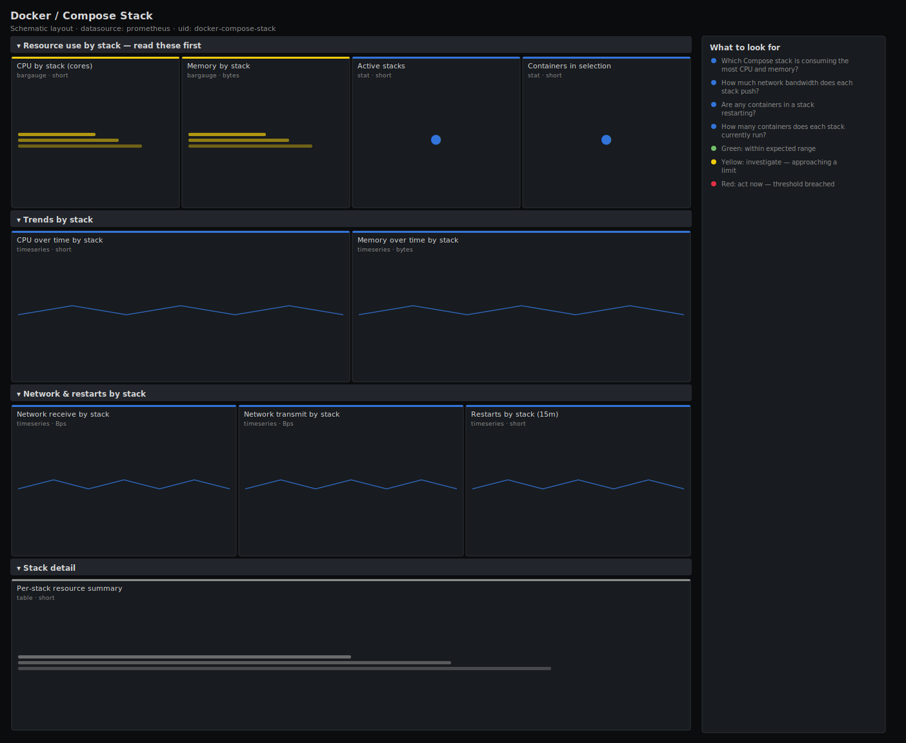

# Docker / Compose Stack

> Per-project view of Docker Compose stacks: CPU, memory, network and restarts grouped by the `com.docker.compose.project` label so you see resource use one stack at a time instead of one container at a time. The board for a host running several Compose apps where you need to know which *stack* — not which container — is the heavy one.

**Primary search phrase:** Docker Compose stack Grafana dashboard  
**Category:** `docker` · **UID:** `docker-compose-stack` · **Datasource:** Prometheus



## Questions this dashboard answers

- Which Compose stack is consuming the most CPU and memory?
- How much network bandwidth does each stack push?
- Are any containers in a stack restarting?
- How many containers does each stack currently run?

## Production lessons — why this dashboard exists

On a host running several Compose apps, per-container graphs are noise — you think in stacks ("the analytics app is slow"), not in the dozen containers that make it up. So this board groups every metric by the Compose project label and ranks stacks, which instantly answers "which app do I scale or move?" The catch teams hit is that cAdvisor must be configured to expose container labels; without that the `container_label_com_docker_compose_project` label is empty and every stack collapses into one. We filter that label `!=""` everywhere so a misconfigured exporter fails loudly (empty board) rather than quietly lumping all stacks together.

## Data source requirements

- **Prometheus** datasource (selected at import time via `${DS_PROMETHEUS}`).
- `cAdvisor` with container-label collection enabled, so the `container_label_com_docker_compose_project` (and `..._service`) labels appear on `container_cpu_usage_seconds_total`, `container_memory_working_set_bytes`, `container_network_*` and `container_start_time_seconds`. Enable label exposure with cAdvisor's `--store_container_labels` (or a `--whitelisted_container_labels` list).

## Template variables

| Variable | Label | Type | Purpose |
|----------|-------|------|---------|
| `${instance}` | Host | query | cAdvisor instance (Docker host) to inspect. |
| `${project}` | Stack | query | Compose project(s) to display. Select All to compare every stack. |

## Panels

### Resource use by stack — read these first

- **CPU by stack (cores)** (bargauge, `short`) — CPU cores used per Compose project over the last 5 minutes, ranked.
- **Memory by stack** (bargauge, `bytes`) — Working-set memory per Compose project, ranked.
- **Active stacks** (stat, `short`) — Distinct Compose projects with running containers on this host.
- **Containers in selection** (stat, `short`) — Containers across the selected stacks.

### Trends by stack

- **CPU over time by stack** (timeseries, `short`) — Per-stack CPU cores — spot the app that started running hot.
- **Memory over time by stack** (timeseries, `bytes`) — Per-stack working-set memory — a steady climb is a leak somewhere in the stack.

### Network & restarts by stack

- **Network receive by stack** (timeseries, `Bps`) — Inbound bandwidth aggregated per Compose project.
- **Network transmit by stack** (timeseries, `Bps`) — Outbound bandwidth aggregated per Compose project.
- **Restarts by stack (15m)** (timeseries, `short`) — Container start-time changes summed per stack — non-zero means something is flapping.

### Stack detail

- **Per-stack resource summary** (table, `short`) — Sortable CPU and memory totals per Compose project for capacity planning.

## Import

**Grafana UI** — *Dashboards → New → Import*, upload `dashboards/docker/compose-stack.json`, then pick your datasource when prompted.

**API:**

```bash
scripts/import-dashboard.sh dashboards/docker/compose-stack.json
```

**Provisioning** — drop the JSON into a provisioned folder (see [provisioning guide](../../provisioning.md)).

## Recommended alerts

Ready-to-use rules ship in `alerts/docker.rules.yml`.

### ComposeStackContainerRestart (`warning`)

```promql
sum by (container_label_com_docker_compose_project, instance) (
  changes(container_start_time_seconds{container_label_com_docker_compose_project!="", name!=""}[15m])) > 3
```

- **Fires after:** `5m`
- **Why it matters:** Restarts concentrated in one stack point at a single failing app — a bad config, a dead dependency, or an OOM loop in one of its services.
- **Investigate:** Open Docker / Compose Stack, scope to the project, and read the restarts panel to find which service in the stack is flapping.
- **Recovery:** Clears when restarts stop for 15m.
- **False positives:** A deliberate `docker compose up --build` redeploy of the stack — silence during deploys.

### ComposeStackCPUHigh (`warning`)

```promql
sum by (container_label_com_docker_compose_project, instance) (
  rate(container_cpu_usage_seconds_total{container_label_com_docker_compose_project!="", name!=""}[5m]))
/ scalar(machine_cpu_cores) > 0.8
```

- **Fires after:** `10m`
- **Why it matters:** A single stack consuming most of the host's CPU starves every other stack on the same host, turning one app's problem into everyone's.
- **Investigate:** Compare the stack's CPU trend to the host headroom and identify the hottest service.
- **Recovery:** Clears when the stack's CPU share drops below 80% for 5m.
- **False positives:** A short batch job inside the stack; the 10m window filters bursts. On multi-host setups `scalar(machine_cpu_cores)` assumes one host — scope per instance.

### ComposeStackMemoryGrowth (`warning`)

```promql
sum by (container_label_com_docker_compose_project, instance) (
  deriv(container_memory_working_set_bytes{container_label_com_docker_compose_project!="", name!=""}[1h])) > 1.0e6
```

- **Fires after:** `30m`
- **Why it matters:** A stack whose working set climbs by more than ~1MB/s for half an hour is leaking and will eventually OOM one of its containers.
- **Investigate:** Open the per-stack memory trend; identify which service carries the slope.
- **Recovery:** Clears when the growth rate falls back to near zero.
- **False positives:** Legitimate warm-up (cache fill) early in a stack's life — the 30m window reduces but does not eliminate this.

## Troubleshooting

| Symptom | Likely cause | First action |
|---------|--------------|--------------|
| Every panel is empty | cAdvisor is not exposing container labels, so the Compose project label is absent. | Restart cAdvisor with `--store_container_labels` (or whitelist the compose labels) and re-check in Explore. |
| All containers collapse into one unnamed stack | The containers were not started by Docker Compose, so they carry no project label. | This board only covers Compose-managed containers; use the container overview for the rest. |
| CPU-share alert misfires on a multi-host fleet | `scalar(machine_cpu_cores)` takes a single value, not per-host cores. | Replace it with a per-instance join, or scope the rule to one host. |

## Performance considerations

Grouping by the Compose project label keeps series count at one per stack regardless of how many containers each stack runs, so this board scales well. Rates use a 5m window (≥4× a 15s scrape); `changes()`/`deriv()` over longer windows are bounded by the stack-level aggregation.

## Customization

Add `container_label_com_docker_compose_service` to any `by (...)` clause to drill from stack down to service. Tune the 80% CPU-share and 1MB/s growth thresholds to your host sizing. On multi-host fleets, add `instance` to the grouping and replace `scalar(machine_cpu_cores)` with a per-instance core count.

## Related resources

- [Advanced observability guides](https://devopsaitoolkit.com/guides/)
- [Grafana & Prometheus tutorials](https://devopsaitoolkit.com/blog/)
- [AI Incident Response Assistant](https://devopsaitoolkit.com/dashboard/incident-response)
- [PromQL cookbook](../../../promql/README.md) · [Alerting guide](../../alerting.md) · [Dashboard catalog](../../catalog.md)
