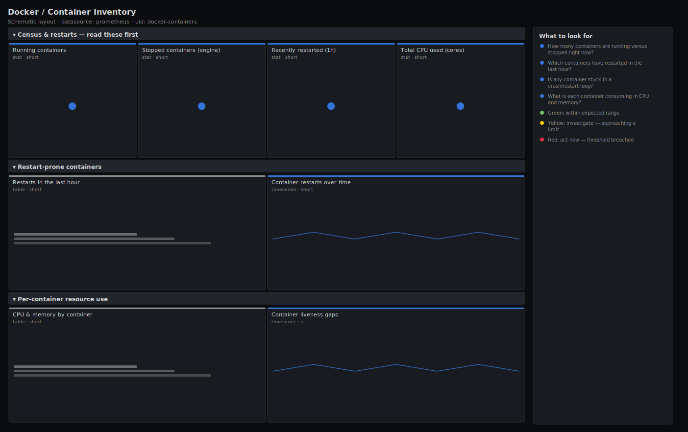

# Docker / Container Inventory

> Inventory and health of the containers on a Docker host: how many are running versus stopped, which ones have restarted recently (a restart loop is the most common silent failure), and a sortable table of per-container CPU and memory. Combines Docker engine state counts with cAdvisor per-container detail.

**Primary search phrase:** Docker container inventory Grafana dashboard  
**Category:** `docker` · **UID:** `docker-containers` · **Datasource:** Prometheus



## Questions this dashboard answers

- How many containers are running versus stopped right now?
- Which containers have restarted in the last hour?
- Is any container stuck in a crash/restart loop?
- What is each container consuming in CPU and memory?

## Production lessons — why this dashboard exists

The failure mode Docker hides best is the **restart loop**: a container that crashes and is restarted every few seconds shows up as "running" in `docker ps` and burns CPU while serving nothing. We surface a recently-restarted count and a restart table up front, derived from `container_start_time_seconds` changing, because by the time a human notices "it's flapping" you have usually already lost an hour. The running/ stopped split from the engine gives the quick census; the cAdvisor table tells you what each survivor is actually costing you.

## Data source requirements

- **Prometheus** datasource (selected at import time via `${DS_PROMETHEUS}`).
- `Docker engine metrics` endpoint for `engine_daemon_container_states_containers` (labelled `state=running|paused|stopped`). Enable with `metrics-addr` in the daemon config and scrape it as a target.
- `cAdvisor` for per-container restart detection (`container_start_time_seconds`), CPU (`container_cpu_usage_seconds_total`), memory (`container_memory_working_set_bytes`) and liveness (`container_last_seen`).

## Template variables

| Variable | Label | Type | Purpose |
|----------|-------|------|---------|
| `${instance}` | Host | query | cAdvisor instance (Docker host) for the per-container panels. |

## Panels

### Census & restarts — read these first

- **Running containers** (stat, `short`) — Containers cAdvisor saw in the last scrape on this host.
- **Stopped containers (engine)** (stat, `short`) — Containers the Docker daemon reports as stopped.
- **Recently restarted (1h)** (stat, `short`) — Containers whose start time changed in the last hour — your flapping suspects.
- **Total CPU used (cores)** (stat, `short`) — Sum of CPU cores used by all containers on the host.

### Restart-prone containers

- **Restarts in the last hour** (table, `short`) — Containers ranked by restart count — anything above a couple is a crash loop.
- **Container restarts over time** (timeseries, `short`) — When restarts happened — line them up against deploys and OOM events.

### Per-container resource use

- **CPU & memory by container** (table, `short`) — Sortable roster of what each container is consuming.
- **Container liveness gaps** (timeseries, `s`) — Time since each container was last seen — a rising line means it vanished from cAdvisor.

## Import

**Grafana UI** — *Dashboards → New → Import*, upload `dashboards/docker/containers.json`, then pick your datasource when prompted.

**API:**

```bash
scripts/import-dashboard.sh dashboards/docker/containers.json
```

**Provisioning** — drop the JSON into a provisioned folder (see [provisioning guide](../../provisioning.md)).

## Recommended alerts

Ready-to-use rules ship in `alerts/docker.rules.yml`.

### ContainerRestartLoop (`critical`)

```promql
changes(container_start_time_seconds{name!=""}[15m]) > 3
```

- **Fires after:** `5m`
- **Why it matters:** A container restarting repeatedly is crash-looping — it serves no traffic while consuming CPU and polluting logs, and it stays invisible in `docker ps`.
- **Investigate:** Open Docker / Container Inventory, find it in the restart table, then read its logs (docker logs --tail=200) and check for an OOM kill.
- **Recovery:** Clears when restarts stop for 15m.
- **False positives:** A deliberate rolling restart or a job container that exits by design — exclude those names.

### ContainerStopped (`warning`)

```promql
engine_daemon_container_states_containers{state="stopped"} > 0
```

- **Fires after:** `10m`
- **Why it matters:** A container that exited and was not restarted may be a failed service the orchestrator gave up on.
- **Investigate:** List exited containers (docker ps -a --filter status=exited) and inspect their exit codes.
- **Recovery:** Clears when no stopped containers remain for 10m.
- **False positives:** One-shot/init containers that exit successfully — filter them out of the alert.

### ContainerVanished (`warning`)

```promql
time() - container_last_seen{name!=""} > 300
```

- **Fires after:** `5m`
- **Why it matters:** A container cAdvisor stops seeing has usually been killed or the cgroup removed — but a dashboard scoped to live containers would never show its absence.
- **Investigate:** Confirm whether the container is gone (docker ps) or cAdvisor lost the cgroup.
- **Recovery:** Clears when the container is seen again.
- **False positives:** Intentionally removed containers; scope the alert to services that must stay up.

## Troubleshooting

| Symptom | Likely cause | First action |
|---------|--------------|--------------|
| Stopped count is always 0 | The Docker engine metrics endpoint is not scraped (only cAdvisor is). | Enable the daemon `metrics-addr` and add it as a Prometheus target; the cAdvisor panels work without it. |
| Restart table is empty during a known crash loop | `container_start_time_seconds` is missing because cAdvisor restarted and reset its view. | Widen the lookback or confirm cAdvisor has been up longer than the window. |
| Running count disagrees with `docker ps` | cAdvisor counts cgroups it can see; short-lived containers may be missed between scrapes. | Cross-check with the engine `state=running` series for the daemon's own count. |

## Performance considerations

`changes()` over a 1h window is the heaviest expression here; it is bounded by `topk` so only the worst offenders render. Counts use `count by (name)` to stay at one series per container. Scope `$instance` to one host on dense fleets.

## Customization

Tune the restart thresholds (3 in 15m) to your deploy cadence. Add a `name` filter to watch a single service. If you do not run the engine metrics endpoint, drop the stopped-count stat and derive everything from cAdvisor.

## Related resources

- [Advanced observability guides](https://devopsaitoolkit.com/guides/)
- [Grafana & Prometheus tutorials](https://devopsaitoolkit.com/blog/)
- [AI Incident Response Assistant](https://devopsaitoolkit.com/dashboard/incident-response)
- [PromQL cookbook](../../../promql/README.md) · [Alerting guide](../../alerting.md) · [Dashboard catalog](../../catalog.md)
