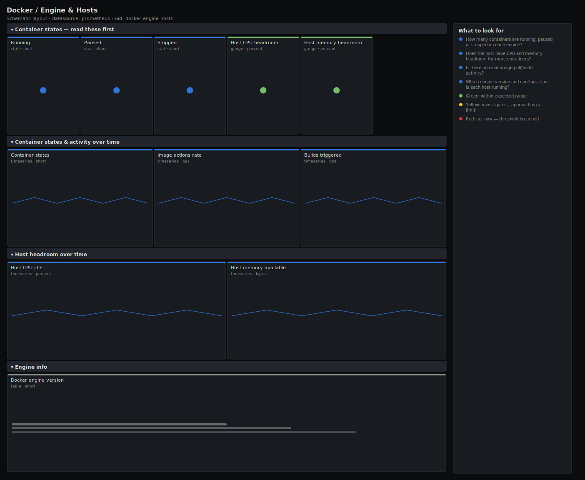

# Docker / Engine & Hosts

> Health of the Docker daemon and the host it runs on: container state breakdown (running/paused/stopped), image and build activity, and the host's CPU and memory headroom from node_exporter. Answers "can this Docker host take more containers, and is the daemon itself healthy?"

**Primary search phrase:** Docker engine host Grafana dashboard  
**Category:** `docker` · **UID:** `docker-engine-hosts` · **Datasource:** Prometheus



## Questions this dashboard answers

- How many containers are running, paused or stopped on each engine?
- Does the host have CPU and memory headroom for more containers?
- Is there unusual image pull/build activity?
- Which engine version and configuration is each host running?

## Production lessons — why this dashboard exists

A Docker host falls over for two different reasons, and you must tell them apart fast: the **daemon** is unhealthy (containers stuck, image operations hung) or the **host** is out of resources. So this board puts the engine's container-state counts next to the host's CPU and memory headroom from node_exporter — the same instance, two layers. The headroom framing matters: schedulers care about what is *left*, not what is used, so we show available cores and available memory rather than utilisation percentages.

## Data source requirements

- **Prometheus** datasource (selected at import time via `${DS_PROMETHEUS}`).
- `Docker engine metrics` endpoint: `engine_daemon_container_states_containers` (state breakdown), `engine_daemon_image_actions_seconds_count` (image pulls/pushes/ deletes by action), `builder_builds_triggered_total` and `engine_daemon_engine_info` (version/commit labels). Enable via the daemon `metrics-addr`.
- `node_exporter` on the same host for CPU and memory headroom (`node_cpu_seconds_total`, `node_memory_MemAvailable_bytes`, `node_memory_MemTotal_bytes`).

## Template variables

| Variable | Label | Type | Purpose |
|----------|-------|------|---------|
| `${instance}` | Docker host | query | The Docker engine instance to inspect. |
| `${node}` | Node exporter target | query | The node_exporter target for the same host (for headroom panels). |

## Panels

### Container states — read these first

- **Running** (stat, `short`) — Containers the daemon currently reports as running.
- **Paused** (stat, `short`) — Paused containers — usually a forgotten debug pause.
- **Stopped** (stat, `short`) — Stopped containers the daemon is still tracking.
- **Host CPU headroom** (gauge, `percent`) — Idle CPU left on the host — what a scheduler can still place.
- **Host memory headroom** (gauge, `percent`) — Available memory on the host as a share of total.

### Container states & activity over time

- **Container states** (timeseries, `short`) — Running/paused/stopped over time — a climbing stopped line means failures piling up.
- **Image actions rate** (timeseries, `ops`) — Image pulls, pushes and deletes per second by action.
- **Builds triggered** (timeseries, `ops`) — Image build rate — a spike here often explains CPU and disk pressure.

### Host headroom over time

- **Host CPU idle** (timeseries, `percent`) — Idle CPU trend; when this approaches zero the daemon and its containers contend.
- **Host memory available** (timeseries, `bytes`) — Bytes of memory the host can still hand out before swapping or OOM.

### Engine info

- **Docker engine version** (table, `short`) — Daemon version and build metadata per host — confirm a fleet is on one version.

## Import

**Grafana UI** — *Dashboards → New → Import*, upload `dashboards/docker/engine-hosts.json`, then pick your datasource when prompted.

**API:**

```bash
scripts/import-dashboard.sh dashboards/docker/engine-hosts.json
```

**Provisioning** — drop the JSON into a provisioned folder (see [provisioning guide](../../provisioning.md)).

## Recommended alerts

Ready-to-use rules ship in `alerts/docker.rules.yml`.

### DockerHostCPUExhausted (`warning`)

```promql
100 * avg by (instance) (rate(node_cpu_seconds_total{mode="idle"}[5m])) < 10
```

- **Fires after:** `10m`
- **Why it matters:** With almost no idle CPU the daemon and its containers contend for cores, so every container slows together and new placements stall.
- **Investigate:** Open Docker / Engine & Hosts and find the container burning CPU via the overview board.
- **Recovery:** Clears when idle CPU rises above 10% for 5m.
- **False positives:** Build hosts intentionally run hot during CI bursts — scope or raise `for`.

### DockerHostMemoryLow (`warning`)

```promql
100 * node_memory_MemAvailable_bytes / node_memory_MemTotal_bytes < 10
```

- **Fires after:** `10m`
- **Why it matters:** Low host memory triggers the OOM killer, which kills containers unpredictably and can take down the daemon's own workloads.
- **Investigate:** Check per-container working set on the container overview board for a leak or an over-allocated container.
- **Recovery:** Clears when headroom rises above 10% for 5m.
- **False positives:** Page cache is excluded by MemAvailable, so a sustained breach is real pressure.

### DockerContainersPaused (`info`)

```promql
engine_daemon_container_states_containers{state="paused"} > 0
```

- **Fires after:** `15m`
- **Why it matters:** A long-paused container is almost always a forgotten manual `docker pause` that silently removed capacity.
- **Investigate:** List paused containers (docker ps --filter status=paused).
- **Recovery:** Clears when no containers are paused for 15m.
- **False positives:** Deliberate maintenance pauses — silence during the window.

## Troubleshooting

| Symptom | Likely cause | First action |
|---------|--------------|--------------|
| All engine panels show "No data" | The Docker daemon metrics endpoint is not exposed or not scraped. | Set `metrics-addr` in /etc/docker/daemon.json, restart Docker, and add the endpoint as a target. |
| Headroom panels are empty | The `$node` variable does not match the node_exporter instance for the same host. | Pick the node_exporter target whose host matches the Docker engine instance. |
| Engine info table is blank | `engine_daemon_engine_info` is exposed only by newer daemons. | Upgrade Docker, or drop this panel if your version predates the metric. |

## Performance considerations

Engine metrics are low cardinality and cheap. The node_exporter headroom queries are a single series each. The only multi-series panel (container states) is bounded by the three state values. Rates use a 5m window (≥4× a 15s scrape).

## Customization

Tune the 10% headroom floors to your overcommit policy. Switch `$instance` and `$node` to multi-select with `sum by (instance)` to watch a small Docker host pool on one board. Add disk headroom from `node_filesystem_*` if your image store is a concern.

## Related resources

- [Advanced observability guides](https://devopsaitoolkit.com/guides/)
- [Grafana & Prometheus tutorials](https://devopsaitoolkit.com/blog/)
- [AI Incident Response Assistant](https://devopsaitoolkit.com/dashboard/incident-response)
- [PromQL cookbook](../../../promql/README.md) · [Alerting guide](../../alerting.md) · [Dashboard catalog](../../catalog.md)
