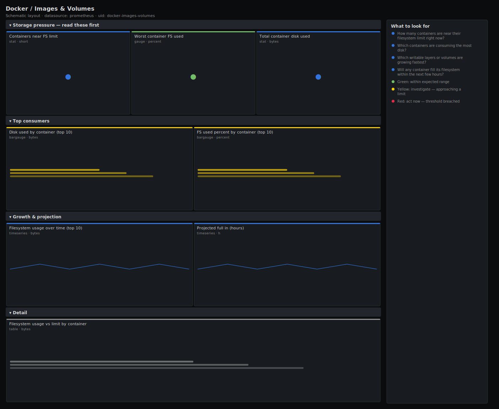

# Docker / Images & Volumes

> Container filesystem and storage view: which containers are closest to their filesystem limit, the top disk consumers, and how container writable layers and volumes grow over time. The board to open when a Docker host is running out of disk and you need to know which container's writable layer is to blame.

**Primary search phrase:** Docker images and volumes Grafana dashboard  
**Category:** `docker` · **UID:** `docker-images-volumes` · **Datasource:** Prometheus



## Questions this dashboard answers

- How many containers are near their filesystem limit right now?
- Which containers are consuming the most disk?
- Which writable layers or volumes are growing fastest?
- Will any container fill its filesystem within the next few hours?

## Production lessons — why this dashboard exists

"Docker host out of disk" is a top-three on-call page, and the cause is almost always one container's **writable layer** quietly growing — an app logging to stdout into a container that does not rotate, or temp files nobody mounts a volume for. So this board leads with the count of containers near their limit and ranks consumers by absolute bytes, then adds a growth projection so you get paged on the *trend* before the disk is actually full. Watching `container_fs_usage_bytes` per container beats watching the host filesystem because it tells you *which* container to fix, not just that you are in trouble.

## Data source requirements

- **Prometheus** datasource (selected at import time via `${DS_PROMETHEUS}`).
- `cAdvisor` filesystem collector: `container_fs_usage_bytes` (bytes used by each container's writable layer and tracked mounts) and `container_fs_limit_bytes` (the filesystem size backing it). Requires cAdvisor's disk metrics to be enabled and a supported storage driver (overlay2).

## Template variables

| Variable | Label | Type | Purpose |
|----------|-------|------|---------|
| `${instance}` | Host | query | cAdvisor instance (Docker host) to inspect. |

## Panels

### Storage pressure — read these first

- **Containers near FS limit** (stat, `short`) — Containers using more than 80% of their filesystem limit.
- **Worst container FS used** (gauge, `percent`) — Fullest container filesystem on the host.
- **Total container disk used** (stat, `bytes`) — Sum of writable-layer and tracked-mount usage across all containers.

### Top consumers

- **Disk used by container (top 10)** (bargauge, `bytes`) — Absolute filesystem bytes per container, ranked.
- **FS used percent by container (top 10)** (bargauge, `percent`) — Each container's usage as a share of its filesystem limit.

### Growth & projection

- **Filesystem usage over time (top 10)** (timeseries, `bytes`) — Per-container disk growth — a straight climb is an unrotated log or leaking temp dir.
- **Projected full in (hours)** (timeseries, `h`) — Hours until each growing container hits its limit at the current 1h rate. Lower is more urgent.

### Detail

- **Filesystem usage vs limit by container** (table, `bytes`) — Sortable per-container used, limit and percent for capacity planning.

## Import

**Grafana UI** — *Dashboards → New → Import*, upload `dashboards/docker/images-volumes.json`, then pick your datasource when prompted.

**API:**

```bash
scripts/import-dashboard.sh dashboards/docker/images-volumes.json
```

**Provisioning** — drop the JSON into a provisioned folder (see [provisioning guide](../../provisioning.md)).

## Recommended alerts

Ready-to-use rules ship in `alerts/docker.rules.yml`.

### ContainerFilesystemNearFull (`warning`)

```promql
sum by (name, instance) (container_fs_usage_bytes{name!=""}) / clamp_min(sum by (name, instance) (container_fs_limit_bytes{name!=""}), 1) > 0.9
```

- **Fires after:** `10m`
- **Why it matters:** A container that fills its filesystem starts failing writes, which crashes the app or corrupts local state and can wedge the whole Docker storage pool.
- **Investigate:** Open Docker / Images & Volumes, scope to the host, and find the container in the top-consumers panel; check what is writing inside it.
- **Recovery:** Clears when usage drops below 90% for 5m.
- **False positives:** Containers that write large temp files transiently — they self-clear.

### ContainerFilesystemFillingFast (`warning`)

```promql
predict_linear(container_fs_usage_bytes{name!=""}[1h], 4 * 3600) > container_fs_limit_bytes{name!=""}
```

- **Fires after:** `15m`
- **Why it matters:** Catching the trend lets you act during business hours instead of being paged at 3am when the disk is already full.
- **Investigate:** Check the growth panel for the slope; identify the file or directory responsible.
- **Recovery:** Clears when the projection no longer crosses the limit.
- **False positives:** A one-off bulk write (a large import) inflates the slope briefly.

### HostContainerDiskExhausted (`critical`)

```promql
sum by (instance) (container_fs_usage_bytes{name!=""}) / clamp_min(max by (instance) (container_fs_limit_bytes{name!=""}), 1) > 0.95
```

- **Fires after:** `10m`
- **Why it matters:** When the shared storage pool is nearly full, every container on the host risks write failures at once, not just the heaviest one.
- **Investigate:** Rank containers by absolute usage and prune dangling images/volumes (docker system df).
- **Recovery:** Clears when pool usage falls below 95% for 5m.
- **False positives:** Shared-filesystem accounting can overlap; confirm against `df` on the host.

## Troubleshooting

| Symptom | Likely cause | First action |
|---------|--------------|--------------|
| All filesystem panels are empty | cAdvisor's disk collector is disabled or the storage driver is unsupported. | Enable disk metrics in cAdvisor and confirm overlay2 is in use. |
| FS percent reads ~100% for every container | `container_fs_limit_bytes` equals the whole host filesystem, so usage shares the same backing store. | Rank by absolute bytes instead; the percent is only meaningful when per-container quotas are set. |
| Projection panel shows huge or negative hours | A flat or shrinking usage trend makes the slope near zero or negative. | This is expected for stable containers; only short positive projections are actionable. |

## Performance considerations

Filesystem series are moderate cardinality; `topk(10)` and `sum by (name)` cap what renders. `predict_linear`/`deriv` over a 1h window are the heaviest expressions — the longer 1m refresh keeps them cheap. Scope `$instance` to one host on large fleets.

## Customization

Tune the 80/95 fill thresholds and the 4h projection horizon to your storage runway. Add a `name` filter to track one noisy container. If you set per-container storage quotas, the percent panels become far more meaningful than on a shared pool.

## Related resources

- [Advanced observability guides](https://devopsaitoolkit.com/guides/)
- [Grafana & Prometheus tutorials](https://devopsaitoolkit.com/blog/)
- [AI Incident Response Assistant](https://devopsaitoolkit.com/dashboard/incident-response)
- [PromQL cookbook](../../../promql/README.md) · [Alerting guide](../../alerting.md) · [Dashboard catalog](../../catalog.md)
