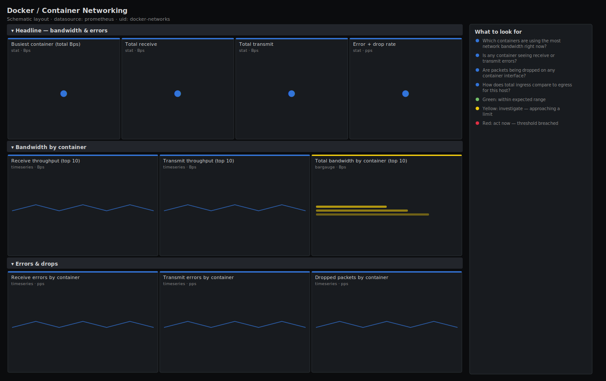

# Docker / Container Networking

> Per-container network throughput, errors and drops for a Docker host scraped by cAdvisor: who the bandwidth hogs are, and whether any container is seeing receive/ transmit errors or dropped packets. The board to open when an app is slow but CPU and memory look fine — the network is the usual silent culprit.

**Primary search phrase:** Docker container networking Grafana dashboard  
**Category:** `docker` · **UID:** `docker-networks` · **Datasource:** Prometheus



## Questions this dashboard answers

- Which containers are using the most network bandwidth right now?
- Is any container seeing receive or transmit errors?
- Are packets being dropped on any container interface?
- How does total ingress compare to egress for this host?

## Production lessons — why this dashboard exists

Network problems hide better than CPU or memory because every utilisation gauge stays green while requests quietly time out. That is why this board leads with both the **top bandwidth talker** and the **error rate** side by side — the talker tells you who might be saturating the bridge, the error rate tells you whether the bridge or NIC is already failing. Drops and errors are the signal that matters: a container moving a lot of bytes is usually fine, but a container with a rising drop rate is losing data, and no other panel on any other dashboard will show you that.

## Data source requirements

- **Prometheus** datasource (selected at import time via `${DS_PROMETHEUS}`).
- `cAdvisor` network counters: `container_network_receive_bytes_total`, `container_network_transmit_bytes_total`, `container_network_receive_errors_total` (plus the standard `container_network_transmit_errors_total` and `container_network_receive_packets_dropped_total` it exports), keyed by the `name` label. Empty-name cgroup series are excluded with `name!=""`.

## Template variables

| Variable | Label | Type | Purpose |
|----------|-------|------|---------|
| `${instance}` | Host | query | cAdvisor instance (Docker host) to inspect. |

## Panels

### Headline — bandwidth & errors

- **Busiest container (total Bps)** (stat, `Bps`) — Highest combined receive+transmit rate of any container.
- **Total receive** (stat, `Bps`) — Aggregate inbound bandwidth across all containers.
- **Total transmit** (stat, `Bps`) — Aggregate outbound bandwidth across all containers.
- **Error + drop rate** (stat, `pps`) — Combined receive errors and drops across all containers — should be zero.

### Bandwidth by container

- **Receive throughput (top 10)** (timeseries, `Bps`) — Inbound bandwidth per container over time.
- **Transmit throughput (top 10)** (timeseries, `Bps`) — Outbound bandwidth per container over time.
- **Total bandwidth by container (top 10)** (bargauge, `Bps`) — Combined rx+tx per container, ranked — find the talker.

### Errors & drops

- **Receive errors by container** (timeseries, `pps`) — Inbound packet errors per container — non-zero means a stressed bridge or NIC.
- **Transmit errors by container** (timeseries, `pps`) — Outbound packet errors per container.
- **Dropped packets by container** (timeseries, `pps`) — Receive drops per container — usually a full socket buffer or overloaded bridge.

## Import

**Grafana UI** — *Dashboards → New → Import*, upload `dashboards/docker/networks.json`, then pick your datasource when prompted.

**API:**

```bash
scripts/import-dashboard.sh dashboards/docker/networks.json
```

**Provisioning** — drop the JSON into a provisioned folder (see [provisioning guide](../../provisioning.md)).

## Recommended alerts

Ready-to-use rules ship in `alerts/docker.rules.yml`.

### ContainerNetworkErrors (`warning`)

```promql
sum by (name, instance) (rate(container_network_receive_errors_total{name!=""}[5m])) + sum by (name, instance) (rate(container_network_transmit_errors_total{name!=""}[5m])) > 1
```

- **Fires after:** `10m`
- **Why it matters:** NIC/bridge errors cause retransmits and tail latency the app feels as slowness, while every utilisation gauge stays green.
- **Investigate:** Open Docker / Container Networking, scope to the host, and check whether one container or all of them are erroring (host NIC versus container).
- **Recovery:** Clears when the error rate returns to zero for 5m.
- **False positives:** A brief burst during container restart or network reconfiguration.

### ContainerPacketDrops (`warning`)

```promql
sum by (name, instance) (rate(container_network_receive_packets_dropped_total{name!=""}[5m])) > 1
```

- **Fires after:** `10m`
- **Why it matters:** Dropped packets mean lost data — the container's socket buffers or the bridge cannot keep up, causing retransmits and stalls.
- **Investigate:** Correlate drops with the bandwidth panel; a talker overwhelming the bridge is the usual cause.
- **Recovery:** Clears when drops return to zero for 5m.
- **False positives:** Momentary drops under a legitimate traffic spike.

### ContainerBandwidthSpike (`info`)

```promql
sum by (name, instance) (rate(container_network_receive_bytes_total{name!=""}[5m])) + sum by (name, instance) (rate(container_network_transmit_bytes_total{name!=""}[5m])) > 1.0e8
```

- **Fires after:** `10m`
- **Why it matters:** A container pushing ~800 Mbps for ten minutes can saturate a 1GbE host link and starve its neighbours.
- **Investigate:** Confirm the traffic is expected (backup, replication) and check the host NIC for saturation.
- **Recovery:** Clears when throughput drops below the threshold for 5m.
- **False positives:** Legitimate bulk transfers — tune the byte threshold to your link speed.

## Troubleshooting

| Symptom | Likely cause | First action |
|---------|--------------|--------------|
| Error and drop panels are always empty | cAdvisor is not exposing the network error/drop counters, or there genuinely are none. | Confirm the counters exist in Explore; healthy hosts legitimately show zero. |
| Bandwidth looks doubled | Per-interface series summed without `by (name)` double-count multi-NIC containers. | Keep the `sum by (name) (rate(...))` shape used here. |
| Busiest-container stat flaps wildly | A short rate window over bursty traffic amplifies noise. | Widen the rate window from 5m to 10m for a smoother headline number. |

## Performance considerations

Network counters are moderate cardinality; `topk(10)` and `sum by (name)` bound every panel. Rates use a 5m window (≥4× a 15s scrape). On hosts with many containers and interfaces, drop per-interface series with metric_relabel_configs to keep cAdvisor scrapes fast.

## Customization

Set the bandwidth-spike threshold to a fraction of your actual link speed (the 100MB/s default assumes 1GbE). Add a `name` filter to focus on one service. Split rx and tx alerts if egress and ingress have different SLAs.

## Related resources

- [Advanced observability guides](https://devopsaitoolkit.com/guides/)
- [Grafana & Prometheus tutorials](https://devopsaitoolkit.com/blog/)
- [AI Incident Response Assistant](https://devopsaitoolkit.com/dashboard/incident-response)
- [PromQL cookbook](../../../promql/README.md) · [Alerting guide](../../alerting.md) · [Dashboard catalog](../../catalog.md)
