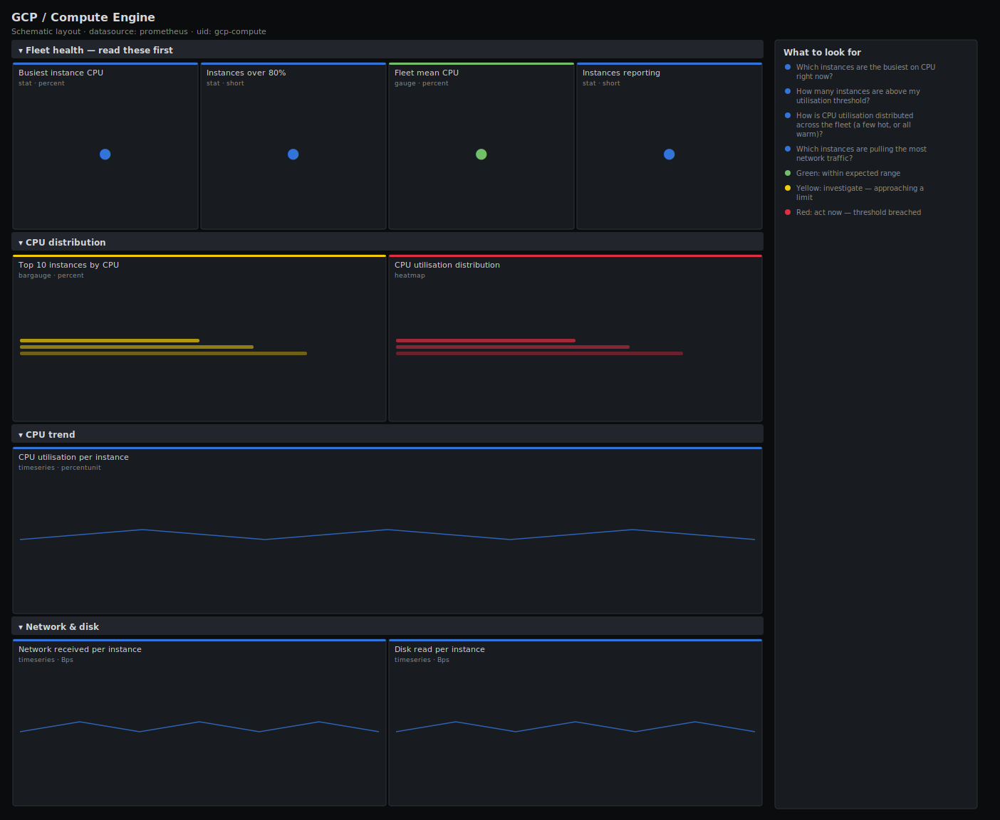

# GCP / Compute Engine

> CPU utilisation, network ingress and disk read throughput for Compute Engine instances exported from Cloud Monitoring (Stackdriver). Answers "which instances are running hottest and how is utilisation distributed across the fleet?" rather than charting one raw counter.

**Primary search phrase:** GCP Compute Engine Grafana dashboard  
**Category:** `gcp` · **UID:** `gcp-compute` · **Datasource:** Prometheus



## Questions this dashboard answers

- Which instances are the busiest on CPU right now?
- How many instances are above my utilisation threshold?
- How is CPU utilisation distributed across the fleet (a few hot, or all warm)?
- Which instances are pulling the most network traffic?
- Is disk read throughput spiking anywhere?

## Production lessons — why this dashboard exists

Cloud Monitoring reports GCE CPU utilisation as a **fraction (0–1)**, and the network/disk metrics are **delta counters** sampled on a delay — so this dashboard converts CPU to a percentage and uses `rate()` on the `_count` series rather than plotting raw deltas. The useful question on a fleet isn't "what's the average" (a few hot instances hide in a calm mean) but "how is utilisation distributed" — so we lead with a top-N and a distribution heatmap. That combo catches the classic case where the autoscaler looks healthy on average while a handful of instances are pinned and dropping requests.

## Data source requirements

- **Prometheus** datasource (selected at import time via `${DS_PROMETHEUS}`).
- `stackdriver_exporter` scraping `compute.googleapis.com` instance metrics (`stackdriver_gce_instance_compute_googleapis_com_instance_cpu_utilization`, `stackdriver_gce_instance_compute_googleapis_com_instance_network_received_bytes_count`, `stackdriver_gce_instance_compute_googleapis_com_instance_disk_read_bytes_count`).
- **Naming/label assumption:** series carry `instance_name`, `zone` and `project_id` labels. CPU utilisation is a fraction (0–1) — multiply by 100 for percent. The `_count` metrics are DELTA types; use `rate()` to get bytes/sec. Cloud Monitoring sampling lags 1–4 minutes.

## Template variables

| Variable | Label | Type | Purpose |
|----------|-------|------|---------|
| `${zone}` | Zone | query | GCE zone(s) to display. |
| `${instance_name}` | Instance | query | Compute Engine instance(s) to display; supports multi-select. |

## Panels

### Fleet health — read these first

- **Busiest instance CPU** (stat, `percent`) — Highest CPU utilisation across the selection (fraction shown as percent).
- **Instances over 80%** (stat, `short`) — Count of instances with CPU utilisation above 80% right now.
- **Fleet mean CPU** (gauge, `percent`) — Mean CPU utilisation across the selection — context for the top-N.
- **Instances reporting** (stat, `short`) — Number of instances currently emitting CPU metrics.

### CPU distribution

- **Top 10 instances by CPU** (bargauge, `percent`) — The hottest instances right now — your scaling and right-sizing candidates.
- **CPU utilisation distribution** (heatmap, `percentunit`) — How instances are spread across utilisation bands over time — a hot tail with a calm mean is the danger pattern.

### CPU trend

- **CPU utilisation per instance** (timeseries, `percentunit`) — Per-instance CPU over time — find the instance pulling away from the pack.

### Network & disk

- **Network received per instance** (timeseries, `Bps`) — Inbound network throughput (rate of the delta counter) per instance.
- **Disk read per instance** (timeseries, `Bps`) — Disk read throughput (rate of the delta counter) per instance — correlate with CPU spikes.

## Import

**Grafana UI** — *Dashboards → New → Import*, upload `dashboards/gcp/compute.json`, then pick your datasource when prompted.

**API:**

```bash
scripts/import-dashboard.sh dashboards/gcp/compute.json
```

**Provisioning** — drop the JSON into a provisioned folder (see [provisioning guide](../../provisioning.md)).

## Recommended alerts

Ready-to-use rules ship in `alerts/gcp.rules.yml`.

### GceInstanceHighCPU (`warning`)

```promql
stackdriver_gce_instance_compute_googleapis_com_instance_cpu_utilization > 0.9
```

- **Fires after:** `15m`
- **Why it matters:** A pinned instance drops or delays work even when the fleet average looks healthy — autoscaling on the mean misses it.
- **Investigate:** Open GCP / Compute Engine; check whether the instance is part of a MIG and whether the autoscaler is reacting.
- **Recovery:** Clears when utilisation falls below 90% for 10m.
- **False positives:** Batch/render instances meant to run pinned — scope by instance_name or label.

### GceFleetCPUSaturated (`warning`)

```promql
avg(stackdriver_gce_instance_compute_googleapis_com_instance_cpu_utilization) by (zone) > 0.85
```

- **Fires after:** `15m`
- **Why it matters:** When the whole zone's average is high there is no headroom to absorb a failure or a traffic spike.
- **Investigate:** Check the distribution heatmap — is it broadly hot or a few extreme outliers dragging the mean?
- **Recovery:** Clears when the zone average falls below 85% for 10m.
- **False positives:** Small fleets where one busy instance swings the average — raise the threshold for tiny groups.

### GceMetricsMissing (`critical`)

```promql
absent(stackdriver_gce_instance_compute_googleapis_com_instance_cpu_utilization)
```

- **Fires after:** `10m`
- **Why it matters:** Missing metrics mean the exporter, its service-account credentials, or the Cloud Monitoring API is broken — you are blind to the fleet.
- **Investigate:** Check the stackdriver_exporter logs for auth/quota errors and verify the service account's monitoring.viewer role.
- **Recovery:** Clears when CPU metrics resume for 10m.
- **False positives:** A scrape gap during an exporter redeploy — the 10m `for` covers routine restarts.

## Troubleshooting

| Symptom | Likely cause | First action |
|---------|--------------|--------------|
| CPU panels show 0–1 instead of 0–100% | The metric is a fraction; a panel used a raw value without ×100. | Multiply by 100 for percent panels (as the headline panels do) or use the `percentunit` unit (as the trend panel does). |
| Network/disk lines are flat or spiky-zero | Plotting the raw delta counter instead of its rate. | Wrap the `_count` metric in `rate(...[5m])`; these are DELTA metrics. |
| All panels "No data" | Wrong metric prefix or the exporter isn't configured for compute.googleapis.com. | Confirm the long metric name in Explore; stackdriver_exporter names vary with its `monitoring.metrics-prefixes` config. |

## Performance considerations

Cloud Monitoring data is 1-minute granularity with a few-minute delay, so a 1m refresh matches it and avoids extra API cost — each scrape calls the Monitoring API, so don't over-refresh. Top-N and counts bound the series; the heatmap reads the raw gauge. Narrow `monitoring.metrics-prefixes` in the exporter and scope `$zone` to control API quota on large projects.

## Customization

Adjust the 0.8/0.9 utilisation thresholds to your autoscaler targets. To track a single managed instance group, scope `$instance_name` with a regex on its name prefix. Add per-project `project_id` filtering if one exporter serves multiple projects.

## Related resources

- [Advanced observability guides](https://devopsaitoolkit.com/guides/)
- [Grafana & Prometheus tutorials](https://devopsaitoolkit.com/blog/)
- [AI Incident Response Assistant](https://devopsaitoolkit.com/dashboard/incident-response)
- [PromQL cookbook](../../../promql/README.md) · [Alerting guide](../../alerting.md) · [Dashboard catalog](../../catalog.md)
