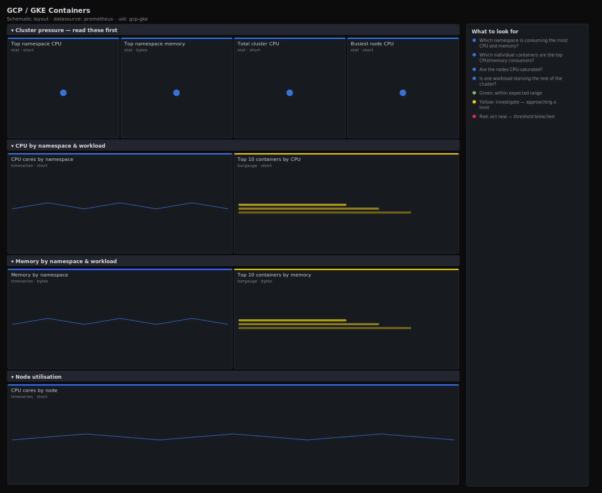

# GCP / GKE Containers

> Container CPU and memory usage by namespace and workload, node CPU pressure and the top consumers in a GKE cluster, exported from Cloud Monitoring (Stackdriver). Answers "which namespace or container is eating the cluster, and are the nodes saturated?" rather than dumping raw container counters.

**Primary search phrase:** GCP GKE Grafana dashboard  
**Category:** `gcp` · **UID:** `gcp-gke` · **Datasource:** Prometheus



## Questions this dashboard answers

- Which namespace is consuming the most CPU and memory?
- Which individual containers are the top CPU/memory consumers?
- Are the nodes CPU-saturated?
- Is one workload starving the rest of the cluster?
- Did a deploy change the cluster's resource profile?

## Production lessons — why this dashboard exists

On GKE the metric that matters is **CPU core usage over time**, exported as a DELTA counter — so this dashboard rates it to cores rather than plotting the raw delta, and aggregates by namespace and workload so you can attribute spend and pressure to a team in one glance. The recurring incident is a single namespace or a runaway container consuming cores and memory until nodes saturate and the scheduler can't place pods; leading with per-namespace totals and a top-N of containers turns "the cluster is slow" into "this workload is the cause" quickly. Node CPU tells you whether to scale the node pool or just right-size a workload.

## Data source requirements

- **Prometheus** datasource (selected at import time via `${DS_PROMETHEUS}`).
- `stackdriver_exporter` scraping `kubernetes.io` metrics for the GKE cluster (`stackdriver_k8s_container_kubernetes_io_container_cpu_core_usage_time`, `stackdriver_k8s_container_kubernetes_io_container_memory_used_bytes`, `stackdriver_k8s_node_kubernetes_io_node_cpu_core_usage_time`).
- **Naming/label assumption:** container series carry `namespace_name`, `pod_name`, `container_name` and `cluster_name`; node series carry `node_name` and `cluster_name`. The `cpu_core_usage_time` metrics are DELTA seconds — wrap in `rate()` to get cores. The memory metric is a gauge in bytes. Metric names follow stackdriver_exporter's `k8s_*_kubernetes_io_*` convention and vary with its prefix config.

## Template variables

| Variable | Label | Type | Purpose |
|----------|-------|------|---------|
| `${cluster_name}` | Cluster | query | GKE cluster(s) to display. |
| `${namespace_name}` | Namespace | query | Namespace(s) to display; supports multi-select. |

## Panels

### Cluster pressure — read these first

- **Top namespace CPU** (stat, `short`) — Highest per-namespace CPU usage (cores) across the selection.
- **Top namespace memory** (stat, `bytes`) — Highest per-namespace memory usage across the selection.
- **Total cluster CPU** (stat, `short`) — Total container CPU usage (cores) across the selection.
- **Busiest node CPU** (stat, `short`) — Highest per-node CPU usage (cores) — context for whether to scale the node pool.

### CPU by namespace & workload

- **CPU cores by namespace** (timeseries, `short`) — Per-namespace CPU usage over time, stacked — attribute cluster CPU to a team or app.
- **Top 10 containers by CPU** (bargauge, `short`) — The biggest CPU consumers right now (namespace / container) — your right-sizing candidates.

### Memory by namespace & workload

- **Memory by namespace** (timeseries, `bytes`) — Per-namespace memory usage over time, stacked — watch for the climb that precedes OOMKills.
- **Top 10 containers by memory** (bargauge, `bytes`) — The biggest memory consumers right now (namespace / container).

### Node utilisation

- **CPU cores by node** (timeseries, `short`) — Per-node CPU usage over time — flat-topping nodes mean the pool needs to scale.

## Import

**Grafana UI** — *Dashboards → New → Import*, upload `dashboards/gcp/gke.json`, then pick your datasource when prompted.

**API:**

```bash
scripts/import-dashboard.sh dashboards/gcp/gke.json
```

**Provisioning** — drop the JSON into a provisioned folder (see [provisioning guide](../../provisioning.md)).

## Recommended alerts

Ready-to-use rules ship in `alerts/gcp.rules.yml`.

### GkeNamespaceHighCPU (`warning`)

```promql
sum by (cluster_name, namespace_name) (rate(stackdriver_k8s_container_kubernetes_io_container_cpu_core_usage_time[5m])) > 8
```

- **Fires after:** `15m`
- **Why it matters:** A namespace consuming an outsized share of cluster CPU can starve other workloads and force the node pool to scale (cost) or fail to schedule pods.
- **Investigate:** Open GCP / GKE Containers; use the top-containers panel to find which workload in the namespace is responsible.
- **Recovery:** Clears when the namespace's CPU usage falls below 8 cores for 10m.
- **False positives:** Batch/CI namespaces meant to burst — raise the threshold or exclude them by namespace.

### GkeContainerHighMemory (`warning`)

```promql
sum by (cluster_name, namespace_name, container_name) (stackdriver_k8s_container_kubernetes_io_container_memory_used_bytes) > 2147483648
```

- **Fires after:** `10m`
- **Why it matters:** A container near or above its memory limit gets OOMKilled and restarts, dropping in-flight work; unbounded growth signals a leak.
- **Investigate:** Check whether usage is plateauing (sized correctly) or climbing (leak); compare against the container's memory limit.
- **Recovery:** Clears when the container's memory falls below 2GiB for 10m.
- **False positives:** Caches and JVMs that intentionally hold large heaps — set the threshold per workload.

### GkeNodeCPUSaturated (`warning`)

```promql
sum by (cluster_name, node_name) (rate(stackdriver_k8s_node_kubernetes_io_node_cpu_core_usage_time[5m])) > 8
```

- **Fires after:** `15m`
- **Why it matters:** A saturated node can't accept new pods and throttles the ones it has — the scheduler then fails placements cluster-wide.
- **Investigate:** Check which pods are bin-packed onto the node and whether the cluster autoscaler is adding nodes.
- **Recovery:** Clears when node CPU usage falls below 8 cores for 10m.
- **False positives:** Large machine types where 8 cores is well within capacity — set the threshold to the node's core count.

## Troubleshooting

| Symptom | Likely cause | First action |
|---------|--------------|--------------|
| CPU panels read in tiny fractions or huge totals | Plotting the raw DELTA counter instead of its rate. | Wrap `cpu_core_usage_time` in `rate(...[5m])`; the result is in cores. |
| Memory panels "No data" | The container memory metric isn't in the exporter's prefix list. | Add `kubernetes.io/container/memory/used_bytes` to the stackdriver_exporter config. |
| Labels like namespace_name are missing | The exporter drops or renames resource labels. | Enable resource-label export and confirm the label names in Explore, then update the queries. |

## Performance considerations

Cloud Monitoring GKE metrics are 1-minute granularity with a delay, so a 1m refresh matches them and avoids extra Monitoring API cost. Every panel aggregates with `sum by (namespace_name|container_name|node_name)` and top-N panels use `topk` to bound cardinality on large clusters. Narrow the exporter's metric prefixes to only the GKE families you need.

## Customization

Set the 8-core namespace/node thresholds to your actual node sizes and the 2GiB memory threshold to your typical limits. Scope `$namespace_name` to a team's namespaces, and add `pod_name` to the top-N legends if you need pod-level rather than container-level attribution.

## Related resources

- [Advanced observability guides](https://devopsaitoolkit.com/guides/)
- [Grafana & Prometheus tutorials](https://devopsaitoolkit.com/blog/)
- [AI Incident Response Assistant](https://devopsaitoolkit.com/dashboard/incident-response)
- [PromQL cookbook](../../../promql/README.md) · [Alerting guide](../../alerting.md) · [Dashboard catalog](../../catalog.md)
