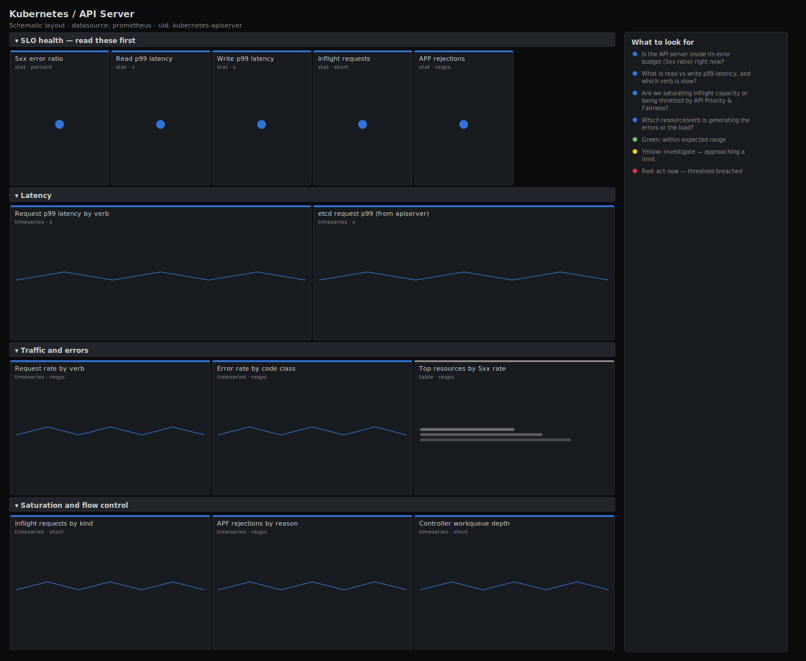

# Kubernetes / API Server

> Request rate, p99 latency, 5xx error ratio and concurrency saturation for the kube-apiserver, plus API Priority & Fairness rejections. Answers "is the control plane serving requests within its SLO, and if not, is it errors, latency or saturation?" rather than dumping raw counters.

**Primary search phrase:** Kubernetes API server Grafana dashboard  
**Category:** `kubernetes` · **UID:** `kubernetes-apiserver` · **Datasource:** Prometheus



## Questions this dashboard answers

- Is the API server inside its error budget (5xx ratio) right now?
- What is read vs write p99 latency, and which verb is slow?
- Are we saturating inflight capacity or being throttled by API Priority & Fairness?
- Which resource/verb is generating the errors or the load?
- Is slow etcd showing up as API server latency?

## Production lessons — why this dashboard exists

Nearly every "the cluster feels slow" incident lands on the API server first, because controllers, kubelets and kubectl all funnel through it. Averages hide the problem, so this dashboard leads with the **5xx error ratio** and **read/write p99** computed from native histograms, not means. The most common root cause is not the API server itself but **etcd**: when WAL fsync or backend commit slows, LIST/WATCH latency climbs and the apiserver starts shedding load via API Priority & Fairness — so inflight saturation and APF rejections sit right next to latency here. WATCH and CONNECT verbs are excluded from latency math because they are long-lived by design and would otherwise poison the quantiles.

## Data source requirements

- **Prometheus** datasource (selected at import time via `${DS_PROMETHEUS}`).
- `kube-apiserver` metrics endpoint (the `apiserver_request_total`, `apiserver_request_duration_seconds_bucket`, `apiserver_current_inflight_requests` and `apiserver_flowcontrol_rejected_requests_total` series).
- `etcd_request_duration_seconds_bucket` exported by the apiserver for the etcd round-trip view.

## Template variables

| Variable | Label | Type | Purpose |
|----------|-------|------|---------|
| `${job}` | Job | query | Prometheus scrape job for the kube-apiserver targets. |
| `${instance}` | Instance | query | API server instance(s); supports multi-select for HA control planes. |

## Panels

### SLO health — read these first

- **5xx error ratio** (stat, `percent`) — Share of API requests returning a server error (code 5xx). The primary SLI.
- **Read p99 latency** (stat, `s`) — 99th percentile latency for GET/LIST requests (WATCH/CONNECT excluded).
- **Write p99 latency** (stat, `s`) — 99th percentile latency for POST/PUT/PATCH/DELETE requests.
- **Inflight requests** (stat, `short`) — Current concurrent requests in flight (mutating + read-only). Saturation signal.
- **APF rejections** (stat, `reqps`) — Requests dropped by API Priority & Fairness — the apiserver is shedding load.

### Latency

- **Request p99 latency by verb** (timeseries, `s`) — Per-verb 99th percentile. Diverging verbs point at a specific access pattern (e.g. expensive LISTs).
- **etcd request p99 (from apiserver)** (timeseries, `s`) — Round-trip latency the apiserver sees talking to etcd, by operation. Slow etcd surfaces here first.

### Traffic and errors

- **Request rate by verb** (timeseries, `reqps`) — Throughput per verb. A sudden LIST/WATCH spike is a classic controller hot-loop signature.
- **Error rate by code class** (timeseries, `reqps`) — 4xx (client) vs 5xx (server) request rates. 5xx is yours to fix; sustained 4xx points at a misbehaving client.
- **Top resources by 5xx rate** (table, `reqps`) — Which resource/verb pairs are throwing server errors — the place to start a root-cause hunt.

### Saturation and flow control

- **Inflight requests by kind** (timeseries, `short`) — Concurrent mutating vs read-only requests. Hitting the configured max-requests limit triggers APF rejections.
- **APF rejections by reason** (timeseries, `reqps`) — Why requests are being dropped (queue full vs concurrency limit) and in which priority level.
- **Controller workqueue depth** (timeseries, `short`) — Backlog in apiserver-side workqueues. A growing depth means a controller can't keep up with events.

## Import

**Grafana UI** — *Dashboards → New → Import*, upload `dashboards/kubernetes/apiserver.json`, then pick your datasource when prompted.

**API:**

```bash
scripts/import-dashboard.sh dashboards/kubernetes/apiserver.json
```

**Provisioning** — drop the JSON into a provisioned folder (see [provisioning guide](../../provisioning.md)).

## Recommended alerts

Ready-to-use rules ship in `alerts/kubernetes.rules.yml`.

### APIServerHighErrorRate (`critical`)

```promql
100 * sum by (job) (rate(apiserver_request_total{code=~"5.."}[5m])) / sum by (job) (rate(apiserver_request_total[5m])) > 5
```

- **Fires after:** `5m`
- **Why it matters:** A high server-error ratio means controllers, kubelets and operators are failing their API calls — the cluster stops converging.
- **Investigate:** Open Kubernetes / API Server, check the error-rate-by-code panel and the Top resources by 5xx table to isolate the resource/verb.
- **Recovery:** Clears when the 5xx ratio stays below 5% for 5m.
- **False positives:** A single failing admission webhook can spike 5xx briefly during a rollout; confirm it is sustained.

### APIServerHighReadLatency (`warning`)

```promql
histogram_quantile(0.99, sum by (le, job) (rate(apiserver_request_duration_seconds_bucket{verb=~"GET|LIST"}[5m]))) > 1
```

- **Fires after:** `10m`
- **Why it matters:** Slow reads back up controllers and kubectl, and usually signal etcd pressure or an expensive unindexed LIST.
- **Investigate:** Compare with the etcd request p99 panel; if etcd is slow the fix is on etcd, otherwise look for high-cardinality LISTs without field selectors.
- **Recovery:** Clears when read p99 falls below 1s for 5m.
- **False positives:** Large one-off LISTs (backups, migrations) can lift p99 transiently.

### APIServerFlowControlRejecting (`warning`)

```promql
sum by (job) (rate(apiserver_flowcontrol_rejected_requests_total[5m])) > 0
```

- **Fires after:** `10m`
- **Why it matters:** APF rejections mean the apiserver is at its concurrency limit and shedding load; some clients are getting 429s.
- **Investigate:** Open the APF rejections by reason panel to see which priority level and reason (queue full vs concurrency limit) dominate.
- **Recovery:** Clears when no rejections are seen for 5m.
- **False positives:** Brief rejections during a thundering-herd controller restart are expected and self-resolve.

## Troubleshooting

| Symptom | Likely cause | First action |
|---------|--------------|--------------|
| All panels show "No data" | Wrong `$job`, or apiserver metrics not scraped (RBAC on /metrics). | Check `up{job="$job"}` in Explore and confirm the scrape target has a bearer token with the `nonResourceURLs: /metrics` permission. |
| Latency quantiles look absurdly high (hundreds of seconds) | WATCH/CONNECT verbs leaked into the histogram aggregation. | Keep the `verb!~"WATCH\|CONNECT"` selector; those streams are long-lived by design. |
| Error ratio panel is blank but traffic exists | No 5xx in the window, so the numerator is empty and the division yields no series. | This is healthy — the ratio is effectively zero; widen the time range to confirm. |

## Performance considerations

All rates use a 5m window (>=4x a 30s scrape) so counters survive an apiserver restart. Quantiles aggregate the histogram with `sum by (le, ...)` before `histogram_quantile`, which is the only correct order and keeps series bounded. On large clusters the request-rate-by-verb panel can be heavy; back it with a `verb:apiserver_request_total:rate5m` recording rule if render time suffers.

## Customization

Tune the 1%/5% error and 0.5s/1s latency thresholds to your control-plane SLO. To watch a single apiserver replica, deselect the others in `$instance`. If you run a custom APF configuration, add a `$priority_level` variable and scope the saturation row to the priority levels you care about.

## Related resources

- [Advanced observability guides](https://devopsaitoolkit.com/guides/)
- [Grafana & Prometheus tutorials](https://devopsaitoolkit.com/blog/)
- [AI Incident Response Assistant](https://devopsaitoolkit.com/dashboard/incident-response)
- [PromQL cookbook](../../../promql/README.md) · [Alerting guide](../../alerting.md) · [Dashboard catalog](../../catalog.md)
