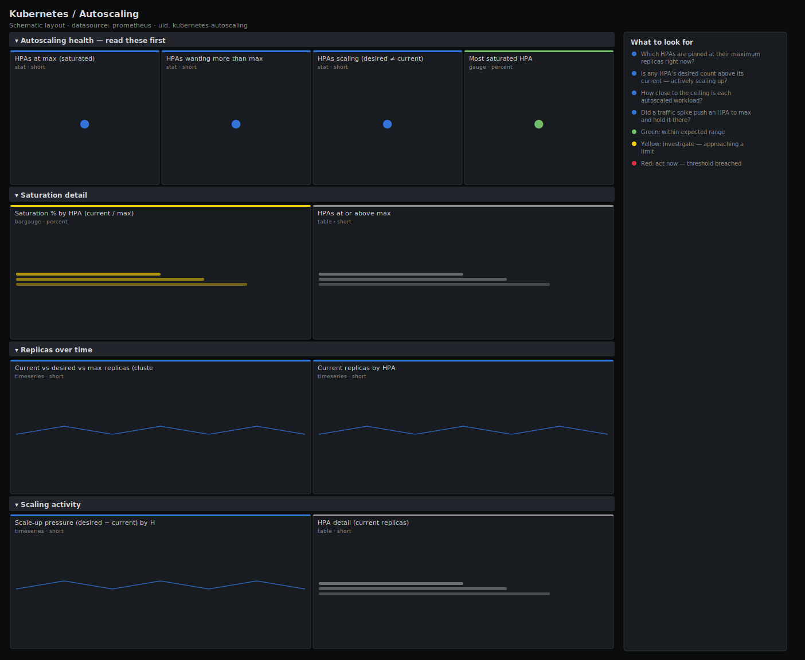

# Kubernetes / Autoscaling

> HorizontalPodAutoscaler behaviour: current versus desired versus maximum replicas, which HPAs are pinned at their ceiling (out of room to scale), and where scaling is actively happening. Answers "is autoscaling keeping up, or has it maxed out and started dropping load?" from kube-state-metrics.

**Primary search phrase:** Kubernetes HPA autoscaling Grafana dashboard  
**Category:** `kubernetes` · **UID:** `kubernetes-autoscaling` · **Datasource:** Prometheus



## Questions this dashboard answers

- Which HPAs are pinned at their maximum replicas right now?
- Is any HPA's desired count above its current — actively scaling up?
- How close to the ceiling is each autoscaled workload?
- Did a traffic spike push an HPA to max and hold it there?

## Production lessons — why this dashboard exists

An HPA pinned at its maximum is the quiet failure of autoscaling: it has done all it can and is now silently shedding load — latency and queue depth climb while the HPA reports "working as configured". The number that matters is desired vs max, not current vs target: once desired wants more than max allows, the cap is the bottleneck and only a human raising the limit (or adding cluster capacity) helps. This dashboard leads with the count of HPAs at their ceiling and how saturated each is, so you catch a maxed-out autoscaler before users do. The second trap it covers: an HPA that wants to scale up but cannot because the cluster has no schedulable capacity — desired rises, current does not follow, and the pods sit Pending.

## Data source requirements

- **Prometheus** datasource (selected at import time via `${DS_PROMETHEUS}`).
- `kube-state-metrics` for HPA state (`kube_horizontalpodautoscaler_status_current_replicas`, `kube_horizontalpodautoscaler_status_desired_replicas`, `kube_horizontalpodautoscaler_spec_max_replicas`).

## Template variables

| Variable | Label | Type | Purpose |
|----------|-------|------|---------|
| `${cluster}` | Cluster | query | Cluster to scope to. Select All on single-cluster setups. |
| `${namespace}` | Namespace | query | Namespace(s) to inspect; supports multi-select. |

## Panels

### Autoscaling health — read these first

- **HPAs at max (saturated)** (stat, `short`) — HPAs whose current replicas have reached their configured maximum — out of room to scale up.
- **HPAs wanting more than max** (stat, `short`) — HPAs whose desired replicas exceed their maximum — the cap is actively limiting them and shedding load.
- **HPAs scaling (desired ≠ current)** (stat, `short`) — HPAs whose desired and current replica counts differ — a scale-up or scale-down is in progress.
- **Most saturated HPA** (gauge, `percent`) — Highest current-vs-max ratio across all HPAs — the autoscaler closest to its ceiling.

### Saturation detail

- **Saturation % by HPA (current / max)** (bargauge, `percent`) — How much of each HPA's replica budget is in use. At 100% the autoscaler has no room left.
- **HPAs at or above max** (table, `short`) — Autoscalers pinned at their ceiling — raise maxReplicas or add capacity, or accept that load is being shed here.

### Replicas over time

- **Current vs desired vs max replicas (cluster total)** (timeseries, `short`) — Aggregate autoscaled replicas. Desired riding the max line means HPAs collectively want more than the cap allows.
- **Current replicas by HPA** (timeseries, `short`) — Per-HPA replica count over time — the shape of each autoscaler's scaling events. Flat-topped at max is a saturated HPA.

### Scaling activity

- **Scale-up pressure (desired − current) by HPA** (timeseries, `short`) — Positive values mean the HPA wants more replicas than it currently has — actively scaling up or blocked from doing so.
- **HPA detail (current replicas)** (table, `short`) — Current replica count per HPA — the snapshot for capacity reviews and tuning maxReplicas.

## Import

**Grafana UI** — *Dashboards → New → Import*, upload `dashboards/kubernetes/autoscaling.json`, then pick your datasource when prompted.

**API:**

```bash
scripts/import-dashboard.sh dashboards/kubernetes/autoscaling.json
```

**Provisioning** — drop the JSON into a provisioned folder (see [provisioning guide](../../provisioning.md)).

## Recommended alerts

Ready-to-use rules ship in `alerts/kubernetes.rules.yml`.

### KubeHPAMaxedOut (`warning`)

```promql
kube_horizontalpodautoscaler_status_current_replicas >= kube_horizontalpodautoscaler_spec_max_replicas
```

- **Fires after:** `15m`
- **Why it matters:** An HPA at its ceiling has exhausted its ability to scale — any further load increase is absorbed as higher latency or dropped requests, not more pods.
- **Investigate:** Check the workload's latency and queue depth; confirm whether real demand has risen or a metric is mis-scaled, pushing the HPA up.
- **Recovery:** Clears when current replicas fall below max for 5m.
- **False positives:** Workloads where max is set deliberately as a hard cost ceiling and being capped is the intended behaviour.

### KubeHPADesiredAboveMax (`critical`)

```promql
kube_horizontalpodautoscaler_status_desired_replicas > kube_horizontalpodautoscaler_spec_max_replicas
```

- **Fires after:** `10m`
- **Why it matters:** When desired exceeds max, the autoscaler is explicitly asking for capacity it is not allowed to create — the cap is now the direct cause of under-provisioning.
- **Investigate:** This is unambiguous: the metric target says scale further but maxReplicas forbids it. Verify cluster headroom before raising the cap.
- **Recovery:** Clears when desired no longer exceeds max for 5m.
- **False positives:** Brief spikes during a sharp traffic burst that settle within minutes — raise `for` for very spiky workloads.

## Troubleshooting

| Symptom | Likely cause | First action |
|---------|--------------|--------------|
| Desired stays above current for a long time | HPA wants to scale up but pods are Pending for lack of cluster capacity | Check Kubernetes / Cluster Capacity and Pods — add nodes or free capacity. |
| Saturation panels empty | No HorizontalPodAutoscaler objects in $namespace | Expected on clusters without HPAs; set $namespace to All to confirm. |
| Current above max momentarily | maxReplicas was just lowered below the running count | The HPA will scale down to the new max shortly; transient. |

## Performance considerations

All panels read three kube-state-metrics gauges per HPA with no rate windows, so cost scales only with the number of HPAs — trivial on almost any cluster. Tables and the scale-pressure panel filter with comparisons (`>=`, `!= 0`) so only the relevant HPAs render. `clamp_min(max, 1)` guards the saturation ratio against an HPA with a zero or missing max.

## Customization

Tune the 80%/100% saturation bands to how much replica headroom you want before paging. Add a `horizontalpodautoscaler=~"..."` selector to focus on one service. To correlate scaling with the signal driving it, place this dashboard beside the workload's own latency/throughput dashboard and align the time ranges.

## Related resources

- [Advanced observability guides](https://devopsaitoolkit.com/guides/)
- [Grafana & Prometheus tutorials](https://devopsaitoolkit.com/blog/)
- [AI Incident Response Assistant](https://devopsaitoolkit.com/dashboard/incident-response)
- [PromQL cookbook](../../../promql/README.md) · [Alerting guide](../../alerting.md) · [Dashboard catalog](../../catalog.md)
