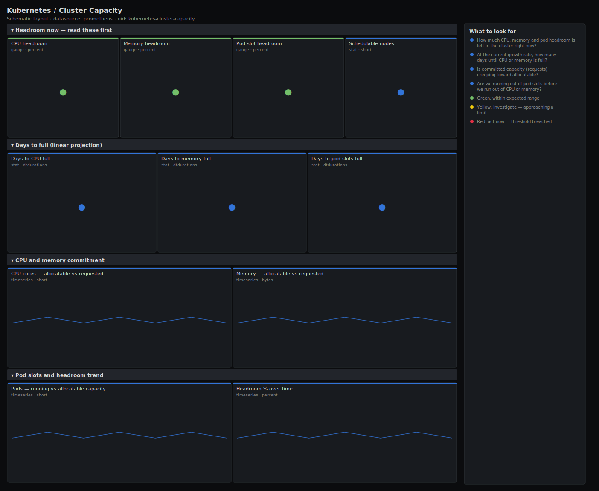

# Kubernetes / Cluster Capacity

> Capacity-planning view for a cluster: how much CPU, memory and pod headroom is left between what nodes can allocate and what is already committed, plus a linear projection of how many days until each dimension fills at the current growth rate. Answers "do we need to add nodes, and by when?" before Pending pods force the question.

**Primary search phrase:** Kubernetes cluster capacity planning Grafana dashboard  
**Category:** `kubernetes` · **UID:** `kubernetes-cluster-capacity` · **Datasource:** Prometheus



## Questions this dashboard answers

- How much CPU, memory and pod headroom is left in the cluster right now?
- At the current growth rate, how many days until CPU or memory is full?
- Is committed capacity (requests) creeping toward allocatable?
- Are we running out of pod slots before we run out of CPU or memory?

## Production lessons — why this dashboard exists

Capacity runs out as a request that suddenly will not schedule, and by then the fix — provisioning and joining nodes — takes longer than the incident allows. The job of this dashboard is to make "we will be full in N days" visible weeks ahead. It leads with current headroom across all three schedulable dimensions — CPU, memory and pod count — because clusters often hit the pod-count ceiling (default 110/node) long before CPU or memory, and teams that only watch CPU get blindsided. The days-to-full projection uses a linear fit over the last several hours: it is a trend indicator, not a promise, and a single large rollout will skew it — read it alongside the headroom trend, not on its own.

## Data source requirements

- **Prometheus** datasource (selected at import time via `${DS_PROMETHEUS}`).
- `kube-state-metrics` for allocatable capacity, committed requests and pod phase (`kube_node_status_allocatable`, `kube_node_status_capacity`, `kube_pod_container_resource_requests`, `kube_pod_status_phase`, `kube_node_spec_unschedulable`).

## Template variables

| Variable | Label | Type | Purpose |
|----------|-------|------|---------|
| `${cluster}` | Cluster | query | Cluster to scope to. Select All on single-cluster setups. |

## Panels

### Headroom now — read these first

- **CPU headroom** (gauge, `percent`) — Allocatable CPU not yet committed to requests, as a percentage. Low headroom means the next pod may not schedule.
- **Memory headroom** (gauge, `percent`) — Allocatable memory not yet committed to requests, as a percentage.
- **Pod-slot headroom** (gauge, `percent`) — Free pod slots as a percentage of total allocatable pod capacity. Clusters often hit this ceiling before CPU or memory.
- **Schedulable nodes** (stat, `short`) — Nodes that are not cordoned — the pool the scheduler can actually place new pods on.

### Days to full (linear projection)

- **Days to CPU full** (stat, `dtdurations`) — Projected time until CPU requests reach allocatable, from a linear fit of the last 6 hours. A trend estimate, not a guarantee.
- **Days to memory full** (stat, `dtdurations`) — Projected time until memory requests reach allocatable, from a linear fit of the last 6 hours.
- **Days to pod-slots full** (stat, `dtdurations`) — Projected time until running pods reach allocatable pod capacity, from a linear fit of the last 6 hours.

### CPU and memory commitment

- **CPU cores — allocatable vs requested** (timeseries, `short`) — The gap between these lines is your CPU headroom. When they meet, scheduling stops.
- **Memory — allocatable vs requested** (timeseries, `bytes`) — The gap between these lines is your memory headroom in bytes.

### Pod slots and headroom trend

- **Pods — running vs allocatable capacity** (timeseries, `short`) — Running pods against total pod capacity. The pod-count ceiling (default 110/node) is the limit teams forget to watch.
- **Headroom % over time** (timeseries, `percent`) — CPU, memory and pod headroom trended together — the shape that tells you whether you are filling steadily or in steps.

## Import

**Grafana UI** — *Dashboards → New → Import*, upload `dashboards/kubernetes/cluster-capacity.json`, then pick your datasource when prompted.

**API:**

```bash
scripts/import-dashboard.sh dashboards/kubernetes/cluster-capacity.json
```

**Provisioning** — drop the JSON into a provisioned folder (see [provisioning guide](../../provisioning.md)).

## Recommended alerts

Ready-to-use rules ship in `alerts/kubernetes.rules.yml`.

### KubeClusterCPUHeadroomLow (`warning`)

```promql
100 * (1 - sum(kube_pod_container_resource_requests{resource="cpu"}) / sum(kube_node_status_allocatable{resource="cpu"})) < 10
```

- **Fires after:** `30m`
- **Why it matters:** Under 10% headroom the cluster cannot absorb a rolling update, a node failure, or an autoscaling event without producing Pending pods.
- **Investigate:** Open the commitment timeseries and Kubernetes / Namespaces to see whether growth is real demand or over-sized requests.
- **Recovery:** Clears when CPU headroom returns above 10% for 5m.
- **False positives:** Intentionally tightly packed clusters that run a separate burst pool — exclude that pool from the sums.

### KubeClusterPodSlotsLow (`warning`)

```promql
100 * (1 - sum(kube_pod_status_phase{phase="Running"}) / sum(kube_node_status_allocatable{resource="pods"})) < 10
```

- **Fires after:** `30m`
- **Why it matters:** Pods have a hard per-node cap (default 110); hitting it produces Pending pods even when CPU and memory look plentiful — a failure mode CPU-only dashboards miss.
- **Investigate:** Check pods-per-node in Kubernetes / Nodes; many tiny pods can exhaust slots while leaving resources idle.
- **Recovery:** Clears when pod-slot headroom returns above 10% for 5m.
- **False positives:** Short bursts of completed Job pods inflating the running count before they are garbage-collected.

## Troubleshooting

| Symptom | Likely cause | First action |
|---------|--------------|--------------|
| Days-to-full shows years or a flat huge value | Requests are flat or shrinking | Expected when not growing — read it as "ample headroom" |
| Days-to-full is "No data" | Less than 6 hours of history | The projection needs a 6h window — wait for data to accumulate. |
| Headroom negative | Requests exceed allocatable (overcommit beyond capacity) | The cluster is already over-full on requests; expect Pending pods and add capacity now. |

## Performance considerations

Headroom and commitment panels are simple cluster-wide sums — cheap at any scale. The projection uses `deriv(...[6h:30m])`, a subquery evaluated every 30 minutes over 6 hours; it is the most expensive query here, so the dashboard defaults to a 1m refresh and a 24h window rather than tight, frequent refreshes.

## Customization

Tune the 10%/25% headroom bands to your provisioning lead time — set yellow to the headroom you can rebuild before it runs out. Widen the `[6h:30m]` projection window for steadier, slower-moving estimates. To plan a single node pool, filter the allocatable sums by your pool label.

## Related resources

- [Advanced observability guides](https://devopsaitoolkit.com/guides/)
- [Grafana & Prometheus tutorials](https://devopsaitoolkit.com/blog/)
- [AI Incident Response Assistant](https://devopsaitoolkit.com/dashboard/incident-response)
- [PromQL cookbook](../../../promql/README.md) · [Alerting guide](../../alerting.md) · [Dashboard catalog](../../catalog.md)
