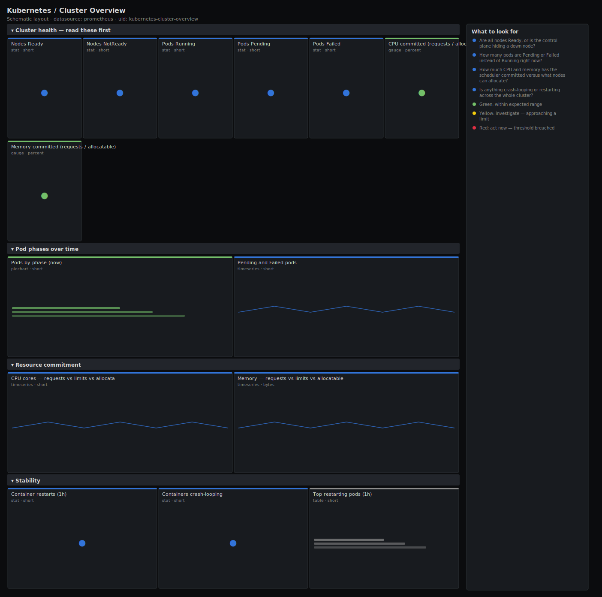

# Kubernetes / Cluster Overview

> One screen that answers "is this cluster healthy right now?" — nodes ready, pods running vs pending vs failed, how much CPU and memory is committed against what the nodes can allocate, and whether containers are crash-looping. Built from kube-state-metrics so it works on any conformant cluster.

**Primary search phrase:** Kubernetes cluster overview Grafana dashboard  
**Category:** `kubernetes` · **UID:** `kubernetes-cluster-overview` · **Datasource:** Prometheus



## Questions this dashboard answers

- Are all nodes Ready, or is the control plane hiding a down node?
- How many pods are Pending or Failed instead of Running right now?
- How much CPU and memory has the scheduler committed versus what nodes can allocate?
- Is anything crash-looping or restarting across the whole cluster?

## Production lessons — why this dashboard exists

Most "the cluster is broken" pages are actually one of four things: a NotReady node, a wave of Pending pods (no schedulable capacity), a Failed/CrashLoop workload, or commitment creeping past allocatable so the scheduler quietly stops placing pods. This dashboard leads with those four signals as headline stats so an on-call engineer can triage in five seconds, then drills into phase breakdown and resource commitment. The commitment gauges are the early warning the others lack: once CPU or memory requests pass ~90% of allocatable, the next Pending pod is inevitable.

## Data source requirements

- **Prometheus** datasource (selected at import time via `${DS_PROMETHEUS}`).
- `kube-state-metrics` for node conditions, pod phases, container restarts and resource requests/limits (`kube_node_*`, `kube_pod_*`).
- `cAdvisor`/kubelet is not required here — every panel is kube-state-metrics so the dashboard renders even when node metrics are missing.

## Template variables

| Variable | Label | Type | Purpose |
|----------|-------|------|---------|
| `${cluster}` | Cluster | query | Cluster to scope to. Select All on single-cluster setups (the label may be empty). |

## Panels

### Cluster health — read these first

- **Nodes Ready** (stat, `short`) — Nodes reporting the Ready condition as true.
- **Nodes NotReady** (stat, `short`) — Nodes that exist but are not reporting Ready — a down or cordoned-off kubelet.
- **Pods Running** (stat, `short`) — Pods currently in the Running phase across all namespaces.
- **Pods Pending** (stat, `short`) — Pods stuck in Pending — usually unschedulable for lack of CPU/memory or a missing volume.
- **Pods Failed** (stat, `short`) — Pods in the Failed phase — terminated with a non-zero exit and not restarted.
- **CPU committed (requests / allocatable)** (gauge, `percent`) — Sum of pod CPU requests as a share of total allocatable CPU. Above ~90% the scheduler runs out of room.
- **Memory committed (requests / allocatable)** (gauge, `percent`) — Sum of pod memory requests as a share of total allocatable memory.

### Pod phases over time

- **Pods by phase (now)** (piechart, `short`) — Share of pods in each lifecycle phase. A healthy cluster is almost entirely Running.
- **Pending and Failed pods** (timeseries, `short`) — Trend of not-Running pods. A rising Pending line means the cluster is out of schedulable capacity.

### Resource commitment

- **CPU cores — requests vs limits vs allocatable** (timeseries, `short`) — Cluster-wide CPU commitment. When requests meet allocatable, scheduling stalls; limits above allocatable risk node CPU contention.
- **Memory — requests vs limits vs allocatable** (timeseries, `bytes`) — Cluster-wide memory commitment in bytes.

### Stability

- **Container restarts (1h)** (stat, `short`) — Total container restarts across the cluster in the last hour.
- **Containers crash-looping** (stat, `short`) — Containers currently waiting in CrashLoopBackOff.
- **Top restarting pods (1h)** (table, `short`) — Pods accumulating the most container restarts in the last hour — start crash investigations here.

## Import

**Grafana UI** — *Dashboards → New → Import*, upload `dashboards/kubernetes/cluster-overview.json`, then pick your datasource when prompted.

**API:**

```bash
scripts/import-dashboard.sh dashboards/kubernetes/cluster-overview.json
```

**Provisioning** — drop the JSON into a provisioned folder (see [provisioning guide](../../provisioning.md)).

## Recommended alerts

Ready-to-use rules ship in `alerts/kubernetes.rules.yml`.

### KubeClusterNodeNotReady (`critical`)

```promql
count(kube_node_info) - sum(kube_node_status_condition{condition="Ready", status="true"}) > 0
```

- **Fires after:** `5m`
- **Why it matters:** A NotReady node has stopped scheduling and its pods will be evicted, shrinking capacity and risking cascading Pending pods.
- **Investigate:** Open Kubernetes / Nodes, find the NotReady node, then check kubelet, container runtime and node pressure conditions.
- **Recovery:** Clears when every node reports Ready for 5m.
- **False positives:** Brief NotReady during a planned reboot or autoscaler scale-down — raise `for` or exclude cordoned nodes.

### KubeClusterPodsPending (`warning`)

```promql
sum(kube_pod_status_phase{phase="Pending"}) > 10
```

- **Fires after:** `15m`
- **Why it matters:** Sustained Pending pods mean the scheduler cannot place work — usually exhausted CPU/memory allocatable or unsatisfiable affinity.
- **Investigate:** Check the CPU/memory committed gauges; if near 100%, the cluster is full. Otherwise inspect pod events for taints/affinity/volume errors.
- **Recovery:** Clears when Pending falls to 10 or fewer for 5m.
- **False positives:** Large rollouts or batch jobs that briefly queue before nodes scale up.

### KubeClusterCPUOvercommitted (`warning`)

```promql
100 * sum(kube_pod_container_resource_requests{resource="cpu"}) / sum(kube_node_status_allocatable{resource="cpu"}) > 90
```

- **Fires after:** `15m`
- **Why it matters:** With requests above 90% of allocatable there is almost no room for the next pod, restart or rolling update — the cluster is one deploy from Pending.
- **Investigate:** Open the resource commitment row; identify namespaces with oversized requests in Kubernetes / Namespaces.
- **Recovery:** Clears when committed CPU drops below 90% for 5m.
- **False positives:** Intentionally densely packed clusters running with headroom reserved elsewhere.

## Troubleshooting

| Symptom | Likely cause | First action |
|---------|--------------|--------------|
| All stats show "No data" | kube-state-metrics is not scraped or the `cluster` label differs | Verify `up{job=~".*kube-state-metrics.*"}` in Explore and set $cluster to All. |
| Committed % above 100 | Limits or requests defined larger than node allocatable (overcommit) | Expected in burstable clusters — compare requests (scheduling) with usage in Kubernetes / Workload Resources. |
| Nodes Ready is 0 but pods run | `kube_node_status_condition` collapsed by a recording rule that dropped the status label | Point the dashboard at raw kube-state-metrics series. |

## Performance considerations

Every panel aggregates with `sum`/`count` so series count stays tiny regardless of cluster size — this dashboard is cheap even at thousands of pods. The restart table uses `topk(15, ...)` to cap rows. Restart counters use `increase(...[1h])` so a single counter reset across a pod restart does not distort the total.

## Customization

Tune the 75/90% commitment thresholds to your packing target. To watch a single team, swap the cluster-wide sums for `sum by (namespace)` and add a namespace variable. On multi-cluster Thanos/Mimir setups, set $cluster to the external label your federation adds.

## Related resources

- [Advanced observability guides](https://devopsaitoolkit.com/guides/)
- [Grafana & Prometheus tutorials](https://devopsaitoolkit.com/blog/)
- [AI Incident Response Assistant](https://devopsaitoolkit.com/dashboard/incident-response)
- [PromQL cookbook](../../../promql/README.md) · [Alerting guide](../../alerting.md) · [Dashboard catalog](../../catalog.md)
