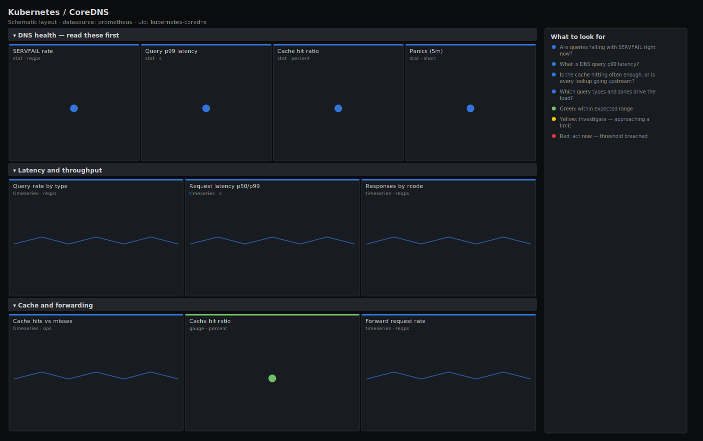

# Kubernetes / CoreDNS

> Query rate by type, response codes (SERVFAIL/NXDOMAIN), request latency (p99), cache hit ratio and panics for CoreDNS. Answers "is cluster DNS healthy and fast?" so you can rule DNS in or out of a service incident in seconds.

**Primary search phrase:** CoreDNS Grafana dashboard  
**Category:** `kubernetes` · **UID:** `kubernetes-coredns` · **Datasource:** Prometheus



## Questions this dashboard answers

- Are queries failing with SERVFAIL right now?
- What is DNS query p99 latency?
- Is the cache hitting often enough, or is every lookup going upstream?
- Which query types and zones drive the load?
- Has any CoreDNS instance panicked?

## Production lessons — why this dashboard exists

"Intermittent timeouts across half our services" is, more often than anyone admits, a CoreDNS problem — so this dashboard leads with the three signals that prove it: **SERVFAIL rate** (real resolution failures), **p99 latency** (the tail that turns into app timeouts) and **cache hit ratio** (the lever that protects upstream resolvers). A collapsing cache hit ratio means more traffic to upstream DNS and a latency cliff; a rising SERVFAIL usually means upstream resolvers or the forward plugin are unhealthy. NXDOMAIN is shown separately because it is normal background noise (search-domain expansion) and should not be mistaken for failure. Panics are rare but fatal to that instance, so they sit in the lead row too.

## Data source requirements

- **Prometheus** datasource (selected at import time via `${DS_PROMETHEUS}`).
- `coredns` metrics endpoint (the `coredns_dns_requests_total`, `coredns_dns_responses_total`, `coredns_dns_request_duration_seconds_bucket`, `coredns_cache_hits_total`, `coredns_cache_misses_total` and `coredns_panics_total` series).

## Template variables

| Variable | Label | Type | Purpose |
|----------|-------|------|---------|
| `${job}` | Job | query | Prometheus scrape job for the CoreDNS pods. |
| `${instance}` | Instance | query | CoreDNS instance(s); supports multi-select. |

## Panels

### DNS health — read these first

- **SERVFAIL rate** (stat, `reqps`) — Responses returning SERVFAIL — genuine resolution failures (not NXDOMAIN). The primary DNS error signal.
- **Query p99 latency** (stat, `s`) — 99th percentile request duration. The tail that becomes application timeouts.
- **Cache hit ratio** (stat, `percent`) — Share of queries answered from cache. A low ratio pushes load onto upstream resolvers and raises latency.
- **Panics (5m)** (stat, `short`) — CoreDNS panics in the last 5 minutes. Any panic kills that instance's serving until it restarts.

### Latency and throughput

- **Query rate by type** (timeseries, `reqps`) — Requests per second by record type (A/AAAA/SRV/PTR...). A surge in one type points at a specific client behaviour.
- **Request latency p50/p99** (timeseries, `s`) — Median vs tail latency. A widening gap means cache misses or a slow upstream forwarder.
- **Responses by rcode** (timeseries, `reqps`) — Response code mix. NOERROR is healthy, NXDOMAIN is usually benign search-domain noise, SERVFAIL is the one to chase.

### Cache and forwarding

- **Cache hits vs misses** (timeseries, `ops`) — Absolute cache hit and miss rates. Misses are the traffic that reaches upstream resolvers.
- **Cache hit ratio** (gauge, `percent`) — Cache effectiveness right now. Below ~70% the upstream forwarder usually becomes the latency bottleneck.
- **Forward request rate** (timeseries, `reqps`) — Queries CoreDNS forwarded upstream. Tracks cache misses and exposes upstream dependency load.

## Import

**Grafana UI** — *Dashboards → New → Import*, upload `dashboards/kubernetes/coredns.json`, then pick your datasource when prompted.

**API:**

```bash
scripts/import-dashboard.sh dashboards/kubernetes/coredns.json
```

**Provisioning** — drop the JSON into a provisioned folder (see [provisioning guide](../../provisioning.md)).

## Recommended alerts

Ready-to-use rules ship in `alerts/kubernetes.rules.yml`.

### CoreDNSHighServfailRate (`critical`)

```promql
100 * sum by (job) (rate(coredns_dns_responses_total{rcode="SERVFAIL"}[5m])) / sum by (job) (rate(coredns_dns_responses_total[5m])) > 2
```

- **Fires after:** `5m`
- **Why it matters:** SERVFAIL means real resolution failures; clients across the cluster will see intermittent connection errors and timeouts.
- **Investigate:** Open Kubernetes / CoreDNS, check responses-by-rcode and the forward request rate to see if upstream resolvers are the cause.
- **Recovery:** Clears when the SERVFAIL ratio stays below 2% for 5m.
- **False positives:** A transient upstream blip during a resolver failover can spike SERVFAIL briefly.

### CoreDNSHighLatency (`warning`)

```promql
histogram_quantile(0.99, sum by (le, job) (rate(coredns_dns_request_duration_seconds_bucket[5m]))) > 0.1
```

- **Fires after:** `10m`
- **Why it matters:** Slow DNS turns into application-level timeouts and retries everywhere, since almost every connection starts with a lookup.
- **Investigate:** Check the cache hit ratio and forward latency — a dropped cache hit ratio usually explains a latency climb.
- **Recovery:** Clears when p99 falls below 100ms for 5m.
- **False positives:** A cold cache right after a CoreDNS rollout briefly raises latency until it warms.

### CoreDNSPanicking (`critical`)

```promql
increase(coredns_panics_total[5m]) > 0
```

- **Fires after:** `0m`
- **Why it matters:** A panic crashes the CoreDNS process; that replica stops answering until it restarts, shrinking DNS capacity.
- **Investigate:** Check the pod's logs and recent restarts; correlate with any Corefile/plugin change.
- **Recovery:** Clears when no further panics occur for 5m.
- **False positives:** Essentially none — a panic is always worth investigating.

## Troubleshooting

| Symptom | Likely cause | First action |
|---------|--------------|--------------|
| All panels show "No data" | The CoreDNS `prometheus` plugin isn't enabled, or the wrong `$job`. | Add `prometheus :9153` to the Corefile and scrape it; confirm `up{job="$job"}` is 1. |
| Cache hit ratio panel is blank | The `cache` plugin isn't configured, so no hit/miss series exist. | Add the `cache` plugin to the Corefile; without it every query forwards upstream. |
| NXDOMAIN rate looks alarmingly high | ndots search-domain expansion tries several suffixes per lookup, producing benign NXDOMAINs. | This is usually normal; tune pod `dnsConfig` ndots if the extra lookups add latency. |

## Performance considerations

All rates use a 5m window (>=4x a 30s scrape). Latency quantiles aggregate the histogram with `sum by (le)` before `histogram_quantile`. Per-type and per-rcode panels bound cardinality with `by (...)`. On very large clusters, back the query-rate panel with a recording rule if it renders slowly.

## Customization

Tune the 50ms/100ms latency and 2% SERVFAIL thresholds to your DNS SLO, and the cache-hit-ratio bands to your workload's repeat-query profile. Add a `$zone` variable to scope the query-rate panel to a single zone, and scope `$instance` to a single replica to debug an outlier.

## Related resources

- [Advanced observability guides](https://devopsaitoolkit.com/guides/)
- [Grafana & Prometheus tutorials](https://devopsaitoolkit.com/blog/)
- [AI Incident Response Assistant](https://devopsaitoolkit.com/dashboard/incident-response)
- [PromQL cookbook](../../../promql/README.md) · [Alerting guide](../../alerting.md) · [Dashboard catalog](../../catalog.md)
