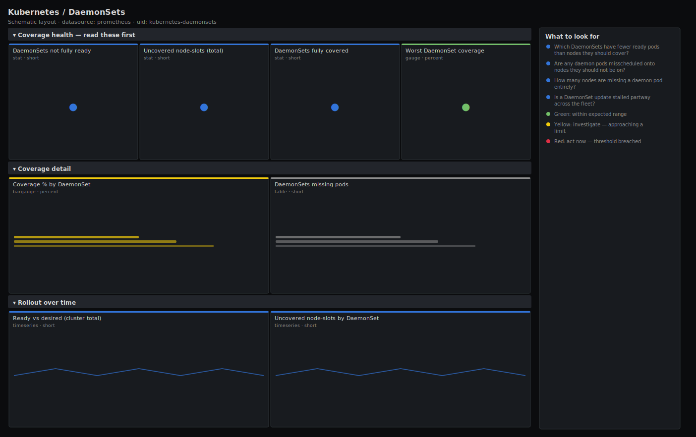

# Kubernetes / DaemonSets

> Coverage health for DaemonSets: whether every node that should run a daemon pod actually has a ready one, how many are misscheduled, and which DaemonSets are not fully rolled out. Answers "is my logging/CNI/node agent running everywhere it should?" from kube-state-metrics.

**Primary search phrase:** Kubernetes DaemonSet coverage Grafana dashboard  
**Category:** `kubernetes` · **UID:** `kubernetes-daemonsets` · **Datasource:** Prometheus



## Questions this dashboard answers

- Which DaemonSets have fewer ready pods than nodes they should cover?
- Are any daemon pods misscheduled onto nodes they should not be on?
- How many nodes are missing a daemon pod entirely?
- Is a DaemonSet update stalled partway across the fleet?

## Production lessons — why this dashboard exists

DaemonSets run the invisible plumbing — the CNI agent, log shipper, node exporter, CSI driver — so a DaemonSet that is not fully rolled out means some nodes are silently missing a critical capability: a node with no log agent loses its logs, a node with no CNI agent breaks pod networking. The failure is per-node and easy to miss because the other nodes look fine. This dashboard leads with the count of DaemonSets not fully ready and the number of uncovered nodes, then shows coverage per DaemonSet so you can tell a slow rollout from a node that will never schedule the pod (taint, resource, or affinity mismatch).

## Data source requirements

- **Prometheus** datasource (selected at import time via `${DS_PROMETHEUS}`).
- `kube-state-metrics` for DaemonSet scheduling and readiness (`kube_daemonset_status_number_ready`, `kube_daemonset_status_desired_number_scheduled`).

## Template variables

| Variable | Label | Type | Purpose |
|----------|-------|------|---------|
| `${cluster}` | Cluster | query | Cluster to scope to. Select All on single-cluster setups. |
| `${namespace}` | Namespace | query | Namespace(s) to inspect; supports multi-select. |

## Panels

### Coverage health — read these first

- **DaemonSets not fully ready** (stat, `short`) — DaemonSets with fewer ready pods than nodes they should be scheduled on.
- **Uncovered node-slots (total)** (stat, `short`) — Sum of missing daemon pods across all DaemonSets — nodes that should have a pod but do not have a ready one.
- **DaemonSets fully covered** (stat, `short`) — DaemonSets with a ready pod on every node they target.
- **Worst DaemonSet coverage** (gauge, `percent`) — Lowest ready-vs-desired ratio across all DaemonSets — the least-covered daemon.

### Coverage detail

- **Coverage % by DaemonSet** (bargauge, `percent`) — Ready pods as a share of desired-scheduled nodes, per DaemonSet. Below 100% means at least one node is uncovered.
- **DaemonSets missing pods** (table, `short`) — DaemonSets with uncovered nodes and how many — the worklist when a node agent is missing somewhere.

### Rollout over time

- **Ready vs desired (cluster total)** (timeseries, `short`) — Aggregate ready and desired daemon pods. A gap that opens during an update and does not close is a stalled rollout.
- **Uncovered node-slots by DaemonSet** (timeseries, `short`) — Per-DaemonSet count of nodes missing a ready pod over time.

## Import

**Grafana UI** — *Dashboards → New → Import*, upload `dashboards/kubernetes/daemonsets.json`, then pick your datasource when prompted.

**API:**

```bash
scripts/import-dashboard.sh dashboards/kubernetes/daemonsets.json
```

**Provisioning** — drop the JSON into a provisioned folder (see [provisioning guide](../../provisioning.md)).

## Recommended alerts

Ready-to-use rules ship in `alerts/kubernetes.rules.yml`.

### KubeDaemonSetNotFullyRolledOut (`warning`)

```promql
kube_daemonset_status_number_ready < kube_daemonset_status_desired_number_scheduled
```

- **Fires after:** `15m`
- **Why it matters:** An uncovered node is silently missing whatever the daemon provides — logging, networking, storage or metrics — and that gap is invisible from the affected node's own perspective.
- **Investigate:** Identify the uncovered node(s); check for taints the daemon does not tolerate, node resource pressure, or a stuck pod on that node.
- **Recovery:** Clears when ready equals desired for 5m.
- **False positives:** A genuinely slow rolling update across a large fleet, or a node intentionally tainted away from the daemon.

### KubeDaemonSetFullyDown (`critical`)

```promql
kube_daemonset_status_number_ready == 0 and kube_daemonset_status_desired_number_scheduled > 0
```

- **Fires after:** `10m`
- **Why it matters:** A DaemonSet with no ready pods means the capability is missing cluster-wide — every node has lost its log agent, CNI, or CSI driver.
- **Investigate:** Check the DaemonSet's pod template for a recent bad change; inspect events on any one of its pods.
- **Recovery:** Clears when at least one pod becomes ready and coverage recovers.
- **False positives:** A DaemonSet intentionally scaled to zero via a nodeSelector that currently matches no nodes.

## Troubleshooting

| Symptom | Likely cause | First action |
|---------|--------------|--------------|
| Coverage gauge shows under 100% but no node is obviously down | A node taint the daemon does not tolerate | Compare desired-scheduled with node count; tolerations decide which nodes count as desired. |
| Desired count is lower than total nodes | The DaemonSet uses a nodeSelector limiting it to a subset | Expected — desired reflects only matching nodes |
| No data | kube-state-metrics not scraped or no DaemonSets in $namespace | Set $namespace to All and verify kube-state-metrics in Explore. |

## Performance considerations

Panels read two gauges per DaemonSet with no rate windows, so cost is negligible. Tables and bar panels filter with `> 0` so only under-covered DaemonSets render. `clamp_min(desired, 1)` guards the coverage ratio against divide-by-zero when a selector currently matches no nodes.

## Customization

Scope to platform daemons with a `daemonset=~"fluent-bit|cilium|node-exporter"` selector. Tighten the `for` on `KubeDaemonSetNotFullyRolledOut` if your rollouts are fast and any lingering gap is a real problem. The worst-coverage gauge is a good single number for a fleet status wall.

## Related resources

- [Advanced observability guides](https://devopsaitoolkit.com/guides/)
- [Grafana & Prometheus tutorials](https://devopsaitoolkit.com/blog/)
- [AI Incident Response Assistant](https://devopsaitoolkit.com/dashboard/incident-response)
- [PromQL cookbook](../../../promql/README.md) · [Alerting guide](../../alerting.md) · [Dashboard catalog](../../catalog.md)
