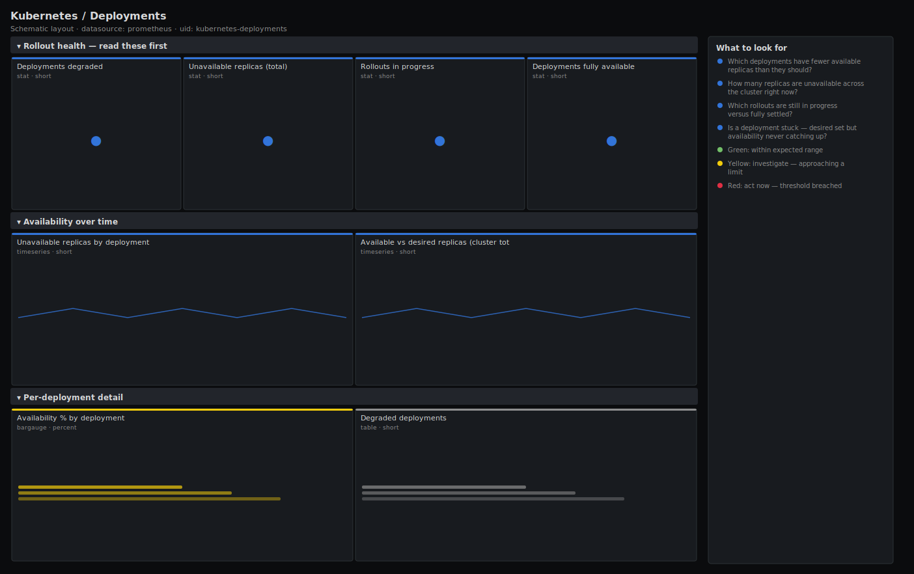

# Kubernetes / Deployments

> Rollout and availability health for Deployments: which ones have fewer available replicas than desired, how many replicas are unavailable, and which rollouts are still in progress. Answers "did my deploy land, and is anything degraded?" from kube-state-metrics.

**Primary search phrase:** Kubernetes deployment health Grafana dashboard  
**Category:** `kubernetes` · **UID:** `kubernetes-deployments` · **Datasource:** Prometheus



## Questions this dashboard answers

- Which deployments have fewer available replicas than they should?
- How many replicas are unavailable across the cluster right now?
- Which rollouts are still in progress versus fully settled?
- Is a deployment stuck — desired set but availability never catching up?

## Production lessons — why this dashboard exists

A deployment that reports the right *spec* replica count can still be serving from a fraction of them: a bad image, a failing readiness probe, or insufficient capacity leaves replicas unavailable while `kubectl get deploy` looks fine to the untrained eye. This dashboard leads with the count of degraded deployments and total unavailable replicas, so you see at a glance whether a rollout succeeded. The trap it prevents: declaring a deploy "done" because the new ReplicaSet exists, when availability is still climbing — or worse, permanently stuck because the new pods never pass readiness.

## Data source requirements

- **Prometheus** datasource (selected at import time via `${DS_PROMETHEUS}`).
- `kube-state-metrics` for deployment replica state (`kube_deployment_spec_replicas`, `kube_deployment_status_replicas`, `kube_deployment_status_replicas_available`, `kube_deployment_status_replicas_unavailable`).

## Template variables

| Variable | Label | Type | Purpose |
|----------|-------|------|---------|
| `${cluster}` | Cluster | query | Cluster to scope to. Select All on single-cluster setups. |
| `${namespace}` | Namespace | query | Namespace(s) to inspect; supports multi-select. |

## Panels

### Rollout health — read these first

- **Deployments degraded** (stat, `short`) — Deployments with fewer available replicas than desired — actively serving below capacity.
- **Unavailable replicas (total)** (stat, `short`) — Sum of unavailable replicas across all deployments — the missing serving capacity.
- **Rollouts in progress** (stat, `short`) — Deployments whose available replicas have not yet caught up to desired — a rollout is mid-flight.
- **Deployments fully available** (stat, `short`) — Deployments where every desired replica is available and serving.

### Availability over time

- **Unavailable replicas by deployment** (timeseries, `short`) — Per-deployment unavailable replica count. A line that does not return to zero is a stuck rollout.
- **Available vs desired replicas (cluster total)** (timeseries, `short`) — Aggregate desired and available replicas. A persistent gap is degraded capacity.

### Per-deployment detail

- **Availability % by deployment** (bargauge, `percent`) — Available replicas as a share of desired, per deployment. Below 100% means at least one replica is down.
- **Degraded deployments** (table, `short`) — Deployments running below their desired replica count — the worklist for a degraded-rollout incident.

## Import

**Grafana UI** — *Dashboards → New → Import*, upload `dashboards/kubernetes/deployments.json`, then pick your datasource when prompted.

**API:**

```bash
scripts/import-dashboard.sh dashboards/kubernetes/deployments.json
```

**Provisioning** — drop the JSON into a provisioned folder (see [provisioning guide](../../provisioning.md)).

## Recommended alerts

Ready-to-use rules ship in `alerts/kubernetes.rules.yml`.

### KubeDeploymentReplicasMismatch (`warning`)

```promql
kube_deployment_status_replicas_available < kube_deployment_spec_replicas
```

- **Fires after:** `15m`
- **Why it matters:** A deployment short of replicas for 15 minutes is not a slow rollout — it is stuck, serving below capacity and one failure away from an outage.
- **Investigate:** Open Kubernetes / Pods for this namespace; check whether the new pods are CrashLooping, failing readiness, or unschedulable.
- **Recovery:** Clears when available replicas reach desired for 5m.
- **False positives:** A long, deliberately paused canary or a deploy with maxUnavailable set high during a large rollout.

### KubeDeploymentUnavailableReplicas (`critical`)

```promql
kube_deployment_status_replicas_unavailable > 0 and kube_deployment_spec_replicas <= 2
```

- **Fires after:** `10m`
- **Why it matters:** On a small deployment a single unavailable replica is a large fraction of capacity — for a 1- or 2-replica service it may be a full or half outage.
- **Investigate:** Check the pod's status and events; for a single-replica deployment this is effectively downtime.
- **Recovery:** Clears when no replicas are unavailable for 5m.
- **False positives:** Intentional single-replica batch/utility deployments during a restart.

## Troubleshooting

| Symptom | Likely cause | First action |
|---------|--------------|--------------|
| Availability % shows over 100 | Surge replicas during a rolling update (maxSurge) | Transient during deploys — it settles to 100% when the rollout completes. |
| Degraded count never returns to zero | New ReplicaSet pods fail readiness or cannot schedule | Drill into Kubernetes / Pods; fix the probe |
| A deployment is missing | It has zero spec replicas (scaled to 0) | Scaled-to-zero deployments are excluded from the availability ratio by design. |

## Performance considerations

All panels read kube-state-metrics gauges directly with no rate windows, so this dashboard is inexpensive. Tables and the bargauge use `> 0` / per-object series so only relevant deployments render. `clamp_min(spec, 1)` guards the availability ratio against divide-by-zero on scaled-to-zero deployments.

## Customization

To gate a release pipeline, alert on `KubeDeploymentReplicasMismatch` scoped to your app's namespace with a shorter `for`. Raise the low-replica threshold in `KubeDeploymentUnavailableReplicas` if most of your services run many replicas. Add a `deployment=~"..."` selector to focus on one application family.

## Related resources

- [Advanced observability guides](https://devopsaitoolkit.com/guides/)
- [Grafana & Prometheus tutorials](https://devopsaitoolkit.com/blog/)
- [AI Incident Response Assistant](https://devopsaitoolkit.com/dashboard/incident-response)
- [PromQL cookbook](../../../promql/README.md) · [Alerting guide](../../alerting.md) · [Dashboard catalog](../../catalog.md)
