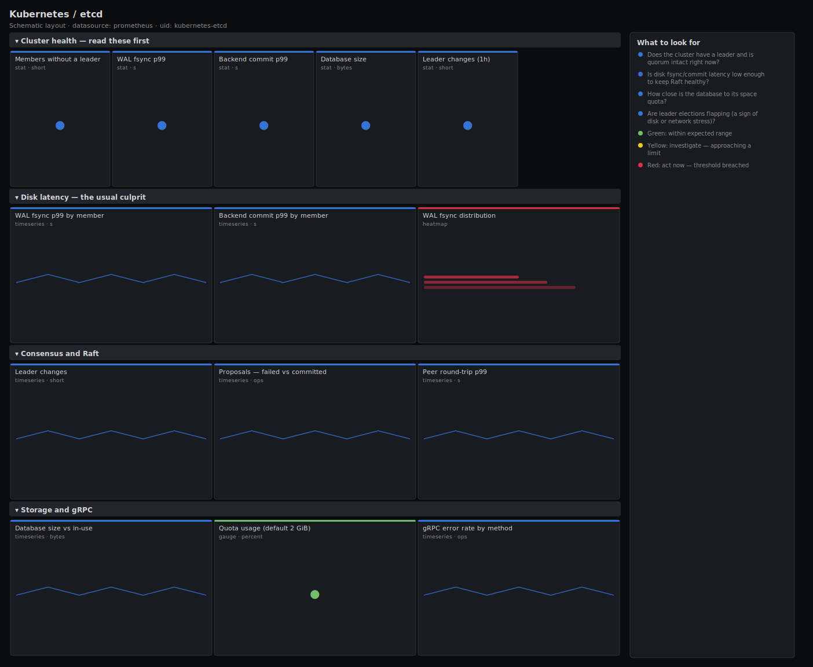

# Kubernetes / etcd

> Quorum, leader stability, disk write latency (WAL fsync and backend commit), database size versus quota, and Raft proposal health for an etcd cluster backing Kubernetes. Answers "is etcd healthy and fast enough to keep the API server responsive?" instead of just plotting Raft internals.

**Primary search phrase:** etcd Grafana dashboard  
**Category:** `kubernetes` · **UID:** `kubernetes-etcd` · **Datasource:** Prometheus



## Questions this dashboard answers

- Does the cluster have a leader and is quorum intact right now?
- Is disk fsync/commit latency low enough to keep Raft healthy?
- How close is the database to its space quota?
- Are leader elections flapping (a sign of disk or network stress)?
- Are Raft proposals failing or peers slow to round-trip?

## Production lessons — why this dashboard exists

etcd outages almost never start as "etcd is down" — they start as **slow disk**. When WAL fsync or backend commit p99 crosses ~tens of milliseconds, Raft heartbeats miss, leader elections start flapping, and the API server latency you were paging on is really an etcd disk problem. So this dashboard leads with **fsync and backend commit p99**, then leader stability, then **database size vs quota** (the other classic outage: hit the 2 GiB default quota and etcd goes read-only until you defrag/compact). Run etcd on dedicated low-latency SSDs and never share the disk — this dashboard exists to prove that you did.

## Data source requirements

- **Prometheus** datasource (selected at import time via `${DS_PROMETHEUS}`).
- `etcd` metrics endpoint (the `etcd_server_has_leader`, `etcd_disk_wal_fsync_duration_seconds_bucket`, `etcd_disk_backend_commit_duration_seconds_bucket`, `etcd_mvcc_db_total_size_in_bytes` and `etcd_server_proposals_*` series).
- `grpc_server_handled_total` for the gRPC error view and `etcd_network_peer_round_trip_time_seconds_bucket` for peer latency.

## Template variables

| Variable | Label | Type | Purpose |
|----------|-------|------|---------|
| `${job}` | Job | query | Prometheus scrape job for the etcd members. |
| `${instance}` | Member | query | etcd member(s) to display; supports multi-select. |

## Panels

### Cluster health — read these first

- **Members without a leader** (stat, `short`) — Count of etcd members that currently cannot see a leader. Anything above zero risks quorum.
- **WAL fsync p99** (stat, `s`) — 99th percentile time to fsync the write-ahead log to disk. The single best predictor of etcd health.
- **Backend commit p99** (stat, `s`) — 99th percentile time to commit a batch to the backend (boltdb). High values mean a slow disk.
- **Database size** (stat, `bytes`) — Largest member's on-disk MVCC database size. Compare against your space quota (2 GiB by default).
- **Leader changes (1h)** (stat, `short`) — Number of leader elections in the last hour. Sustained churn means disk or network stress.

### Disk latency — the usual culprit

- **WAL fsync p99 by member** (timeseries, `s`) — Per-member fsync latency. A single slow disk drags the whole cluster.
- **Backend commit p99 by member** (timeseries, `s`) — Per-member backend commit latency — the boltdb write path.
- **WAL fsync distribution** (heatmap, `s`) — Full latency distribution for fsync — spot a bimodal disk before the p99 alert fires.

### Consensus and Raft

- **Leader changes** (timeseries, `short`) — Rate of leader elections. Flat is good; spikes correlate with disk/network stalls.
- **Proposals — failed vs committed** (timeseries, `ops`) — Raft proposal throughput and failures. Failed proposals mean writes are being lost to quorum problems.
- **Peer round-trip p99** (timeseries, `s`) — Network latency between etcd members. High values delay Raft replication and elections.

### Storage and gRPC

- **Database size vs in-use** (timeseries, `bytes`) — Total on-disk size vs logically in-use bytes. A large gap means fragmentation — defrag to reclaim it.
- **Quota usage (default 2 GiB)** (gauge, `percent`) — Database size as a percent of the default 2 GiB space quota. At 100% etcd goes read-only until you compact and defrag.
- **gRPC error rate by method** (timeseries, `ops`) — Server-side gRPC failures (non-OK codes). A spike here often precedes API server errors.

## Import

**Grafana UI** — *Dashboards → New → Import*, upload `dashboards/kubernetes/etcd.json`, then pick your datasource when prompted.

**API:**

```bash
scripts/import-dashboard.sh dashboards/kubernetes/etcd.json
```

**Provisioning** — drop the JSON into a provisioned folder (see [provisioning guide](../../provisioning.md)).

## Recommended alerts

Ready-to-use rules ship in `alerts/kubernetes.rules.yml`.

### EtcdNoLeader (`critical`)

```promql
etcd_server_has_leader == 0
```

- **Fires after:** `1m`
- **Why it matters:** A member without a leader cannot serve writes; if a majority lose the leader the cluster loses quorum and the API server stops accepting changes.
- **Investigate:** Open Kubernetes / etcd, check leader changes and peer round-trip latency, and confirm how many members are affected.
- **Recovery:** Clears within 1m of the member seeing a leader again.
- **False positives:** A brief blip during an intentional leader transfer or rolling restart.

### EtcdHighFsyncDuration (`critical`)

```promql
histogram_quantile(0.99, sum by (le, instance, job) (rate(etcd_disk_wal_fsync_duration_seconds_bucket[5m]))) > 0.05
```

- **Fires after:** `10m`
- **Why it matters:** Slow fsync stalls the Raft log; heartbeats miss, elections flap and API server latency climbs across the whole cluster.
- **Investigate:** Compare fsync vs backend commit per member; check the underlying disk for contention or a noisy co-tenant.
- **Recovery:** Clears when fsync p99 stays below 50ms for 5m.
- **False positives:** A transient spike during a large compaction or snapshot.

### EtcdDatabaseQuotaNearFull (`warning`)

```promql
etcd_mvcc_db_total_size_in_bytes / 2147483648 > 0.8
```

- **Fires after:** `15m`
- **Why it matters:** When the database hits its space quota etcd switches to read-only (NOSPACE alarm) and the cluster can no longer accept writes.
- **Investigate:** Check the database size vs in-use panel for fragmentation, and review history retention/compaction settings.
- **Recovery:** Clears when database size drops below 80% of quota after compaction/defrag.
- **False positives:** Clusters that intentionally raised the quota above 2 GiB — adjust the divisor to match.

## Troubleshooting

| Symptom | Likely cause | First action |
|---------|--------------|--------------|
| All panels show "No data" | etcd metrics require client-cert auth and many setups don't scrape them by default. | Confirm Prometheus has the etcd client cert/key and `up{job="$job"}` is 1; etcd serves /metrics on the client (2379) or a dedicated metrics port. |
| Quota gauge reads wrong percentage | Your cluster runs a non-default `--quota-backend-bytes`. | Replace the `2147483648` divisor with your configured quota in bytes. |
| Peer round-trip panel is empty | Single-member etcd, or the `To` label casing differs by version. | Multi-member clusters only emit peer metrics; verify the bucket metric exists in Explore. |

## Performance considerations

All rates use a 5m window (>=4x a 30s scrape). Quantiles aggregate the histogram with `sum by (le, ...)` before `histogram_quantile`. The fsync heatmap is the heaviest panel because it keeps every `le` bucket; narrow the time range on large multi-member clusters or pre-aggregate with a recording rule.

## Customization

Adjust the 10ms/50ms fsync and 25ms/100ms commit thresholds to your disk class — NVMe can hold far tighter targets. If you raised `--quota-backend-bytes`, update the quota gauge divisor and the `EtcdDatabaseQuotaNearFull` alert. Scope `$instance` to a single member to debug one slow disk.

## Related resources

- [Advanced observability guides](https://devopsaitoolkit.com/guides/)
- [Grafana & Prometheus tutorials](https://devopsaitoolkit.com/blog/)
- [AI Incident Response Assistant](https://devopsaitoolkit.com/dashboard/incident-response)
- [PromQL cookbook](../../../promql/README.md) · [Alerting guide](../../alerting.md) · [Dashboard catalog](../../catalog.md)
