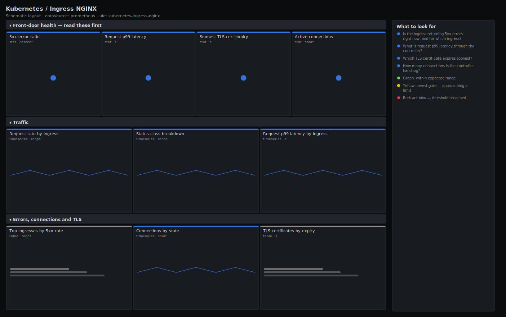

# Kubernetes / Ingress NGINX

> Request rate and status by ingress, p99 latency, 5xx error ratio, active connections and TLS certificate expiry for the ingress-nginx controller. Answers "is the front door serving traffic within SLO, and is any cert about to expire?" rather than dumping raw nginx counters.

**Primary search phrase:** ingress-nginx Grafana dashboard  
**Category:** `kubernetes` · **UID:** `kubernetes-ingress-nginx` · **Datasource:** Prometheus



## Questions this dashboard answers

- Is the ingress returning 5xx errors right now, and for which ingress?
- What is request p99 latency through the controller?
- Which TLS certificate expires soonest?
- How many connections is the controller handling?
- Where is the traffic going and what status mix does each ingress serve?

## Production lessons — why this dashboard exists

The ingress controller is where a backend problem becomes a customer problem, so it is the right place to watch the user-facing SLI: the **5xx ratio** here counts only errors the platform owns (a 502/503/504 is usually an unhealthy upstream, a 500 is the app). The single most embarrassing ingress outage is an **expired TLS certificate** — everything looks healthy until the clock ticks over and every request fails the handshake — so this dashboard puts the soonest cert expiry right in the lead row, in time units, next to errors and latency. Active connections is the saturation signal: a controller pinned near its worker connection limit starts queuing and shedding regardless of upstream health.

## Data source requirements

- **Prometheus** datasource (selected at import time via `${DS_PROMETHEUS}`).
- `ingress-nginx` controller metrics (the `nginx_ingress_controller_requests`, `nginx_ingress_controller_request_duration_seconds_bucket`, `nginx_ingress_controller_nginx_process_connections` and `nginx_ingress_controller_ssl_expire_time_seconds` series).

## Template variables

| Variable | Label | Type | Purpose |
|----------|-------|------|---------|
| `${job}` | Job | query | Prometheus scrape job for the ingress-nginx controller. |
| `${ingress}` | Ingress | query | Ingress object(s) to display; supports multi-select. |

## Panels

### Front-door health — read these first

- **5xx error ratio** (stat, `percent`) — Share of requests returning a 5xx status across the selected ingresses. The user-facing error SLI.
- **Request p99 latency** (stat, `s`) — 99th percentile end-to-end request duration through the controller.
- **Soonest TLS cert expiry** (stat, `s`) — Time until the nearest-expiring certificate. Grafana renders the seconds value as days/hours.
- **Active connections** (stat, `short`) — Current connections handled by the controller. Approaching the worker connection limit means saturation.

### Traffic

- **Request rate by ingress** (timeseries, `reqps`) — Throughput per ingress object. Spot which app is driving load or suddenly went quiet.
- **Status class breakdown** (timeseries, `reqps`) — Request rate by HTTP status class. A rising 5xx with steady 2xx is a backend going bad.
- **Request p99 latency by ingress** (timeseries, `s`) — Per-ingress tail latency. Isolate the slow backend behind the controller.

### Errors, connections and TLS

- **Top ingresses by 5xx rate** (table, `reqps`) — Which ingresses are throwing server errors — the ranked list to start triage from.
- **Connections by state** (timeseries, `short`) — Reading/writing/waiting/active connection counts. A wall of waiting connections signals keepalive or saturation issues.
- **TLS certificates by expiry** (table, `s`) — Days remaining on each served certificate. Renew anything inside two weeks before it pages you.

## Import

**Grafana UI** — *Dashboards → New → Import*, upload `dashboards/kubernetes/ingress-nginx.json`, then pick your datasource when prompted.

**API:**

```bash
scripts/import-dashboard.sh dashboards/kubernetes/ingress-nginx.json
```

**Provisioning** — drop the JSON into a provisioned folder (see [provisioning guide](../../provisioning.md)).

## Recommended alerts

Ready-to-use rules ship in `alerts/kubernetes.rules.yml`.

### IngressNginxHigh5xxRate (`critical`)

```promql
100 * sum by (job) (rate(nginx_ingress_controller_requests{status=~"5.."}[5m])) / sum by (job) (rate(nginx_ingress_controller_requests[5m])) > 5
```

- **Fires after:** `5m`
- **Why it matters:** A high 5xx ratio at the front door means users are seeing errors right now — usually an unhealthy upstream service.
- **Investigate:** Open Kubernetes / Ingress NGINX and use the Top ingresses by 5xx table to find which ingress/backend is failing.
- **Recovery:** Clears when the 5xx ratio stays below 5% for 5m.
- **False positives:** A backend rollout can spike 5xx briefly as old pods drain; confirm it is sustained.

### IngressNginxHighLatency (`warning`)

```promql
histogram_quantile(0.99, sum by (le, job) (rate(nginx_ingress_controller_request_duration_seconds_bucket[5m]))) > 1
```

- **Fires after:** `10m`
- **Why it matters:** Slow requests at the ingress mean slow pages for users regardless of which backend is responsible.
- **Investigate:** Use the per-ingress p99 panel to isolate the slow ingress, then check that backend's own latency.
- **Recovery:** Clears when p99 falls below 1s for 5m.
- **False positives:** A few slow large-file or streaming ingresses can lift p99 without a real problem — scope the alert per ingress if so.

### IngressNginxTLSCertExpiringSoon (`warning`)

```promql
(nginx_ingress_controller_ssl_expire_time_seconds - time()) < 1209600
```

- **Fires after:** `1h`
- **Why it matters:** An expired certificate fails every TLS handshake — a total outage for that host with no warning if you don't watch the clock.
- **Investigate:** Check the TLS certificates table for the exact host and remaining time; confirm whether cert-manager owns this cert.
- **Recovery:** Clears once the renewed certificate pushes expiry back beyond 14 days.
- **False positives:** Short-lived certs (e.g. 90-day ACME) are fine as long as renewal runs well before this window — tighten the threshold if needed.

## Troubleshooting

| Symptom | Likely cause | First action |
|---------|--------------|--------------|
| All panels show "No data" | The controller metrics service isn't scraped, or the wrong `$job`. | Confirm `up{job="$job"}` is 1 and the controller is started with `--enable-metrics` and a scraped metrics port (10254). |
| TLS expiry stat shows a huge negative number | A certificate has already expired (expire_time is in the past). | This is an active outage for that host — renew it immediately and check the per-host table. |
| 5xx ratio is blank during low traffic | No requests in the window, so the denominator is empty. | This is benign; widen the time range to confirm there simply was no traffic. |

## Performance considerations

All rates use a 5m window (>=4x a 30s scrape). Latency quantiles aggregate the histogram with `sum by (le, ...)` before `histogram_quantile`. The `nginx_ingress_controller_requests` series can be high-cardinality (per ingress and status); bound it with `by (ingress)`/`by (status)` and back the busiest panels with a recording rule on large clusters.

## Customization

Tune the 1%/5% error and 0.5s/1s latency thresholds to your SLO, and the active-connection bands to your controller's `worker-connections`. The 14-day cert window and 7/30-day color stops should match your renewal cadence. Scope `$ingress` to a team's ingresses to give each app team its own view.

## Related resources

- [Advanced observability guides](https://devopsaitoolkit.com/guides/)
- [Grafana & Prometheus tutorials](https://devopsaitoolkit.com/blog/)
- [AI Incident Response Assistant](https://devopsaitoolkit.com/dashboard/incident-response)
- [PromQL cookbook](../../../promql/README.md) · [Alerting guide](../../alerting.md) · [Dashboard catalog](../../catalog.md)
