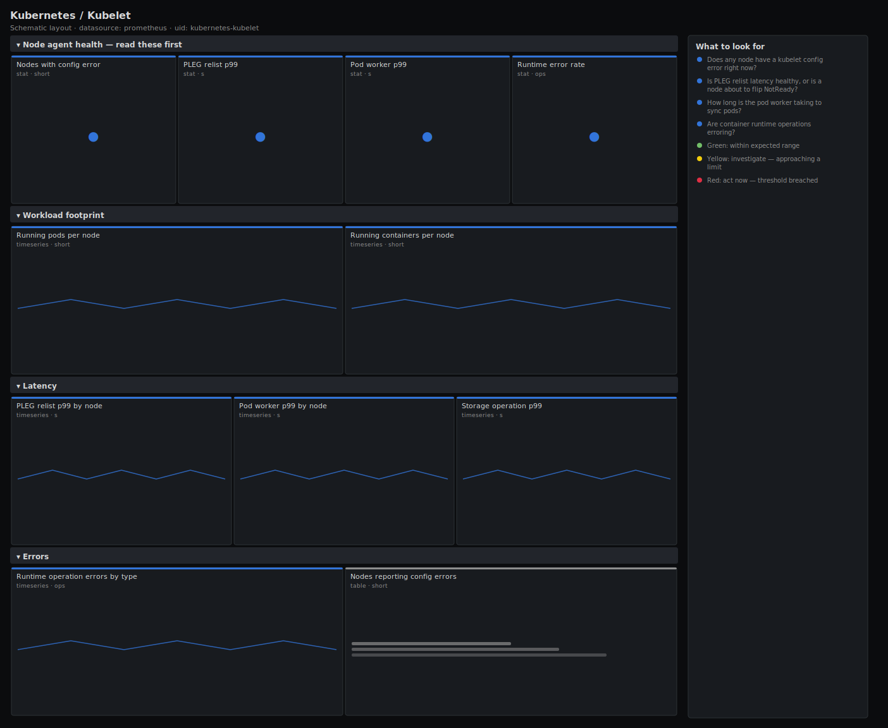

# Kubernetes / Kubelet

> Running pods/containers, PLEG relist latency, pod worker duration, runtime operation errors and node config errors for the kubelet. Answers "is the node agent healthy enough to keep this node Ready and start pods on time?" rather than dumping raw kubelet counters.

**Primary search phrase:** Kubelet Grafana dashboard  
**Category:** `kubernetes` · **UID:** `kubernetes-kubelet` · **Datasource:** Prometheus



## Questions this dashboard answers

- Does any node have a kubelet config error right now?
- Is PLEG relist latency healthy, or is a node about to flip NotReady?
- How long is the pod worker taking to sync pods?
- Are container runtime operations erroring?
- How many pods and containers is each node running?

## Production lessons — why this dashboard exists

When a node flips NotReady the kubelet metrics usually warned you minutes earlier. The classic precursor is **PLEG relist latency** (Pod Lifecycle Event Generator): the kubelet lists every container's state on an interval, and when the container runtime gets slow that relist stretches out — cross three minutes and the node is declared NotReady. So this dashboard leads with **node config errors** (a misconfigured kubelet won't start pods at all) and **PLEG relist p99**, then breaks out pod worker duration and runtime-operation errors so you can tell a runtime problem (containerd/CRI) from a kubelet problem. High PLEG with high runtime errors almost always means the container runtime, not the kubelet.

## Data source requirements

- **Prometheus** datasource (selected at import time via `${DS_PROMETHEUS}`).
- `kubelet` metrics endpoint (the `kubelet_running_pods`, `kubelet_running_containers`, `kubelet_pleg_relist_duration_seconds_bucket`, `kubelet_pod_worker_duration_seconds_bucket`, `kubelet_runtime_operations_errors_total` and `kubelet_node_config_error` series), scraped via the apiserver proxy or directly on each node.

## Template variables

| Variable | Label | Type | Purpose |
|----------|-------|------|---------|
| `${job}` | Job | query | Prometheus scrape job for the kubelet targets. |
| `${instance}` | Node | query | Node(s) to display; supports multi-select. |

## Panels

### Node agent health — read these first

- **Nodes with config error** (stat, `short`) — Count of nodes reporting a kubelet config error. Such a kubelet may refuse to start pods.
- **PLEG relist p99** (stat, `s`) — 99th percentile PLEG relist time. Above a few seconds risks the node being declared NotReady.
- **Pod worker p99** (stat, `s`) — 99th percentile time for the kubelet to sync a pod to its desired state. Slow syncs delay pod startup.
- **Runtime error rate** (stat, `ops`) — Container runtime (CRI) operation errors per second across the selected nodes.

### Workload footprint

- **Running pods per node** (timeseries, `short`) — Pods the kubelet is currently running. Approaching the per-node cap (default 110) is a packing limit.
- **Running containers per node** (timeseries, `short`) — Containers the kubelet is currently running — includes init/sidecars, so it outpaces the pod count.

### Latency

- **PLEG relist p99 by node** (timeseries, `s`) — Per-node PLEG relist latency. A single climbing node is the one about to go NotReady.
- **Pod worker p99 by node** (timeseries, `s`) — Per-node pod sync latency. Rising values delay pod starts and updates on that node.
- **Storage operation p99** (timeseries, `s`) — 99th percentile time for volume operations (mount/attach). Slow storage stalls pod startup.

### Errors

- **Runtime operation errors by type** (timeseries, `ops`) — CRI errors by operation (pull_image, create_container, ...). The operation tells you where the runtime is failing.
- **Nodes reporting config errors** (table, `short`) — Nodes whose kubelet currently reports a config error — fix these before scheduling onto them.

## Import

**Grafana UI** — *Dashboards → New → Import*, upload `dashboards/kubernetes/kubelet.json`, then pick your datasource when prompted.

**API:**

```bash
scripts/import-dashboard.sh dashboards/kubernetes/kubelet.json
```

**Provisioning** — drop the JSON into a provisioned folder (see [provisioning guide](../../provisioning.md)).

## Recommended alerts

Ready-to-use rules ship in `alerts/kubernetes.rules.yml`.

### KubeletNodeConfigError (`warning`)

```promql
kubelet_node_config_error == 1
```

- **Fires after:** `5m`
- **Why it matters:** A kubelet with a config error may refuse to start or update pods, so the node silently stops accepting work correctly.
- **Investigate:** Open Kubernetes / Kubelet, find the node in the config-error table, and read its kubelet logs/events for the rejected config.
- **Recovery:** Clears when the kubelet stops reporting a config error for 5m.
- **False positives:** A brief error during a deliberate kubelet config rollout that immediately self-corrects.

### KubeletPLEGLatencyHigh (`critical`)

```promql
histogram_quantile(0.99, sum by (le, instance, job) (rate(kubelet_pleg_relist_duration_seconds_bucket[5m]))) > 10
```

- **Fires after:** `10m`
- **Why it matters:** A slow PLEG is the canonical precursor to a node flipping NotReady; the kubelet can't keep up with container state.
- **Investigate:** Correlate with runtime-operation errors and node CPU/IO — high PLEG with runtime errors points at the container runtime.
- **Recovery:** Clears when PLEG p99 falls below 10s for 5m.
- **False positives:** A transient spike during a mass pod churn (node drain/fill) can lift PLEG briefly.

### KubeletRuntimeOperationErrors (`warning`)

```promql
sum by (instance, job) (rate(kubelet_runtime_operations_errors_total[5m])) > 0.1
```

- **Fires after:** `10m`
- **Why it matters:** Failing CRI operations mean containers won't pull, create or start reliably — pods get stuck or crash-loop on that node.
- **Investigate:** Open the runtime-errors-by-type panel to see which operation fails (image pull vs container create) and check runtime logs.
- **Recovery:** Clears when the runtime error rate stays below 0.1/s for 5m.
- **False positives:** A bad image reference causes legitimate pull errors that aren't a node fault.

## Troubleshooting

| Symptom | Likely cause | First action |
|---------|--------------|--------------|
| All panels show "No data" | Kubelet /metrics requires auth and the scrape config or RBAC is wrong. | Confirm `up{job="$job"}` is 1; kubelet metrics are usually scraped via the apiserver proxy with a token that has `nodes/metrics` access. |
| PLEG p99 looks fine but a node went NotReady | The node failed for a non-PLEG reason (network, disk-pressure, kubelet crash). | Check node conditions and the kubelet's own up/down; this dashboard covers the agent, not every node failure mode. |
| Running-pods line stops updating for one node | That kubelet stopped being scraped (node down or scrape failing). | Check `up` for the instance; a flat-then-gone series usually means the target disappeared. |

## Performance considerations

All rates use a 5m window (>=4x a 30s scrape). Latency quantiles aggregate the histogram with `sum by (le, instance)` before `histogram_quantile`. On large fleets, multi-selecting every node makes the per-node latency panels heavy; scope `$instance` to a rack/pool, or back the PLEG panel with a recording rule.

## Customization

Tune the 3s/10s PLEG and 1s/5s pod-worker thresholds to your runtime and node class. The 110 running-pods threshold matches the default `--max-pods`; raise it if you configured a higher cap. Scope `$instance` to a node pool to keep the per-node panels readable on big clusters.

## Related resources

- [Advanced observability guides](https://devopsaitoolkit.com/guides/)
- [Grafana & Prometheus tutorials](https://devopsaitoolkit.com/blog/)
- [AI Incident Response Assistant](https://devopsaitoolkit.com/dashboard/incident-response)
- [PromQL cookbook](../../../promql/README.md) · [Alerting guide](../../alerting.md) · [Dashboard catalog](../../catalog.md)
