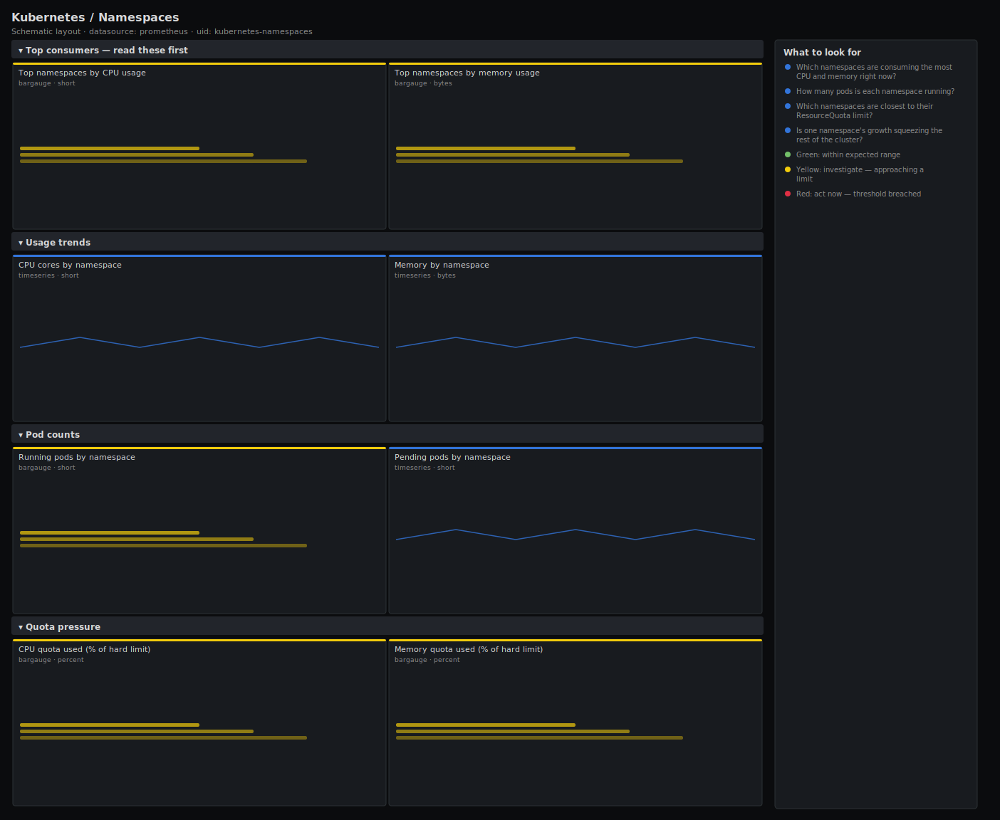

# Kubernetes / Namespaces

> Resource consumption broken down by namespace: which namespaces burn the most CPU and memory, how many pods each runs, and how close they sit to their ResourceQuota. Answers "which team is eating the cluster?" and "who is about to hit their quota?" from kube-state-metrics and cAdvisor.

**Primary search phrase:** Kubernetes namespace resource usage Grafana dashboard  
**Category:** `kubernetes` · **UID:** `kubernetes-namespaces` · **Datasource:** Prometheus



## Questions this dashboard answers

- Which namespaces are consuming the most CPU and memory right now?
- How many pods is each namespace running?
- Which namespaces are closest to their ResourceQuota limit?
- Is one namespace's growth squeezing the rest of the cluster?

## Production lessons — why this dashboard exists

In a shared cluster, capacity problems are almost always traceable to one or two namespaces — a runaway batch job, a team that set requests far above usage, or a namespace silently filling its quota until deploys start failing. This dashboard ranks namespaces by actual CPU and memory (cAdvisor) so you can find the heavy consumer instantly, then surfaces quota utilisation so you catch the namespace that is about to reject its own pods. Ranking by usage, not requests, is the key: a namespace can hold huge requests while using almost nothing, and that is a right-sizing conversation, not an incident.

## Data source requirements

- **Prometheus** datasource (selected at import time via `${DS_PROMETHEUS}`).
- `cAdvisor`/kubelet for per-namespace CPU and memory usage (`container_cpu_usage_seconds_total`, `container_memory_working_set_bytes`).
- `kube-state-metrics` for pod counts and quota state (`kube_pod_status_phase`, `kube_resourcequota`, `kube_namespace_created`).

## Template variables

| Variable | Label | Type | Purpose |
|----------|-------|------|---------|
| `${cluster}` | Cluster | query | Cluster to scope to. Select All on single-cluster setups. |

## Panels

### Top consumers — read these first

- **Top namespaces by CPU usage** (bargauge, `short`) — Actual CPU cores consumed per namespace over the last 5 minutes, ranked.
- **Top namespaces by memory usage** (bargauge, `bytes`) — Working-set memory consumed per namespace, ranked. The bytes a namespace would lose on eviction.

### Usage trends

- **CPU cores by namespace** (timeseries, `short`) — CPU consumption per namespace over time — watch for a namespace that climbs and never comes down.
- **Memory by namespace** (timeseries, `bytes`) — Working-set memory per namespace over time, stacked to the cluster total.

### Pod counts

- **Running pods by namespace** (bargauge, `short`) — How many pods each namespace is running — density and blast radius at a glance.
- **Pending pods by namespace** (timeseries, `short`) — Pending pods per namespace — a namespace that cannot schedule is either out of quota or out of cluster capacity.

### Quota pressure

- **CPU quota used (% of hard limit)** (bargauge, `percent`) — For namespaces with a ResourceQuota, used CPU request as a share of the hard cap. Near 100% means new pods will be rejected.
- **Memory quota used (% of hard limit)** (bargauge, `percent`) — Used memory request as a share of the namespace's memory quota.

## Import

**Grafana UI** — *Dashboards → New → Import*, upload `dashboards/kubernetes/namespaces.json`, then pick your datasource when prompted.

**API:**

```bash
scripts/import-dashboard.sh dashboards/kubernetes/namespaces.json
```

**Provisioning** — drop the JSON into a provisioned folder (see [provisioning guide](../../provisioning.md)).

## Recommended alerts

Ready-to-use rules ship in `alerts/kubernetes.rules.yml`.

### KubeNamespaceQuotaAlmostFull (`warning`)

```promql
100 * kube_resourcequota{resource="requests.cpu", type="used"} / ignoring(type) kube_resourcequota{resource="requests.cpu", type="hard"} > 95
```

- **Fires after:** `15m`
- **Why it matters:** A namespace at its ResourceQuota cannot create new pods — deploys and scale-ups silently fail with quota errors, not capacity errors.
- **Investigate:** Open the quota pressure row; compare quota usage with actual CPU usage to tell over-allocation from genuine demand.
- **Recovery:** Clears when quota usage falls below 95% for 5m.
- **False positives:** Namespaces intentionally pinned at their quota as a hard budget ceiling.

### KubeNamespaceCPUHeavyConsumer (`info`)

```promql
sum by (namespace) (rate(container_cpu_usage_seconds_total{container!="", pod!=""}[5m])) > 0.4 * sum(rate(container_cpu_usage_seconds_total{container!="", pod!=""}[5m]))
```

- **Fires after:** `30m`
- **Why it matters:** A single namespace dominating cluster CPU is a noisy-neighbour and capacity-planning risk worth a deliberate review.
- **Investigate:** Open the CPU-by-namespace trend; confirm whether the growth is expected load or a runaway/looping workload.
- **Recovery:** Clears when the namespace drops below 40% of cluster CPU for 5m.
- **False positives:** Single-tenant clusters where one namespace is meant to own the cluster.

## Troubleshooting

| Symptom | Likely cause | First action |
|---------|--------------|--------------|
| Quota panels are empty | No ResourceQuota objects exist in those namespaces | Quota panels only populate where a ResourceQuota is defined — this is expected on unquota'd clusters. |
| A namespace is missing from rankings | `topk` trimmed it below the top 15 | Raise the `topk` count in the spec or scope with a namespace filter. |
| Memory ranking dominated by one namespace | Working set includes page cache for IO-heavy pods | Cross-check with container memory limits before treating it as a leak. |

## Performance considerations

Rankings use `topk(15..20, sum by (namespace) (...))`, which keeps both query cost and panel series bounded even on clusters with hundreds of namespaces. CPU uses a 5m rate window. For very large clusters, precompute `namespace:container_cpu_usage:sum` and `namespace:container_memory_working_set:sum` recording rules and point the panels at those.

## Customization

Change `topk(15, ...)` to show more or fewer namespaces. To exclude platform namespaces, add `namespace!~"kube-.*|monitoring"` to the selectors. The 40% heavy-consumer alert threshold should match how multi-tenant your cluster is — lower it on shared clusters, disable it on single-tenant ones.

## Related resources

- [Advanced observability guides](https://devopsaitoolkit.com/guides/)
- [Grafana & Prometheus tutorials](https://devopsaitoolkit.com/blog/)
- [AI Incident Response Assistant](https://devopsaitoolkit.com/dashboard/incident-response)
- [PromQL cookbook](../../../promql/README.md) · [Alerting guide](../../alerting.md) · [Dashboard catalog](../../catalog.md)
