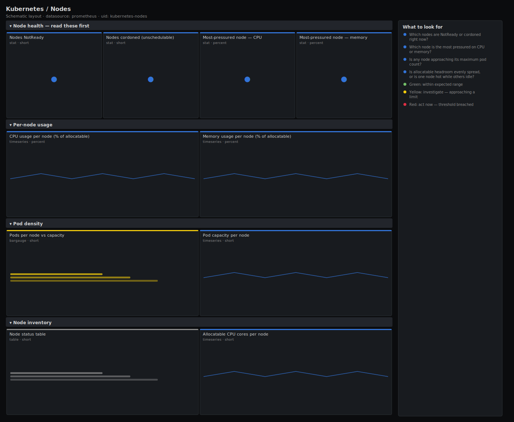

# Kubernetes / Nodes

> Per-node health and capacity for a Kubernetes cluster: which nodes are Ready or cordoned, how much of each node's allocatable CPU and memory is actually in use, and how close each node is to its pod-count ceiling. Answers "which node should I drain?" rather than just listing nodes.

**Primary search phrase:** Kubernetes node health Grafana dashboard  
**Category:** `kubernetes` · **UID:** `kubernetes-nodes` · **Datasource:** Prometheus



## Questions this dashboard answers

- Which nodes are NotReady or cordoned right now?
- Which node is the most pressured on CPU or memory?
- Is any node approaching its maximum pod count?
- Is allocatable headroom evenly spread, or is one node hot while others idle?

## Production lessons — why this dashboard exists

Node dashboards fail when they only show the Ready boolean — by the time a node flips NotReady, pods are already being evicted. The leading indicator is per-node pressure: a node sitting at 95% memory usage or near its pod cap will start failing scheduling and evicting long before the condition changes. This dashboard leads with NotReady and the single most-pressured node, then breaks usage down per node so you can pick a drain target or spot an uneven scheduler. Usage is read from cAdvisor (actual consumption), capacity from kube-state-metrics — never confuse "requested" with "used" when deciding which node to relieve.

## Data source requirements

- **Prometheus** datasource (selected at import time via `${DS_PROMETHEUS}`).
- `kube-state-metrics` for node conditions, schedulability and capacity (`kube_node_status_condition`, `kube_node_spec_unschedulable`, `kube_node_status_allocatable`, `kube_node_status_capacity`).
- `cAdvisor`/kubelet for actual per-node CPU and memory usage (`container_cpu_usage_seconds_total`, `container_memory_working_set_bytes`); requires the `node` label that kube-prometheus-stack relabels onto cAdvisor.

## Template variables

| Variable | Label | Type | Purpose |
|----------|-------|------|---------|
| `${cluster}` | Cluster | query | Cluster to scope to. Select All on single-cluster setups. |
| `${node}` | Node | query | Nodes to display; supports multi-select. |

## Panels

### Node health — read these first

- **Nodes NotReady** (stat, `short`) — Nodes not reporting Ready — pods on them are being evicted.
- **Nodes cordoned (unschedulable)** (stat, `short`) — Nodes marked unschedulable — draining, under maintenance, or stuck cordoned.
- **Most-pressured node — CPU** (stat, `percent`) — Highest per-node CPU usage as a share of that node's allocatable cores.
- **Most-pressured node — memory** (stat, `percent`) — Highest per-node working-set memory as a share of that node's allocatable memory.

### Per-node usage

- **CPU usage per node (% of allocatable)** (timeseries, `percent`) — Actual CPU consumption per node against its allocatable cores. Spot the hot node.
- **Memory usage per node (% of allocatable)** (timeseries, `percent`) — Working-set memory per node against allocatable. Nodes near 100% will start evicting pods.

### Pod density

- **Pods per node vs capacity** (bargauge, `short`) — Running pods on each node compared with the node's pod capacity (default 110). Nodes near the cap reject new pods.
- **Pod capacity per node** (timeseries, `short`) — Maximum schedulable pods per node as reported by the kubelet — the ceiling the bargauge fills toward.

### Node inventory

- **Node status table** (table, `short`) — Ready state per node — 1 is Ready, 0 is NotReady. Sort to surface problem nodes.
- **Allocatable CPU cores per node** (timeseries, `short`) — Schedulable CPU cores each node offers — the denominator for the usage panels.

## Import

**Grafana UI** — *Dashboards → New → Import*, upload `dashboards/kubernetes/nodes.json`, then pick your datasource when prompted.

**API:**

```bash
scripts/import-dashboard.sh dashboards/kubernetes/nodes.json
```

**Provisioning** — drop the JSON into a provisioned folder (see [provisioning guide](../../provisioning.md)).

## Recommended alerts

Ready-to-use rules ship in `alerts/kubernetes.rules.yml`.

### KubeNodeNotReady (`critical`)

```promql
kube_node_status_condition{condition="Ready", status="true"} == 0
```

- **Fires after:** `5m`
- **Why it matters:** A NotReady node evicts its pods and removes its capacity, pushing load and Pending pressure onto the rest of the cluster.
- **Investigate:** Check the node's kubelet and container runtime; review memory/disk/PID pressure conditions and recent kernel logs.
- **Recovery:** Clears when the node reports Ready for 5m.
- **False positives:** Planned reboots and autoscaler scale-down — exclude cordoned nodes or raise `for`.

### KubeNodeMemoryPressure (`warning`)

```promql
100 * sum by (node) (container_memory_working_set_bytes{container!="", pod!=""}) / sum by (node) (kube_node_status_allocatable{resource="memory"}) > 92
```

- **Fires after:** `10m`
- **Why it matters:** Memory cannot burst beyond the node — past ~92% the kubelet begins evicting pods, and an OOM kill of a system daemon can take the node NotReady.
- **Investigate:** Open the per-node memory panel; identify the heaviest pods on that node in Kubernetes / Workload Resources.
- **Recovery:** Clears when node memory falls below 92% for 5m.
- **False positives:** Cache-heavy workloads that report high working set but reclaim under pressure — validate with eviction events.

## Troubleshooting

| Symptom | Likely cause | First action |
|---------|--------------|--------------|
| Per-node usage panels are empty | cAdvisor metrics lack a `node` label in this setup | Confirm `container_cpu_usage_seconds_total` carries a `node` label; kube-prometheus-stack adds it via relabeling. Otherwise join through `kube_pod_info`. |
| Usage % above 100 | Allocatable excludes system-reserved while usage includes it | Expected near the limit — treat anything over ~95% as full and act. |
| Pods-per-node looks low | Pods without running containers are not counted by the cAdvisor proxy | Cross-check with the pod capacity panel and node describe output. |

## Performance considerations

Per-node panels aggregate with `sum by (node)`, bounding series to one per node. CPU uses a 5m rate window (≥4× a typical 15s scrape) so counters survive a restart. On very large clusters, back the usage expressions with `node:container_cpu_usage:sum` style recording rules to keep render time low.

## Customization

Adjust the 90% CPU / 92% memory thresholds to your eviction policy. To watch a single node pool, add a `label_values(kube_node_info, ...)` variable on your pool label and filter $node. Pod capacity defaults to 110 — set per-pool caps in your kubelet config and they flow through automatically.

## Related resources

- [Advanced observability guides](https://devopsaitoolkit.com/guides/)
- [Grafana & Prometheus tutorials](https://devopsaitoolkit.com/blog/)
- [AI Incident Response Assistant](https://devopsaitoolkit.com/dashboard/incident-response)
- [PromQL cookbook](../../../promql/README.md) · [Alerting guide](../../alerting.md) · [Dashboard catalog](../../catalog.md)
