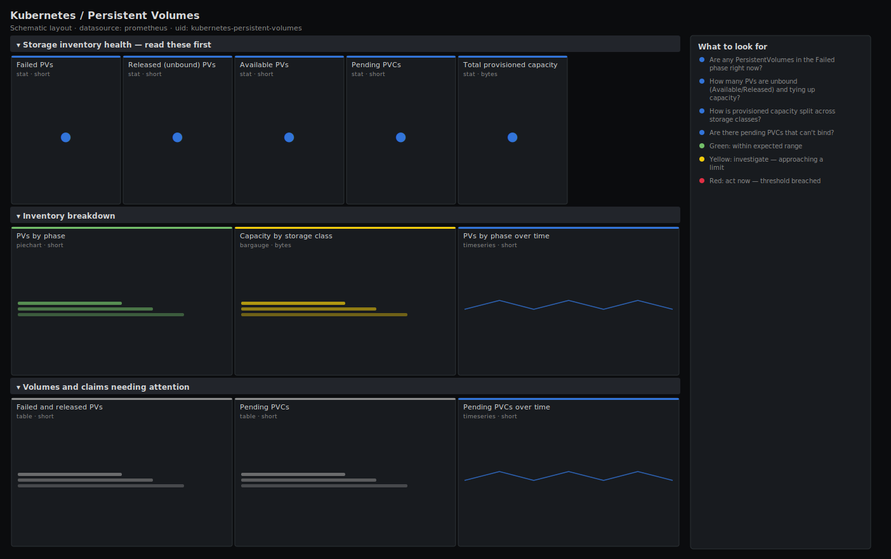

# Kubernetes / Persistent Volumes

> Persistent Volume inventory by phase (Bound/Available/Released/Failed), capacity by storage class, and the PVs and PVCs that need attention. Answers "is storage provisioning healthy and is any volume stuck or leaking capacity?" using kube-state-metrics, not raw object dumps.

**Primary search phrase:** Kubernetes persistent volume Grafana dashboard  
**Category:** `kubernetes` · **UID:** `kubernetes-persistent-volumes` · **Datasource:** Prometheus



## Questions this dashboard answers

- Are any PersistentVolumes in the Failed phase right now?
- How many PVs are unbound (Available/Released) and tying up capacity?
- How is provisioned capacity split across storage classes?
- Are there pending PVCs that can't bind?
- Which released PVs are leaking capacity that should be reclaimed?

## Production lessons — why this dashboard exists

Storage problems are quiet until a pod won't start, so this dashboard watches the control objects rather than the data path. **Failed** PVs mean the reclaim or provisioning step errored and that capacity is stuck; **Released** PVs are the slow leak — a PVC was deleted but the PV (with `Retain`) never returned to the pool, so capacity quietly disappears over months. The lead row pairs failed volumes with the unbound count so you can tell "something broke" from "we have idle supply". Pending PVCs are the user-facing symptom: a PVC that can't bind is a pod stuck in ContainerCreating, and the cause is almost always a missing storage class, an exhausted backend, or no matching PV for a static setup.

## Data source requirements

- **Prometheus** datasource (selected at import time via `${DS_PROMETHEUS}`).
- `kube-state-metrics` (the `kube_persistentvolume_status_phase`, `kube_persistentvolume_capacity_bytes`, `kube_persistentvolume_info` and `kube_persistentvolumeclaim_status_phase` series).

## Template variables

| Variable | Label | Type | Purpose |
|----------|-------|------|---------|
| `${storageclass}` | Storage class | query | Storage class(es) to scope the inventory to; supports multi-select. |

## Panels

### Storage inventory health — read these first

- **Failed PVs** (stat, `short`) — PersistentVolumes in the Failed phase. These are stuck — reclaim or provisioning errored.
- **Released (unbound) PVs** (stat, `short`) — PVs whose claim was deleted but that haven't returned to the pool — capacity leaking under a Retain policy.
- **Available PVs** (stat, `short`) — Provisioned PVs waiting to be bound. Idle supply — fine in small numbers, wasteful in large ones.
- **Pending PVCs** (stat, `short`) — PersistentVolumeClaims that can't bind. Each one is a pod stuck waiting for storage.
- **Total provisioned capacity** (stat, `bytes`) — Sum of capacity across all PersistentVolumes in scope.

### Inventory breakdown

- **PVs by phase** (piechart, `short`) — Distribution of PVs across lifecycle phases. A healthy cluster is almost entirely Bound.
- **Capacity by storage class** (bargauge, `bytes`) — Provisioned bytes per storage class — where your storage spend actually lands.
- **PVs by phase over time** (timeseries, `short`) — Phase counts over time. A rising Released/Failed line is a reclaim problem accumulating.

### Volumes and claims needing attention

- **Failed and released PVs** (table, `short`) — The specific PVs stuck in Failed or Released — clean these up to reclaim capacity.
- **Pending PVCs** (table, `short`) — Claims that can't bind, with their namespace. Each maps to a pod waiting on storage.
- **Pending PVCs over time** (timeseries, `short`) — Count of unbound claims. A sustained nonzero line means provisioning is broken, not just slow.

## Import

**Grafana UI** — *Dashboards → New → Import*, upload `dashboards/kubernetes/persistent-volumes.json`, then pick your datasource when prompted.

**API:**

```bash
scripts/import-dashboard.sh dashboards/kubernetes/persistent-volumes.json
```

**Provisioning** — drop the JSON into a provisioned folder (see [provisioning guide](../../provisioning.md)).

## Recommended alerts

Ready-to-use rules ship in `alerts/kubernetes.rules.yml`.

### PersistentVolumeFailed (`warning`)

```promql
kube_persistentvolume_status_phase{phase="Failed"} == 1
```

- **Fires after:** `5m`
- **Why it matters:** A Failed PV means automatic reclamation or provisioning errored; the capacity is stuck and won't be reused.
- **Investigate:** Open Kubernetes / Persistent Volumes, find the PV in the failed/released table, and check its events and the provisioner/CSI driver logs.
- **Recovery:** Clears when the PV leaves the Failed phase.
- **False positives:** A transient Failed state during a flaky CSI operation that retries successfully.

### PersistentVolumeClaimPending (`warning`)

```promql
kube_persistentvolumeclaim_status_phase{phase="Pending"} == 1
```

- **Fires after:** `15m`
- **Why it matters:** A PVC that can't bind blocks its pod from starting — a real outage for that workload.
- **Investigate:** Check the PVC's events and the requested storage class; confirm the provisioner exists and the backend has capacity.
- **Recovery:** Clears when the PVC binds.
- **False positives:** Brief Pending right after creation while the provisioner works is normal — the 15m `for` filters it out.

### PersistentVolumesReleasedAccumulating (`info`)

```promql
sum(kube_persistentvolume_status_phase{phase="Released"}) > 10
```

- **Fires after:** `1h`
- **Why it matters:** Released PVs under a Retain policy never return to the pool; over time this silently leaks real storage capacity and cost.
- **Investigate:** Use the failed/released PVs table to list them and confirm their reclaim policy and whether the data is still needed.
- **Recovery:** Clears when the released count drops back below 10 after cleanup.
- **False positives:** Clusters that intentionally retain volumes for audit/recovery — raise the threshold to match your policy.

## Troubleshooting

| Symptom | Likely cause | First action |
|---------|--------------|--------------|
| All panels show "No data" | kube-state-metrics isn't deployed or isn't scraped. | Confirm kube-state-metrics is running and `kube_persistentvolume_status_phase` exists in Explore. |
| Capacity-by-class panel is empty but PVs exist | The `group_left` join failed because `kube_persistentvolume_info` lacks the storageclass label in your KSM version. | Check the label names KSM emits for PV info and adjust the `group_left (storageclass)` join key. |
| Phase counts look doubled | The metric kube_persistentvolume_status_phase emits a series per phase; summing without `by (phase)` collapses them incorrectly. | Keep the `by (phase)` aggregation and filter with `== 1` for tables. |

## Performance considerations

These are gauge metrics from kube-state-metrics, so a 1m refresh is plenty and the queries are cheap. The capacity-by-class join (`* on (persistentvolume) group_left`) is the only non-trivial expression; on clusters with thousands of PVs, prefer a recording rule for it.

## Customization

Tune the Released (10) and Available thresholds to your reclaim policy and supply strategy. Scope `$storageclass` to a tier (e.g. fast SSD vs archival) to review one class at a time. Add a `$namespace` variable to the PVC tables if you want per-team views.

## Related resources

- [Advanced observability guides](https://devopsaitoolkit.com/guides/)
- [Grafana & Prometheus tutorials](https://devopsaitoolkit.com/blog/)
- [AI Incident Response Assistant](https://devopsaitoolkit.com/dashboard/incident-response)
- [PromQL cookbook](../../../promql/README.md) · [Alerting guide](../../alerting.md) · [Dashboard catalog](../../catalog.md)
