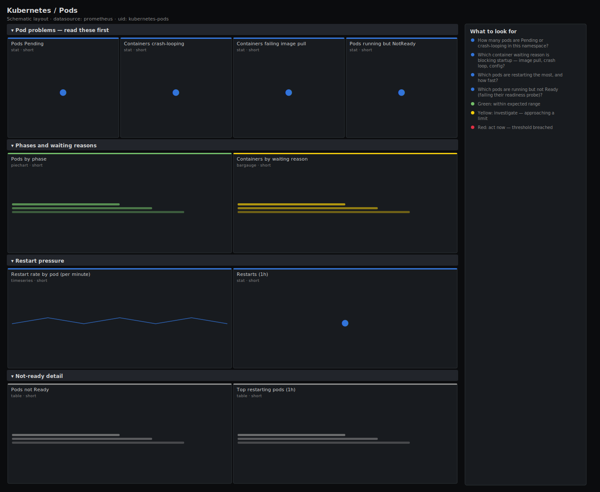

# Kubernetes / Pods

> Pod-level health for a namespace: phase breakdown, CrashLoopBackOff and other waiting reasons, restart rate, and a table of pods that are not Ready. Answers "what is broken in this namespace and why won't it start?" from kube-state-metrics.

**Primary search phrase:** Kubernetes pod health Grafana dashboard  
**Category:** `kubernetes` · **UID:** `kubernetes-pods` · **Datasource:** Prometheus



## Questions this dashboard answers

- How many pods are Pending or crash-looping in this namespace?
- Which container waiting reason is blocking startup — image pull, crash loop, config?
- Which pods are restarting the most, and how fast?
- Which pods are running but not Ready (failing their readiness probe)?

## Production lessons — why this dashboard exists

"The app is down" almost always resolves to one of a handful of pod states, and the waiting *reason* tells you who owns the fix: CrashLoopBackOff is the app or its config, ImagePullBackOff is the registry or a typo'd tag, CreateContainerError is a missing secret/volume, and ContainerCreating that never clears is usually a volume mount. This dashboard leads with Pending and crash-loop counts, then breaks waiting reasons out so triage skips guessing. Restart *rate* matters more than total restarts — a pod with 4000 lifetime restarts that is now stable is far less urgent than one restarting twice a minute.

## Data source requirements

- **Prometheus** datasource (selected at import time via `${DS_PROMETHEUS}`).
- `kube-state-metrics` for pod phase, readiness, restart counts and container waiting reasons (`kube_pod_status_phase`, `kube_pod_status_ready`, `kube_pod_container_status_restarts_total`, `kube_pod_container_status_waiting_reason`).

## Template variables

| Variable | Label | Type | Purpose |
|----------|-------|------|---------|
| `${cluster}` | Cluster | query | Cluster to scope to. Select All on single-cluster setups. |
| `${namespace}` | Namespace | query | Namespace(s) to inspect; supports multi-select. |

## Panels

### Pod problems — read these first

- **Pods Pending** (stat, `short`) — Pods that cannot schedule or start in the selected namespaces.
- **Containers crash-looping** (stat, `short`) — Containers in CrashLoopBackOff — repeatedly starting and dying.
- **Containers failing image pull** (stat, `short`) — Containers stuck in ImagePullBackOff or ErrImagePull — registry, credentials, or a bad tag.
- **Pods running but NotReady** (stat, `short`) — Pods in Running phase that are failing their readiness probe — receiving no traffic.

### Phases and waiting reasons

- **Pods by phase** (piechart, `short`) — Lifecycle phase share across the selected namespaces.
- **Containers by waiting reason** (bargauge, `short`) — Why containers are stuck waiting. The reason names the responder — app, registry, config or volume.

### Restart pressure

- **Restart rate by pod (per minute)** (timeseries, `short`) — Container restarts per minute per pod. A flat non-zero line is an active crash loop.
- **Restarts (1h)** (stat, `short`) — Total container restarts in the selected namespaces over the last hour.

### Not-ready detail

- **Pods not Ready** (table, `short`) — Pods whose Ready condition is false — running but out of the load-balancer rotation. The list to work through during an incident.
- **Top restarting pods (1h)** (table, `short`) — Pods with the most restarts in the last hour — ranked crash-investigation queue.

## Import

**Grafana UI** — *Dashboards → New → Import*, upload `dashboards/kubernetes/pods.json`, then pick your datasource when prompted.

**API:**

```bash
scripts/import-dashboard.sh dashboards/kubernetes/pods.json
```

**Provisioning** — drop the JSON into a provisioned folder (see [provisioning guide](../../provisioning.md)).

## Recommended alerts

Ready-to-use rules ship in `alerts/kubernetes.rules.yml`.

### KubePodCrashLooping (`critical`)

```promql
sum by (namespace, pod, container) (kube_pod_container_status_waiting_reason{reason="CrashLoopBackOff"}) > 0
```

- **Fires after:** `10m`
- **Why it matters:** A crash-looping container serves no traffic and burns the node restarting it; if it is a critical service the namespace is effectively down.
- **Investigate:** Read the container's previous logs (`kubectl logs --previous`) and recent events; check the waiting-reason panel to confirm the reason.
- **Recovery:** Clears when no container reports CrashLoopBackOff for 5m.
- **False positives:** A job container that exits non-zero by design — exclude job pods from the rule.

### KubePodImagePullFailing (`warning`)

```promql
sum by (namespace, pod, container) (kube_pod_container_status_waiting_reason{reason=~"ImagePullBackOff|ErrImagePull"}) > 0
```

- **Fires after:** `10m`
- **Why it matters:** An unpullable image means the pod will never start — a typo'd tag, deleted image, or broken registry credentials blocks the whole rollout.
- **Investigate:** Inspect pod events for the exact pull error; verify the image tag exists and the imagePullSecret is valid.
- **Recovery:** Clears when no container is in ImagePullBackOff/ErrImagePull for 5m.
- **False positives:** Transient registry rate-limits during a mass rollout — usually self-resolve within minutes.

### KubePodNotReady (`warning`)

```promql
sum by (namespace, pod) (kube_pod_status_ready{condition="true"}) == 0 and on (namespace, pod) sum by (namespace, pod) (kube_pod_status_phase{phase="Running"}) > 0
```

- **Fires after:** `15m`
- **Why it matters:** A Running-but-NotReady pod is failing its readiness probe, so it receives no traffic yet still counts as a replica — capacity you think you have but do not.
- **Investigate:** Check the readiness probe path/port and the app's dependency health; the pod is up but the app says it is not ready.
- **Recovery:** Clears when the pod reports Ready for 5m.
- **False positives:** Slow-starting apps during a deploy — raise `for` past the app's warm-up time.

## Troubleshooting

| Symptom | Likely cause | First action |
|---------|--------------|--------------|
| Restart-rate panel is empty | No pods are restarting (the `> 0` filter hides flat zeros) | This is the healthy state — restarts only appear when they happen. |
| NotReady table empty during an incident | Pods are CrashLooping (not Running) so the Ready filter excludes them | Check the crash-loop stat and waiting-reason panel instead. |
| All panels show No data | Wrong $namespace selection or kube-state-metrics not scraped | Set $namespace to All and verify kube-state-metrics in Explore. |

## Performance considerations

Restart and waiting-reason panels aggregate `by (namespace, pod[, container])`, so series scale with the namespace size, not the whole cluster — keep $namespace scoped on large clusters. Tables use `topk(15)` and `== 0` / `> 0` filters so only problem rows render. Restart rate uses a 5m window; `increase(...[1h])` is reset-safe for the hourly totals.

## Customization

To watch one app, set $namespace and append a `pod=~"myapp-.*"` selector. Tune the crash-loop `for: 10m` to your tolerance — shorter pages faster but catches benign deploy-time restarts. Add `OOMKilled` handling by graphing `kube_pod_container_status_last_terminated_reason` alongside the waiting reasons.

## Related resources

- [Advanced observability guides](https://devopsaitoolkit.com/guides/)
- [Grafana & Prometheus tutorials](https://devopsaitoolkit.com/blog/)
- [AI Incident Response Assistant](https://devopsaitoolkit.com/dashboard/incident-response)
- [PromQL cookbook](../../../promql/README.md) · [Alerting guide](../../alerting.md) · [Dashboard catalog](../../catalog.md)
