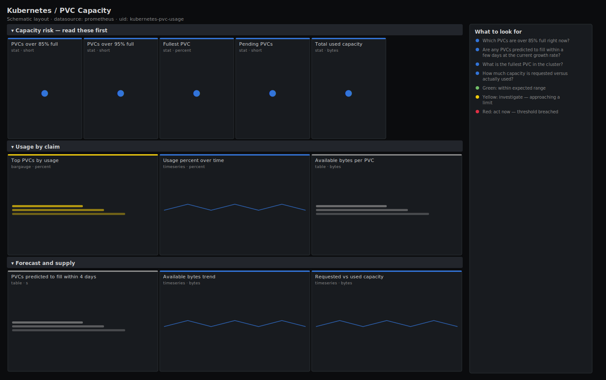

# Kubernetes / PVC Capacity

> Filesystem usage per PersistentVolumeClaim from kubelet volume stats, the PVCs nearest to full, and a predict_linear projection of which will fill soon. Answers "which volumes are about to run out of space?" before an application starts failing writes, rather than after.

**Primary search phrase:** Kubernetes PVC usage Grafana dashboard  
**Category:** `kubernetes` · **UID:** `kubernetes-pvc-usage` · **Datasource:** Prometheus



## Questions this dashboard answers

- Which PVCs are over 85% full right now?
- Are any PVCs predicted to fill within a few days at the current growth rate?
- What is the fullest PVC in the cluster?
- How much capacity is requested versus actually used?
- Are there pending PVCs blocking pods from starting?

## Production lessons — why this dashboard exists

A full PersistentVolume is one of the nastiest failure modes in Kubernetes: the pod doesn't crash cleanly, it starts failing writes, corrupting state or wedging the application while the pod still reports Ready. Worse, you usually **can't just resize** in a hurry if the storage class doesn't allow expansion. So this dashboard is built to warn early — the lead row counts PVCs **over 85%** and the **predict_linear** panel projects which volumes cross 100% within days at their current fill rate, turning a 3am page into a planned ticket. Usage comes from `kubelet_volume_stats_*` (the real filesystem), not the PVC's requested size, because what matters is bytes used versus bytes available, not what was asked for.

## Data source requirements

- **Prometheus** datasource (selected at import time via `${DS_PROMETHEUS}`).
- `kubelet` volume stats (the `kubelet_volume_stats_used_bytes`, `kubelet_volume_stats_available_bytes` and `kubelet_volume_stats_capacity_bytes` series) and `kube-state-metrics` for PVC phase and requested size.

## Template variables

| Variable | Label | Type | Purpose |
|----------|-------|------|---------|
| `${namespace}` | Namespace | query | Namespace(s) to scope the PVCs to; supports multi-select. |

## Panels

### Capacity risk — read these first

- **PVCs over 85% full** (stat, `short`) — Count of PVCs whose filesystem usage exceeds 85%. These are the ones to size up soon.
- **PVCs over 95% full** (stat, `short`) — Count of PVCs critically full. At this point write failures are imminent.
- **Fullest PVC** (stat, `percent`) — Highest filesystem usage percentage across the selected PVCs.
- **Pending PVCs** (stat, `short`) — Claims that can't bind, so their pods can't start.
- **Total used capacity** (stat, `bytes`) — Sum of bytes actually used across the selected PVCs.

### Usage by claim

- **Top PVCs by usage** (bargauge, `percent`) — The fullest PVCs by percentage. The ranked worklist for capacity planning.
- **Usage percent over time** (timeseries, `percent`) — Per-PVC fill percentage trend. The slope is what predict_linear extrapolates.
- **Available bytes per PVC** (table, `bytes`) — Free space remaining on each volume — the absolute headroom behind the percentages.

### Forecast and supply

- **PVCs predicted to fill within 4 days** (table, `s`) — Volumes whose available bytes are projected to hit zero within 4 days at the last 6h growth rate.
- **Available bytes trend** (timeseries, `bytes`) — Absolute free space over time per PVC. A steady downward slope is the early warning.
- **Requested vs used capacity** (timeseries, `bytes`) — Total PVC requested size versus bytes actually used — the gap is over-provisioned spend.

## Import

**Grafana UI** — *Dashboards → New → Import*, upload `dashboards/kubernetes/pvc-usage.json`, then pick your datasource when prompted.

**API:**

```bash
scripts/import-dashboard.sh dashboards/kubernetes/pvc-usage.json
```

**Provisioning** — drop the JSON into a provisioned folder (see [provisioning guide](../../provisioning.md)).

## Recommended alerts

Ready-to-use rules ship in `alerts/kubernetes.rules.yml`.

### PVCNearFull (`warning`)

```promql
kubelet_volume_stats_used_bytes / kubelet_volume_stats_capacity_bytes > 0.85
```

- **Fires after:** `15m`
- **Why it matters:** A volume nearing full risks failing application writes; many storage classes can't be expanded instantly, so you need lead time.
- **Investigate:** Open Kubernetes / PVC Capacity, check the available-bytes table and the usage trend to see how fast it's filling.
- **Recovery:** Clears when usage drops below 85% for 5m.
- **False positives:** Volumes that intentionally run near full (e.g. fixed-size caches) — scope the alert away from them with a label selector.

### PVCCriticallyFull (`critical`)

```promql
kubelet_volume_stats_used_bytes / kubelet_volume_stats_capacity_bytes > 0.95
```

- **Fires after:** `5m`
- **Why it matters:** At this fill level write failures and data corruption are imminent, and the application may already be degrading silently.
- **Investigate:** Check the available-bytes table for absolute headroom and confirm whether the volume can be expanded online.
- **Recovery:** Clears when usage drops below 95% for 5m.
- **False positives:** Almost none — a 95%-full volume is a real risk even if intentional.

### PVCWillFillSoon (`warning`)

```promql
predict_linear(kubelet_volume_stats_available_bytes[6h], 4 * 86400) < 0 and (kubelet_volume_stats_used_bytes / kubelet_volume_stats_capacity_bytes) > 0.7
```

- **Fires after:** `1h`
- **Why it matters:** Catching a fill trend days ahead converts a 3am "disk full" page into a planned capacity ticket.
- **Investigate:** Open the predicted-to-fill table and the available-bytes trend to confirm the slope is real and not a one-off spike.
- **Recovery:** Clears when the projection no longer crosses zero within the window (growth slowed or capacity added).
- **False positives:** A short burst of writes in the 6h window can skew the projection; the 70% guard and 1h `for` reduce noise.

## Troubleshooting

| Symptom | Likely cause | First action |
|---------|--------------|--------------|
| All panels show "No data" | kubelet volume stats aren't scraped, or no PVCs are mounted in scope. | Confirm `kubelet_volume_stats_capacity_bytes` exists in Explore; these come from the kubelet, and only mounted PVCs report stats. |
| A PVC is missing from the usage panels | The volume isn't currently mounted by a running pod, so the kubelet emits no stats for it. | kubelet_volume_stats only covers attached/mounted volumes; use the Persistent Volumes dashboard for unbound inventory. |
| predict_linear table is empty | Volumes are stable or shrinking, so nothing is projected to hit zero. | This is the healthy case; widen the lookback or shorten the horizon to stress-test the projection. |

## Performance considerations

Usage ratios are computed from gauges, so a 1m refresh is comfortable. The predict_linear panels read a 6h range per series and are the heaviest queries here; on clusters with thousands of PVCs, scope `$namespace` or back the projection with a recording rule. All per-PVC panels carry the `namespace`/`persistentvolumeclaim` labels so series stay identifiable.

## Customization

Tune the 85%/95% fill thresholds and the 4-day / 70% projection guards to your storage class's expansion latency and growth profile. Scope `$namespace` to a team to give them their own capacity view, and lengthen the predict_linear lookback for smoother, slower-moving volumes.

## Related resources

- [Advanced observability guides](https://devopsaitoolkit.com/guides/)
- [Grafana & Prometheus tutorials](https://devopsaitoolkit.com/blog/)
- [AI Incident Response Assistant](https://devopsaitoolkit.com/dashboard/incident-response)
- [PromQL cookbook](../../../promql/README.md) · [Alerting guide](../../alerting.md) · [Dashboard catalog](../../catalog.md)
