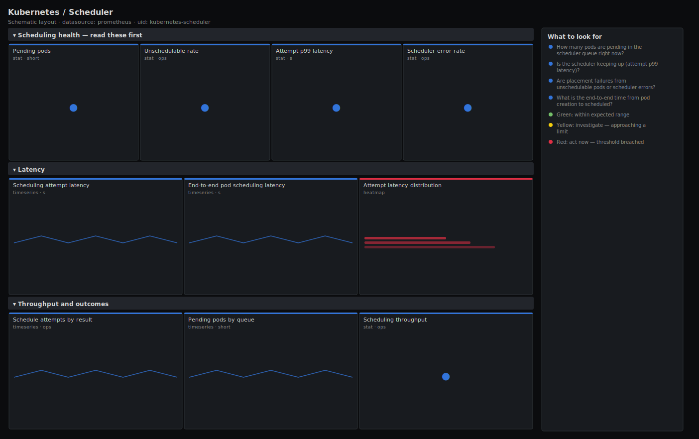

# Kubernetes / Scheduler

> Pending pods, scheduling attempt latency (p99), unschedulable rate and scheduling outcomes for the kube-scheduler. Answers "are pods getting placed, and if not is it because the scheduler is slow or because nothing fits?" rather than dumping raw attempt counters.

**Primary search phrase:** Kubernetes scheduler Grafana dashboard  
**Category:** `kubernetes` · **UID:** `kubernetes-scheduler` · **Datasource:** Prometheus



## Questions this dashboard answers

- How many pods are pending in the scheduler queue right now?
- Is the scheduler keeping up (attempt p99 latency)?
- Are placement failures from unschedulable pods or scheduler errors?
- What is the end-to-end time from pod creation to scheduled?
- Is the scheduling throughput high enough for the current churn?

## Production lessons — why this dashboard exists

When pods sit in Pending the first question is always **"is it the scheduler or is it capacity?"** — and the answer changes who you wake up. This dashboard separates the two: `result="unschedulable"` means **nothing fits** (a capacity/affinity/taint problem for the cluster-autoscaler or platform team), while `result="error"` and a high attempt latency mean the **scheduler itself** is struggling. The lead row puts pending-pods next to the unschedulable rate so you can tell in five seconds whether to scale nodes or to investigate the scheduler. A slow scheduler is usually a slow API server underneath, so cross-check the API server dashboard before blaming the scheduler.

## Data source requirements

- **Prometheus** datasource (selected at import time via `${DS_PROMETHEUS}`).
- `kube-scheduler` metrics endpoint (the `scheduler_pending_pods`, `scheduler_scheduling_attempt_duration_seconds_bucket`, `scheduler_schedule_attempts_total` and `scheduler_pod_scheduling_duration_seconds_bucket` series).

## Template variables

| Variable | Label | Type | Purpose |
|----------|-------|------|---------|
| `${job}` | Job | query | Prometheus scrape job for the kube-scheduler targets. |
| `${instance}` | Instance | query | Scheduler instance(s); the leader serves traffic in an HA setup. |

## Panels

### Scheduling health — read these first

- **Pending pods** (stat, `short`) — Pods currently waiting in the scheduler queue (active + backoff + unschedulable).
- **Unschedulable rate** (stat, `ops`) — Rate of attempts that found no suitable node. Sustained values mean a capacity, taint or affinity problem.
- **Attempt p99 latency** (stat, `s`) — 99th percentile time for a single scheduling attempt. Rising values mean the scheduler is the bottleneck.
- **Scheduler error rate** (stat, `ops`) — Rate of attempts that errored (not unschedulable — an actual scheduler/API failure).

### Latency

- **Scheduling attempt latency** (timeseries, `s`) — p50/p99 of a single scheduling cycle (filter + score). The scheduler's own speed.
- **End-to-end pod scheduling latency** (timeseries, `s`) — p99 time from a pod entering the queue to being scheduled — what users actually feel as "stuck Pending".
- **Attempt latency distribution** (heatmap, `s`) — Full distribution of attempt durations — catch a slow tail before it lifts the p99.

### Throughput and outcomes

- **Schedule attempts by result** (timeseries, `ops`) — Scheduled vs unschedulable vs error. The shape of this stack is the scheduler's story.
- **Pending pods by queue** (timeseries, `short`) — Where pending pods sit — active (ready to try), backoff (recently failed), or unschedulable.
- **Scheduling throughput** (stat, `ops`) — Successfully scheduled pods per second. Compare against your pod churn to size headroom.

## Import

**Grafana UI** — *Dashboards → New → Import*, upload `dashboards/kubernetes/scheduler.json`, then pick your datasource when prompted.

**API:**

```bash
scripts/import-dashboard.sh dashboards/kubernetes/scheduler.json
```

**Provisioning** — drop the JSON into a provisioned folder (see [provisioning guide](../../provisioning.md)).

## Recommended alerts

Ready-to-use rules ship in `alerts/kubernetes.rules.yml`.

### SchedulerPendingPodsHigh (`warning`)

```promql
sum by (job) (scheduler_pending_pods) > 50
```

- **Fires after:** `15m`
- **Why it matters:** A sustained backlog means workloads aren't starting — usually no capacity fits, sometimes the scheduler is stalled.
- **Investigate:** Open Kubernetes / Scheduler and check pending-pods-by-queue and the unschedulable rate to tell capacity from scheduler trouble.
- **Recovery:** Clears when pending pods drop below 50 for 5m.
- **False positives:** A large batch/Job submission briefly inflates pending before nodes scale up.

### SchedulerHighAttemptLatency (`warning`)

```promql
histogram_quantile(0.99, sum by (le, job) (rate(scheduler_scheduling_attempt_duration_seconds_bucket[5m]))) > 1
```

- **Fires after:** `10m`
- **Why it matters:** A slow scheduling cycle throttles placement throughput and delays every new pod, independent of capacity.
- **Investigate:** Compare attempt latency against API server read p99 — a slow scheduler is usually waiting on a slow API server/etcd.
- **Recovery:** Clears when attempt p99 falls below 1s for 5m.
- **False positives:** A burst of pods with complex affinity rules can transiently raise p99.

### SchedulerErrors (`warning`)

```promql
sum by (job) (rate(scheduler_schedule_attempts_total{result="error"}[5m])) > 0.1
```

- **Fires after:** `10m`
- **Why it matters:** Errors (distinct from unschedulable) mean the scheduler failed to complete a cycle — often an API/binding failure, not a capacity issue.
- **Investigate:** Open the attempts-by-result panel to confirm the error rate and read scheduler logs for the failing plugin or binding error.
- **Recovery:** Clears when the error rate stays below 0.1/s for 5m.
- **False positives:** Transient binding conflicts during heavy preemption are usually retried successfully.

## Troubleshooting

| Symptom | Likely cause | First action |
|---------|--------------|--------------|
| All panels show "No data" | Wrong `$job`, or only the leader exposes useful metrics in an HA setup. | Check `up{job="$job"}`; the active leader serves scheduling, so scope `$instance` to it if followers report zeros. |
| Pending pods stays high but unschedulable rate is zero | Pods are in backoff after repeated failures rather than truly unschedulable. | Use the pending-pods-by-queue panel to see the backoff queue, then check the pods' events for the failing predicate. |
| e2e scheduling latency dwarfs attempt latency | Pods spend most of their time waiting in the queue, not in the scheduling cycle. | This points at capacity/backoff, not scheduler speed — investigate node availability and autoscaling. |

## Performance considerations

All rates use a 5m window (>=4x a 30s scrape). Quantiles aggregate the histogram with `sum by (le)` before `histogram_quantile`. The attempt-latency heatmap is the heaviest panel; narrow the range on very high-churn clusters or pre-aggregate the bucket with a recording rule.

## Customization

Tune the 10/50 pending and 0.1s/1s latency thresholds to your cluster size and SLO. In an HA control plane, scope `$instance` to the current leader to avoid follower zeros. Add a `$result` variable if you want to drill the outcomes row to a single scheduling result.

## Related resources

- [Advanced observability guides](https://devopsaitoolkit.com/guides/)
- [Grafana & Prometheus tutorials](https://devopsaitoolkit.com/blog/)
- [AI Incident Response Assistant](https://devopsaitoolkit.com/dashboard/incident-response)
- [PromQL cookbook](../../../promql/README.md) · [Alerting guide](../../alerting.md) · [Dashboard catalog](../../catalog.md)
