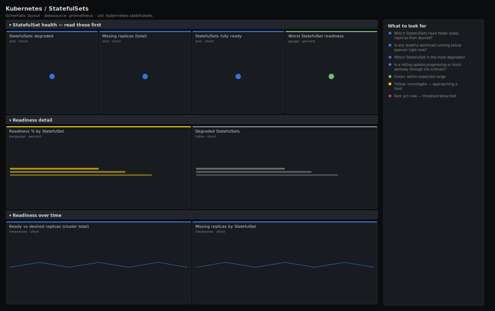

# Kubernetes / StatefulSets

> Health for StatefulSets — databases, queues and other ordered, stateful workloads: how many replicas are ready against desired, which sets are degraded, and a per-StatefulSet status table. Answers "is my data tier at full strength?" from kube-state-metrics.

**Primary search phrase:** Kubernetes StatefulSet health Grafana dashboard  
**Category:** `kubernetes` · **UID:** `kubernetes-statefulsets` · **Datasource:** Prometheus



## Questions this dashboard answers

- Which StatefulSets have fewer ready replicas than desired?
- Is any stateful workload running below quorum right now?
- Which StatefulSet is the most degraded?
- Is a rolling update progressing or stuck partway through the ordinals?

## Production lessons — why this dashboard exists

StatefulSets back the things you cannot afford to lose — databases, brokers, clustered caches — and they update one ordinal at a time, in order, blocking on each pod becoming Ready before moving on. That makes a single stuck pod able to freeze an entire rollout, and a quorum-based system (etcd, Kafka, a 3-node DB) can tip from "degraded" to "unavailable" the moment ready replicas drop below a majority. This dashboard leads with degraded StatefulSets and the worst readiness ratio so you immediately know whether the data tier is at strength, then breaks it down per set. Treat readiness here as more urgent than for stateless apps: unavailable replicas may mean a stalled, ordered, manual-intervention rollout.

## Data source requirements

- **Prometheus** datasource (selected at import time via `${DS_PROMETHEUS}`).
- `kube-state-metrics` for StatefulSet replica state (`kube_statefulset_status_replicas_ready`, `kube_statefulset_replicas`).

## Template variables

| Variable | Label | Type | Purpose |
|----------|-------|------|---------|
| `${cluster}` | Cluster | query | Cluster to scope to. Select All on single-cluster setups. |
| `${namespace}` | Namespace | query | Namespace(s) to inspect; supports multi-select. |

## Panels

### StatefulSet health — read these first

- **StatefulSets degraded** (stat, `short`) — StatefulSets with fewer ready replicas than desired — running below full strength.
- **Missing replicas (total)** (stat, `short`) — Sum of not-ready replicas across all StatefulSets — the missing stateful capacity.
- **StatefulSets fully ready** (stat, `short`) — StatefulSets where every desired replica is ready.
- **Worst StatefulSet readiness** (gauge, `percent`) — Lowest ready-vs-desired ratio across all StatefulSets — the most degraded data tier.

### Readiness detail

- **Readiness % by StatefulSet** (bargauge, `percent`) — Ready replicas as a share of desired, per StatefulSet. Below the quorum line for a clustered system is an availability risk.
- **Degraded StatefulSets** (table, `short`) — StatefulSets running below desired replicas, with ready and desired counts — the worklist for a stuck data-tier rollout.

### Readiness over time

- **Ready vs desired replicas (cluster total)** (timeseries, `short`) — Aggregate ready and desired stateful replicas. A gap that opens on an update and does not close is a stalled, ordered rollout.
- **Missing replicas by StatefulSet** (timeseries, `short`) — Per-StatefulSet count of not-ready replicas over time — watch which set is stuck and for how long.

## Import

**Grafana UI** — *Dashboards → New → Import*, upload `dashboards/kubernetes/statefulsets.json`, then pick your datasource when prompted.

**API:**

```bash
scripts/import-dashboard.sh dashboards/kubernetes/statefulsets.json
```

**Provisioning** — drop the JSON into a provisioned folder (see [provisioning guide](../../provisioning.md)).

## Recommended alerts

Ready-to-use rules ship in `alerts/kubernetes.rules.yml`.

### KubeStatefulSetReplicasMismatch (`warning`)

```promql
kube_statefulset_status_replicas_ready < kube_statefulset_replicas
```

- **Fires after:** `15m`
- **Why it matters:** A stateful workload short of replicas for 15 minutes usually means a pod is stuck Pending or failing readiness, and a sequential update will not advance past it.
- **Investigate:** Find the lowest-ordinal not-ready pod; check its PVC binding, readiness probe and events — StatefulSets block on ordinals in order.
- **Recovery:** Clears when ready replicas reach desired for 5m.
- **False positives:** A deliberately slow, hands-on database upgrade where degraded time is expected and supervised.

### KubeStatefulSetBelowQuorum (`critical`)

```promql
kube_statefulset_status_replicas_ready < (kube_statefulset_replicas / 2) and kube_statefulset_replicas >= 3
```

- **Fires after:** `5m`
- **Why it matters:** For a quorum-based cluster (etcd, Kafka, many databases) fewer than half the replicas ready risks loss of quorum — writes stall and the system may go read-only or unavailable.
- **Investigate:** Treat as a data-tier incident; check the cluster's own health endpoint and storage for the down members.
- **Recovery:** Clears when a majority of replicas are ready for 5m.
- **False positives:** Single- or double-replica StatefulSets (excluded by the `>= 3` guard) that are not quorum systems.

## Troubleshooting

| Symptom | Likely cause | First action |
|---------|--------------|--------------|
| Readiness stuck at the same fraction during an update | A higher-ordinal pod is not becoming Ready so the rollout blocks | Inspect the lowest not-ready ordinal's PVC and probe — fix it to unblock the sequence. |
| A StatefulSet shows 0 desired | Scaled to zero | Excluded from ratios by `clamp_min`; expected for paused stateful workloads. |
| Readiness recovers then drops repeatedly | A pod that passes readiness then crashes (often storage or OOM) | Cross-check Kubernetes / Pods for restarts and OOMKilled on that pod. |

## Performance considerations

Two gauges per StatefulSet, read directly with no rate windows — negligible cost. Filters use `> 0` and `<` comparisons so only degraded sets populate the tables. `clamp_min(desired, 1)` protects the readiness ratio from divide-by-zero on scaled-to-zero sets.

## Customization

The quorum alert assumes odd-sized clusters of 3+; adjust the `>= 3` guard and the `/ 2` fraction to your replication factor. Scope to one data store with a `statefulset=~"postgres|kafka"` selector. Lower the `for` window for tiers where any degraded time warrants an immediate page.

## Related resources

- [Advanced observability guides](https://devopsaitoolkit.com/guides/)
- [Grafana & Prometheus tutorials](https://devopsaitoolkit.com/blog/)
- [AI Incident Response Assistant](https://devopsaitoolkit.com/dashboard/incident-response)
- [PromQL cookbook](../../../promql/README.md) · [Alerting guide](../../alerting.md) · [Dashboard catalog](../../catalog.md)
