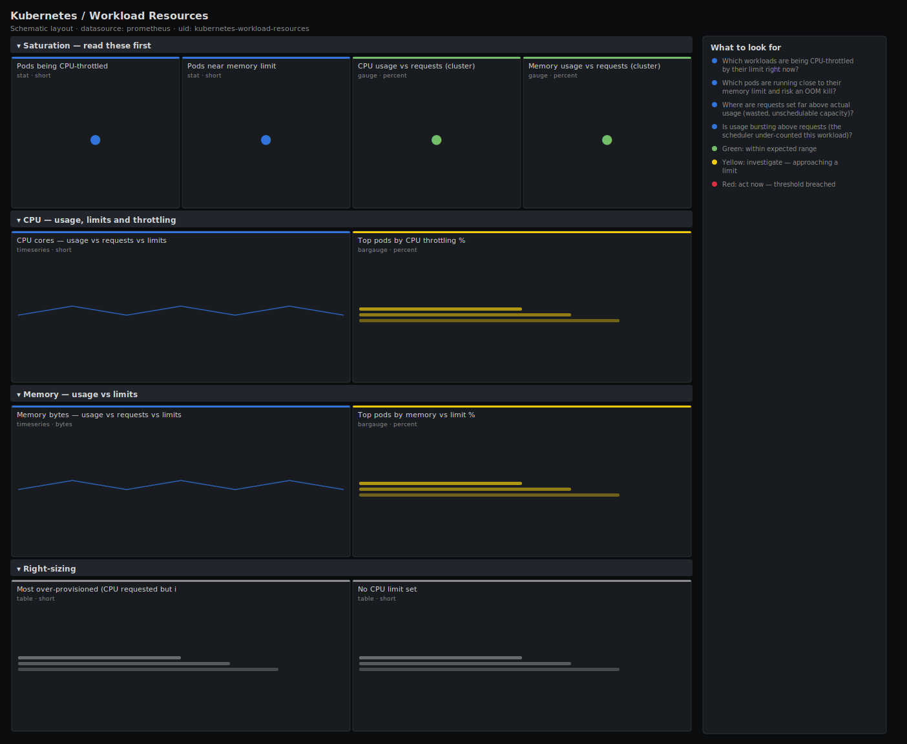

# Kubernetes / Workload Resources

> Right-sizing and saturation view for workloads: actual CPU and memory usage from cAdvisor against the requests and limits set on each pod, plus CPU throttling and pods running close to their memory limit. Answers "is this workload starved, wasteful, or about to be OOM-killed?" — the data behind every requests/limits decision.

**Primary search phrase:** Kubernetes requests limits usage Grafana dashboard  
**Category:** `kubernetes` · **UID:** `kubernetes-workload-resources` · **Datasource:** Prometheus



## Questions this dashboard answers

- Which workloads are being CPU-throttled by their limit right now?
- Which pods are running close to their memory limit and risk an OOM kill?
- Where are requests set far above actual usage (wasted, unschedulable capacity)?
- Is usage bursting above requests (the scheduler under-counted this workload)?

## Production lessons — why this dashboard exists

Requests and limits are guesses until you put usage next to them, and both wrong directions hurt: requests set far above usage waste schedulable capacity and cause false "cluster full" Pending pods, while a CPU limit set too low silently throttles the app — latency climbs with CPU sitting "idle" because the cgroup is capping it. Memory limits are harsher still: cross the limit and the kernel OOM-kills the container with no grace. This dashboard leads with throttled workloads and pods near their memory limit (the two that cause user-visible pain), then shows usage against requests and limits so you can right-size with evidence instead of vibes. The most common fix it surfaces: remove or raise CPU limits while keeping requests, and set memory requests equal to limits for predictable, non-bursty workloads.

## Data source requirements

- **Prometheus** datasource (selected at import time via `${DS_PROMETHEUS}`).
- `cAdvisor`/kubelet for actual usage and CPU throttling (`container_cpu_usage_seconds_total`, `container_memory_working_set_bytes`, `container_cpu_cfs_throttled_periods_total`, `container_cpu_cfs_periods_total`).
- `kube-state-metrics` for configured requests and limits (`kube_pod_container_resource_requests`, `kube_pod_container_resource_limits`).

## Template variables

| Variable | Label | Type | Purpose |
|----------|-------|------|---------|
| `${cluster}` | Cluster | query | Cluster to scope to. Select All on single-cluster setups. |
| `${namespace}` | Namespace | query | Namespace(s) to inspect; supports multi-select. |

## Panels

### Saturation — read these first

- **Pods being CPU-throttled** (stat, `short`) — Pods whose containers are throttled more than 25% of CFS periods by their CPU limit.
- **Pods near memory limit** (stat, `short`) — Pods using more than 90% of their configured memory limit — the next GC pause from an OOM kill.
- **CPU usage vs requests (cluster)** (gauge, `percent`) — Actual CPU usage as a share of CPU requests. Far below 100% means over-requested, wasted capacity; above 100% means bursting beyond what the scheduler reserved.
- **Memory usage vs requests (cluster)** (gauge, `percent`) — Actual working-set memory as a share of memory requests across the selection.

### CPU — usage, limits and throttling

- **CPU cores — usage vs requests vs limits** (timeseries, `short`) — Cluster-wide actual CPU against what is requested and capped. Usage hugging the limit line is where throttling happens.
- **Top pods by CPU throttling %** (bargauge, `percent`) — Share of CFS periods in which each pod was throttled by its CPU limit. High values mean the limit is too low for the load.

### Memory — usage vs limits

- **Memory bytes — usage vs requests vs limits** (timeseries, `bytes`) — Cluster-wide working-set memory against requests and limits. Usage above the request line means the scheduler under-counted this workload.
- **Top pods by memory vs limit %** (bargauge, `percent`) — Each pod's working-set memory as a share of its memory limit. Anything near 100% is one allocation away from an OOM kill.

### Right-sizing

- **Most over-provisioned (CPU requested but idle)** (table, `short`) — Pods reserving the most CPU above what they actually use — reclaimable capacity. Values are wasted cores (requests minus usage).
- **No CPU limit set** (table, `short`) — Pods with CPU requests but no CPU limit. Often deliberate (avoids throttling) — listed so the choice is explicit, not accidental.

## Import

**Grafana UI** — *Dashboards → New → Import*, upload `dashboards/kubernetes/workload-resources.json`, then pick your datasource when prompted.

**API:**

```bash
scripts/import-dashboard.sh dashboards/kubernetes/workload-resources.json
```

**Provisioning** — drop the JSON into a provisioned folder (see [provisioning guide](../../provisioning.md)).

## Recommended alerts

Ready-to-use rules ship in `alerts/kubernetes.rules.yml`.

### KubeWorkloadCPUThrottled (`warning`)

```promql
sum by (namespace, pod) (rate(container_cpu_cfs_throttled_periods_total{container!="", pod!=""}[5m])) / clamp_min(sum by (namespace, pod) (rate(container_cpu_cfs_periods_total{container!="", pod!=""}[5m])), 1) > 0.5
```

- **Fires after:** `15m`
- **Why it matters:** Heavy CPU throttling means the container wants more CPU than its limit allows — latency and queueing climb while the pod's CPU graph looks deceptively idle.
- **Investigate:** Compare the pod's CPU usage with its limit; correlate the throttling with a latency or queue-depth spike in the app's own dashboard.
- **Recovery:** Clears when throttling stays below 50% of periods for 5m.
- **False positives:** Short batch spikes that throttle briefly and finish — raise `for` or the threshold for bursty jobs.

### KubeWorkloadMemoryNearLimit (`critical`)

```promql
sum by (namespace, pod, container) (container_memory_working_set_bytes{container!="", pod!=""}) / on (namespace, pod, container) sum by (namespace, pod, container) (kube_pod_container_resource_limits{resource="memory"}) > 0.95
```

- **Fires after:** `10m`
- **Why it matters:** Crossing the memory limit triggers an immediate OOM kill with no grace period — the container dies mid-request and restarts, often in a loop.
- **Investigate:** Check whether usage is growing steadily (a leak) or stepped up after a deploy; review the app's heap/cache configuration.
- **Recovery:** Clears when working set falls below 95% of the limit for 5m.
- **False positives:** Cache-heavy apps that report high working set but reclaim under pressure without OOM — confirm against actual OOMKilled events.

## Troubleshooting

| Symptom | Likely cause | First action |
|---------|--------------|--------------|
| Throttling panels are empty | Containers have no CPU limit (no CFS quota | Expected — the "No CPU limit set" table lists those pods; throttling only exists where a limit does. |
| Memory-vs-limit panel empty for a workload | That workload has no memory limit set | Without a limit there is no denominator; set limits or watch usage vs requests instead. |
| CPU usage-vs-requests gauge over 100% | Workloads bursting above their requests | Normal for burstable QoS — only a concern if it coincides with node CPU saturation. |

## Performance considerations

Usage and throttling use 5m rate windows over cAdvisor counters (reset-safe). Aggregations are bounded with `sum by (namespace, pod[, container])`; keep $namespace scoped on very large clusters and prefer recording rules for the cluster-total timeseries. `clamp_min(..., 1)` guards every ratio denominator (periods, limits) against divide-by-zero.

## Customization

Tune the 25%/50% throttling and 90%/95% memory thresholds to your latency tolerance. Switch aggregation from `(namespace, pod)` to a workload label if your relabeling adds one, to roll pods up to their Deployment/StatefulSet. Use the over-provisioned table to feed a VerticalPodAutoscaler or a quarterly right-sizing pass.

## Related resources

- [Advanced observability guides](https://devopsaitoolkit.com/guides/)
- [Grafana & Prometheus tutorials](https://devopsaitoolkit.com/blog/)
- [AI Incident Response Assistant](https://devopsaitoolkit.com/dashboard/incident-response)
- [PromQL cookbook](../../../promql/README.md) · [Alerting guide](../../alerting.md) · [Dashboard catalog](../../catalog.md)
