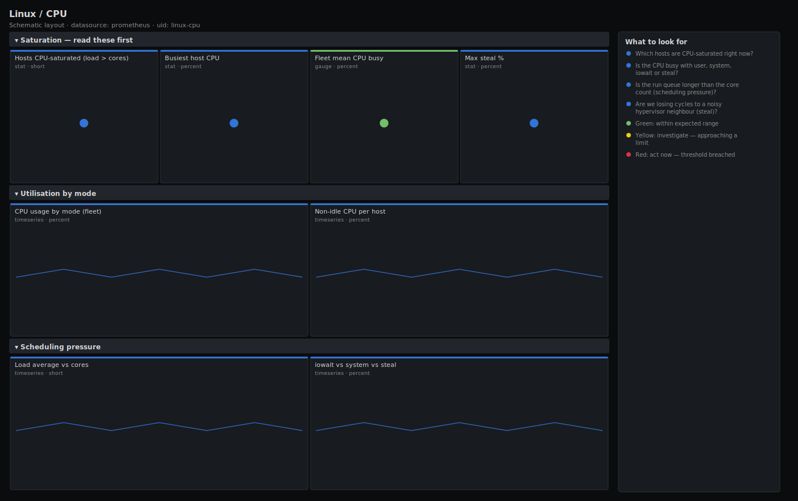

# Linux / CPU

> CPU saturation, utilisation by mode, run-queue pressure and steal time for a fleet of Linux hosts scraped by node_exporter. Answers "is this host CPU-bound, and on what?" rather than just drawing raw counters.

**Primary search phrase:** Node Exporter CPU Grafana dashboard  
**Category:** `linux` · **UID:** `linux-cpu` · **Datasource:** Prometheus



## Questions this dashboard answers

- Which hosts are CPU-saturated right now?
- Is the CPU busy with user, system, iowait or steal?
- Is the run queue longer than the core count (scheduling pressure)?
- Are we losing cycles to a noisy hypervisor neighbour (steal)?

## Production lessons — why this dashboard exists

Average CPU "utilisation" hides the problems that page you. A box at 55% average can still be dropping requests if one core is pinned or the run queue is deep, so this dashboard leads with **saturation** (load vs cores, run queue, steal) and only then breaks utilisation down **by mode**. The single most useful panel in incidents is iowait vs system: high iowait points at storage, high system at syscalls/network, high steal at the hypervisor — three completely different responders.

## Data source requirements

- **Prometheus** datasource (selected at import time via `${DS_PROMETHEUS}`).
- `node_exporter` running on each host (the `node_cpu_seconds_total`, `node_load1` and `node_uname_info` series).

## Template variables

| Variable | Label | Type | Purpose |
|----------|-------|------|---------|
| `${job}` | Job | query | Prometheus scrape job for your node_exporter targets. |
| `${instance}` | Instance | query | Host(s) to display; supports multi-select. |

## Panels

### Saturation — read these first

- **Hosts CPU-saturated (load > cores)** (stat, `short`) — Count of selected hosts whose 1m load average exceeds their core count.
- **Busiest host CPU** (stat, `percent`) — Highest non-idle CPU utilisation across selected hosts.
- **Fleet mean CPU busy** (gauge, `percent`) — Mean non-idle CPU across all selected hosts.
- **Max steal %** (stat, `percent`) — Highest steal time — cycles the hypervisor took from a guest.

### Utilisation by mode

- **CPU usage by mode (fleet)** (timeseries, `percent`) — Aggregate CPU time per mode. Stacks to 100% × core count.
- **Non-idle CPU per host** (timeseries, `percent`) — Per-host busy percentage — spot the outlier.

### Scheduling pressure

- **Load average vs cores** (timeseries, `short`) — 1m/5m/15m load. Sustained values above the core count mean a backlog.
- **iowait vs system vs steal** (timeseries, `percent`) — The three modes that explain *why* CPU is busy and who owns the fix.

## Import

**Grafana UI** — *Dashboards → New → Import*, upload `dashboards/linux/cpu.json`, then pick your datasource when prompted.

**API:**

```bash
scripts/import-dashboard.sh dashboards/linux/cpu.json
```

**Provisioning** — drop the JSON into a provisioned folder (see [provisioning guide](../../provisioning.md)).

## Recommended alerts

Ready-to-use rules ship in `alerts/linux.rules.yml`.

### HostHighCPUSaturation (`warning`)

```promql
100 * (1 - avg by (instance, job) (rate(node_cpu_seconds_total{mode="idle"}[5m]))) > 90
```

- **Fires after:** `10m`
- **Why it matters:** Sustained high CPU starves request handling and increases latency/queueing.
- **Investigate:** Open Linux / CPU, scope to the instance, compare iowait vs system vs steal to pick the responder.
- **Recovery:** Alert clears when busy drops below 90% for 5m.
- **False positives:** Batch/CI hosts that are intentionally CPU-bound — scope the rule with a label selector or raise `for`.

### HostCPUStealHigh (`warning`)

```promql
100 * avg by (instance, job) (rate(node_cpu_seconds_total{mode="steal"}[5m])) > 10
```

- **Fires after:** `15m`
- **Why it matters:** High steal means the hypervisor is denying the guest CPU it asked for — app slowness with idle-looking guest metrics.
- **Investigate:** Confirm on the hypervisor capacity dashboard; check neighbour density.
- **Recovery:** Clears when steal falls below 10% for 5m.
- **False positives:** Brief steal spikes during live-migration are expected.

## Troubleshooting

| Symptom | Likely cause | First action |
|---------|--------------|--------------|
| All panels show "No data" | Wrong `$job` or node_exporter not scraped. | Check `up{job="$job"}` in Explore; confirm the job label matches your scrape config. |
| The cores line is flat at 1 | `node_cpu_seconds_total` collapsed by a recording rule that dropped the `cpu` label. | Point the dashboard at raw node_exporter series, not a downsampled copy. |
| Busy % above 100 | Summing instead of averaging across cores. | Ensure mode aggregations use `avg by (instance)`, not `sum`. |

## Performance considerations

All rates use a 5m window (≥4× a 15s scrape) so counters stay smooth across a reset. Panels aggregate with `avg by (instance)` to keep series count at one per host. On fleets above ~500 hosts, back the per-host panel with the `instance:node_cpu_utilisation:rate5m` recording rule in `recording-rules/`.

## Customization

Tune the 90%/85% thresholds to your SLO. To watch a single service tier, add a `nodename`/`role` label selector to `$instance`. Swap the 5m rate window for 1m on latency-sensitive fleets where you need faster reaction at the cost of noise.

## Related resources

- [Advanced observability guides](https://devopsaitoolkit.com/guides/)
- [Grafana & Prometheus tutorials](https://devopsaitoolkit.com/blog/)
- [AI Incident Response Assistant](https://devopsaitoolkit.com/dashboard/incident-response)
- [PromQL cookbook](../../../promql/README.md) · [Alerting guide](../../alerting.md) · [Dashboard catalog](../../catalog.md)
