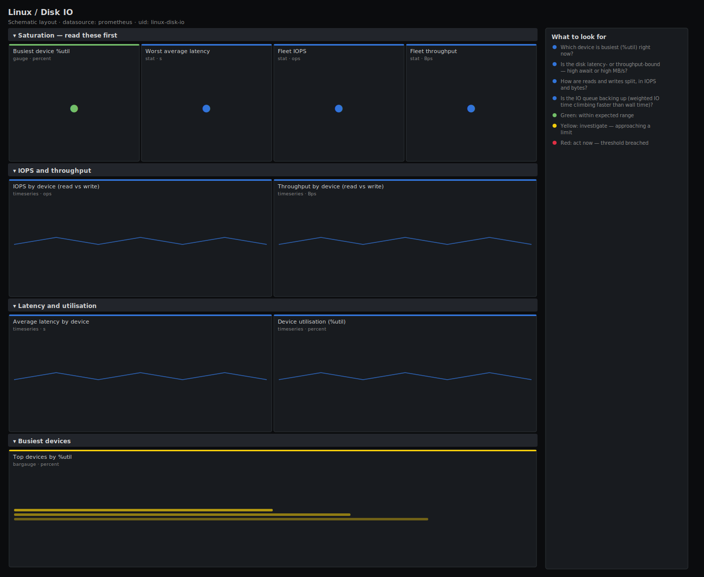

# Linux / Disk IO

> Block-device IO health for Linux hosts scraped by node_exporter: IOPS, throughput, average request latency derived from weighted IO time, and device utilisation (%util). Answers "which disk is the bottleneck and is it latency- or throughput-bound?" rather than drawing raw completion counters.

**Primary search phrase:** Node Exporter disk IO Grafana dashboard  
**Category:** `linux` · **UID:** `linux-disk-io` · **Datasource:** Prometheus



## Questions this dashboard answers

- Which device is busiest (%util) right now?
- Is the disk latency- or throughput-bound — high await or high MB/s?
- How are reads and writes split, in IOPS and bytes?
- Is the IO queue backing up (weighted IO time climbing faster than wall time)?

## Production lessons — why this dashboard exists

A disk at "200 MB/s" tells you nothing without knowing the device ceiling, so this dashboard leads with **%util and average latency** — the two signals that actually correlate with application slowness. %util is the fraction of wall-clock time the device had at least one request in flight (`rate(node_disk_io_time_seconds_total)`); at 100% the device is saturated regardless of IOPS. Average latency comes from the weighted IO-time counter divided by completed operations, which is the closest node_exporter gets to iostat's `await`. The classic incident pattern is high %util with low throughput: many small random IOPS hitting a spinning disk or a throttled cloud volume — completely different from a streaming backup saturating bandwidth.

## Data source requirements

- **Prometheus** datasource (selected at import time via `${DS_PROMETHEUS}`).
- `node_exporter` `diskstats` collector (`node_disk_reads_completed_total`, `node_disk_writes_completed_total`, `node_disk_read_bytes_total`, `node_disk_written_bytes_total`, `node_disk_io_time_seconds_total`, `node_disk_io_time_weighted_seconds_total`).

## Template variables

| Variable | Label | Type | Purpose |
|----------|-------|------|---------|
| `${job}` | Job | query | Prometheus scrape job for your node_exporter targets. |
| `${instance}` | Instance | query | Host(s) to display; supports multi-select. |

## Panels

### Saturation — read these first

- **Busiest device %util** (gauge, `percent`) — Highest device utilisation across selected hosts — fraction of time the device had IO in flight. 100% means saturated.
- **Worst average latency** (stat, `s`) — Highest average request latency (weighted IO time per completed op) across all devices.
- **Fleet IOPS** (stat, `ops`) — Total read + write operations per second across selected devices.
- **Fleet throughput** (stat, `Bps`) — Total read + write bytes per second across selected devices.

### IOPS and throughput

- **IOPS by device (read vs write)** (timeseries, `ops`) — Per-device read and write operations per second. Split tells random-read from write-heavy workloads.
- **Throughput by device (read vs write)** (timeseries, `Bps`) — Per-device read and write bytes per second. Compare against the device or volume bandwidth ceiling.

### Latency and utilisation

- **Average latency by device** (timeseries, `s`) — Weighted IO time per completed operation — the node_exporter analogue of iostat await.
- **Device utilisation (%util)** (timeseries, `percent`) — Fraction of time each device was servicing IO. Sustained near 100% means the device is the bottleneck.

### Busiest devices

- **Top devices by %util** (bargauge, `percent`) — Ranked device utilisation — the saturated devices to look at first.

## Import

**Grafana UI** — *Dashboards → New → Import*, upload `dashboards/linux/disk-io.json`, then pick your datasource when prompted.

**API:**

```bash
scripts/import-dashboard.sh dashboards/linux/disk-io.json
```

**Provisioning** — drop the JSON into a provisioned folder (see [provisioning guide](../../provisioning.md)).

## Recommended alerts

Ready-to-use rules ship in `alerts/linux.rules.yml`.

### HostDiskUtilisationHigh (`warning`)

```promql
100 * rate(node_disk_io_time_seconds_total{device!~"loop.*|ram.*|dm-.*"}[5m]) > 95
```

- **Fires after:** `10m`
- **Why it matters:** A device pinned near 100% util is the bottleneck; every additional request queues, so application latency rises non-linearly.
- **Investigate:** Open Linux / Disk IO and compare IOPS vs throughput for the device — many small ops at low MB/s means random-IO bound, high MB/s means bandwidth bound.
- **Recovery:** Clears when utilisation falls below 95% for 5m.
- **False positives:** Scheduled backups, RAID rebuilds and database compactions saturate disks by design — scope or silence during known windows.

### HostDiskLatencyHigh (`warning`)

```promql
rate(node_disk_io_time_weighted_seconds_total{device!~"loop.*|ram.*|dm-.*"}[5m]) / clamp_min(rate(node_disk_reads_completed_total{device!~"loop.*|ram.*|dm-.*"}[5m]) + rate(node_disk_writes_completed_total{device!~"loop.*|ram.*|dm-.*"}[5m]), 1) > 0.1
```

- **Fires after:** `10m`
- **Why it matters:** High average await means requests are spending most of their time queued or on slow media — a direct hit to user-facing latency.
- **Investigate:** Check whether util is also high (saturation) or low (slow media / throttled volume); inspect the queue via the IOPS panel.
- **Recovery:** Clears when average latency drops below 100ms for 5m.
- **False positives:** Bursty fsync-heavy workloads can spike await briefly; the 10m `for` filters most transients.

## Troubleshooting

| Symptom | Likely cause | First action |
|---------|--------------|--------------|
| Utilisation reads above 100% | Summing io_time across devices, or multipath/dm devices double-counting the same physical disk. | Keep the `device!~"dm-.*"` filter and read util per physical device, not summed. |
| Latency panel shows huge spikes after a reboot | Counter reset makes the first rate sample unreliable. | rate() handles resets, but ignore the first window after boot; the `clamp_min(...,1)` guards divide-by-zero when IOPS is 0. |
| No data for a known disk | Device name filtered out (loop/ram/dm) or the diskstats collector disabled. | Adjust the device regex; confirm `node_disk_io_time_seconds_total` exists in Explore. |

## Performance considerations

Rates use a 5m window (≥4× a 15s scrape). Per-device panels can be high-cardinality on hosts with many volumes; the `device!~"loop.*|ram.*|dm-.*"` filter trims pseudo and mapper devices. The latency expression divides two rates and guards the denominator with `clamp_min(...,1)` so idle devices report 0 rather than NaN.

## Customization

Adjust the device regex to include or exclude `dm-`/`nvme`/`md` devices to match your storage layout. Tune the 95% util and 100ms latency thresholds to the slowest acceptable device class. On large fleets, pre-aggregate %util with a recording rule before widening the time range.

## Related resources

- [Advanced observability guides](https://devopsaitoolkit.com/guides/)
- [Grafana & Prometheus tutorials](https://devopsaitoolkit.com/blog/)
- [AI Incident Response Assistant](https://devopsaitoolkit.com/dashboard/incident-response)
- [PromQL cookbook](../../../promql/README.md) · [Alerting guide](../../alerting.md) · [Dashboard catalog](../../catalog.md)
