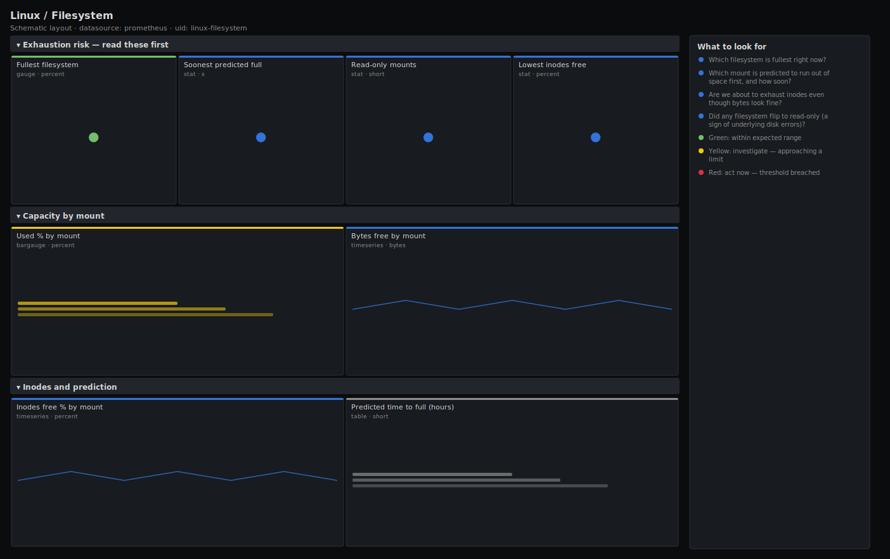

# Linux / Filesystem

> Filesystem capacity and exhaustion risk for Linux hosts scraped by node_exporter: used percent, bytes free, inode headroom, read-only mounts, and a linear prediction of time-to-full. Answers "which mount will fill first and when?" rather than just showing current usage.

**Primary search phrase:** Node Exporter filesystem Grafana dashboard  
**Category:** `linux` · **UID:** `linux-filesystem` · **Datasource:** Prometheus



## Questions this dashboard answers

- Which filesystem is fullest right now?
- Which mount is predicted to run out of space first, and how soon?
- Are we about to exhaust inodes even though bytes look fine?
- Did any filesystem flip to read-only (a sign of underlying disk errors)?

## Production lessons — why this dashboard exists

Disk-full incidents almost never surprise you on the byte axis alone — they surprise you because (a) inodes ran out while gigabytes remained free, or (b) usage was climbing linearly and nobody projected it forward. So this dashboard leads with the fullest mount, a **predict_linear time-to-full**, and an explicit **inodes-free** panel. The read-only-mount count is the quiet killer: when the kernel remounts a filesystem read-only after IO errors, applications fail in confusing ways long before anyone checks `dmesg`. Alert on the *prediction*, not the current value — a 70% disk filling at 5%/hour needs action now, while a stable 95% disk does not.

## Data source requirements

- **Prometheus** datasource (selected at import time via `${DS_PROMETHEUS}`).
- `node_exporter` `filesystem` collector (`node_filesystem_avail_bytes`, `node_filesystem_size_bytes`, `node_filesystem_files`, `node_filesystem_files_free`, `node_filesystem_readonly`).

## Template variables

| Variable | Label | Type | Purpose |
|----------|-------|------|---------|
| `${job}` | Job | query | Prometheus scrape job for your node_exporter targets. |
| `${instance}` | Instance | query | Host(s) to display; supports multi-select. |

## Panels

### Exhaustion risk — read these first

- **Fullest filesystem** (gauge, `percent`) — Highest used percentage across all real (non-pseudo) filesystems on selected hosts.
- **Soonest predicted full** (stat, `s`) — Shortest predicted time to 0 bytes free across mounts, from a linear fit over the last 6h. Empty means nothing is trending to full.
- **Read-only mounts** (stat, `short`) — Count of filesystems currently mounted read-only — often the result of underlying disk IO errors.
- **Lowest inodes free** (stat, `percent`) — Smallest free-inode percentage across mounts. Inode exhaustion fails writes even with bytes to spare.

### Capacity by mount

- **Used % by mount** (bargauge, `percent`) — Ranked filesystem usage. The bars to watch are the ones over 80%.
- **Bytes free by mount** (timeseries, `bytes`) — Absolute free space over time — the slope is what predict_linear extrapolates.

### Inodes and prediction

- **Inodes free % by mount** (timeseries, `percent`) — Free inodes as a percentage. Filesystems with millions of tiny files exhaust inodes first.
- **Predicted time to full (hours)** (table, `short`) — Mounts whose free space is trending down, with the linear-fit hours until empty. Sorted soonest first.

## Import

**Grafana UI** — *Dashboards → New → Import*, upload `dashboards/linux/filesystem.json`, then pick your datasource when prompted.

**API:**

```bash
scripts/import-dashboard.sh dashboards/linux/filesystem.json
```

**Provisioning** — drop the JSON into a provisioned folder (see [provisioning guide](../../provisioning.md)).

## Recommended alerts

Ready-to-use rules ship in `alerts/linux.rules.yml`.

### HostFilesystemPredictedFull (`warning`)

```promql
predict_linear(node_filesystem_avail_bytes{fstype!~"tmpfs|overlay|squashfs|nsfs|fuse.*"}[6h], 24 * 3600) < 0 and node_filesystem_avail_bytes{fstype!~"tmpfs|overlay|squashfs|nsfs|fuse.*"} > 0
```

- **Fires after:** `30m`
- **Why it matters:** A linear fit projects this mount hitting 0 bytes within a day; acting on the trend gives you hours of lead time instead of a 3am page.
- **Investigate:** Open Linux / Filesystem, find the mount in the predicted-full table, and check what is writing (du -x, ncdu, log/backup growth).
- **Recovery:** Clears once the projection no longer reaches 0 within 24h (after cleanup or expansion).
- **False positives:** Steady-state churn (a mount that fills then gets cleaned on a cycle) can trip the linear fit — widen the fit window or raise `for`.

### HostFilesystemAlmostFull (`critical`)

```promql
100 * (1 - node_filesystem_avail_bytes{fstype!~"tmpfs|overlay|squashfs|nsfs|fuse.*"} / node_filesystem_size_bytes{fstype!~"tmpfs|overlay|squashfs|nsfs|fuse.*"}) > 95
```

- **Fires after:** `5m`
- **Why it matters:** Past ~95% many filesystems slow down (fragmentation, reserved-block limits) and writes start failing — databases and logs are the first to break.
- **Investigate:** Identify the largest consumers on the mount and whether usage is still climbing on the bytes-free panel.
- **Recovery:** Clears when usage drops below 95% for 5m.
- **False positives:** Filesystems with large reserved-block percentages report high used% while still writable — tune the threshold per mount.

### HostFilesystemReadOnly (`critical`)

```promql
node_filesystem_readonly{fstype!~"tmpfs|overlay|squashfs|nsfs|fuse.*"} == 1
```

- **Fires after:** `2m`
- **Why it matters:** The kernel typically remounts a filesystem read-only after IO errors; every write now fails, often silently corrupting application state.
- **Investigate:** Check dmesg / journalctl -k for IO or EXT4/XFS errors on the underlying device; inspect SMART/cloud-volume health.
- **Recovery:** Clears when the filesystem is remounted read-write.
- **False positives:** Intentionally read-only mounts (read-only root, immutable images) — exclude those mountpoints from the rule.

## Troubleshooting

| Symptom | Likely cause | First action |
|---------|--------------|--------------|
| Predicted-full table is empty | No mount has a negative slope over the fit window, so the `< 0` filter drops everything. | Expected when nothing is filling; widen the window or check the bytes-free panel for slow trends. |
| Used % seems high but df disagrees | Reserved blocks (default 5% on ext4) count toward size but not avail. | This matches df's behaviour for non-root users; compare against `df` run as root if in doubt. |
| Container/overlay mounts cluttering the view | overlay/tmpfs/fuse filesystems are ephemeral and not capacity-managed. | They are excluded by the `fstype!~` filter; adjust the regex if your real storage uses one of those types. |

## Performance considerations

Capacity gauges read the latest sample (instant queries). The prediction uses `deriv(...[6h])` and `predict_linear(...[6h])`, which scan 6h of samples per mount — keep the fit window proportional to your retention and avoid pointing this at extreme per-container filesystem cardinality. The `clamp_min(...,1)` guards stop divide-by-zero on empty or zero-inode filesystems.

## Customization

Adjust the `fstype!~` regex to match the filesystems you actually manage. Tune the 24h prediction horizon and the 90/95% thresholds to your provisioning lead time. Swap the 6h fit window for 24h on slowly-growing volumes to reduce noise from short bursts.

## Related resources

- [Advanced observability guides](https://devopsaitoolkit.com/guides/)
- [Grafana & Prometheus tutorials](https://devopsaitoolkit.com/blog/)
- [AI Incident Response Assistant](https://devopsaitoolkit.com/dashboard/incident-response)
- [PromQL cookbook](../../../promql/README.md) · [Alerting guide](../../alerting.md) · [Dashboard catalog](../../catalog.md)
