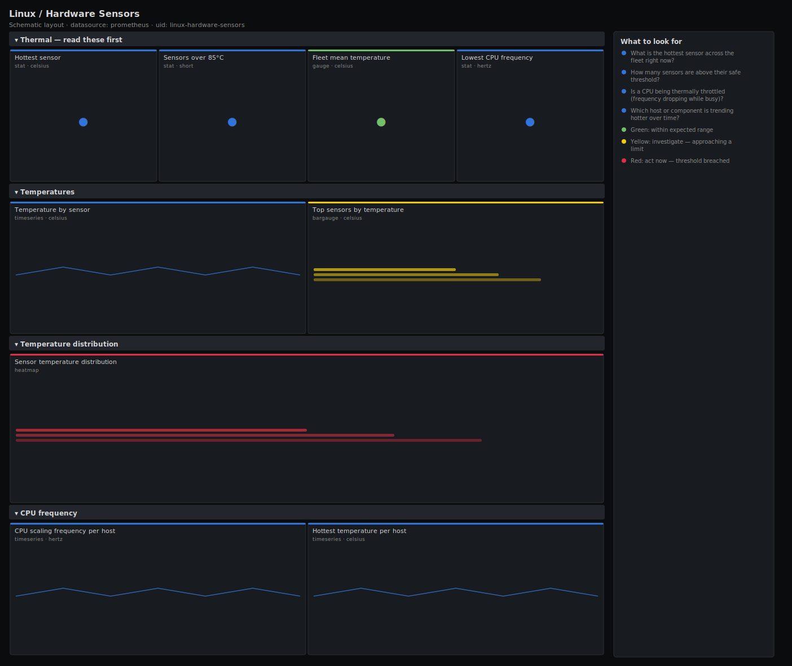

# Linux / Hardware Sensors

> Hardware health for bare-metal Linux hosts scraped by node_exporter: temperatures from every hwmon sensor, CPU scaling frequency, and the hottest sensor on the fleet. Answers "is anything overheating or being thermally throttled?" — the physical-layer failures that no application metric can see.

**Primary search phrase:** Node Exporter hardware sensors Grafana dashboard  
**Category:** `linux` · **UID:** `linux-hardware-sensors` · **Datasource:** Prometheus



## Questions this dashboard answers

- What is the hottest sensor across the fleet right now?
- How many sensors are above their safe threshold?
- Is a CPU being thermally throttled (frequency dropping while busy)?
- Which host or component is trending hotter over time?

## Production lessons — why this dashboard exists

On bare metal, the failure that application metrics cannot show you is **heat**: a clogged filter, a dead fan or a failing AC unit pushes CPU temperature past the throttle point, the kernel quietly drops the clock frequency, and your "healthy" host gets mysteriously slow with no software cause. So this dashboard leads with the **hottest sensor** and the **count of sensors over threshold**, then pairs temperature with **CPU scaling frequency** so you can correlate a thermal spike with the throttle that follows it. hwmon sensor naming is wildly inconsistent across boards — `coretemp`, `k10temp`, `acpitz`, NVMe composite — so read sensors by chip+label rather than guessing, and set thresholds from the hardware's own published `*_crit` limits, not a round number. This dashboard is for physical hosts; VMs and most cloud instances expose no hwmon data at all.

## Data source requirements

- **Prometheus** datasource (selected at import time via `${DS_PROMETHEUS}`).
- `node_exporter` `hwmon` collector (`node_hwmon_temp_celsius`) and `cpufreq` collector (`node_cpu_scaling_frequency_hertz`). hwmon is bare-metal only; cloud/VM guests rarely expose it.

## Template variables

| Variable | Label | Type | Purpose |
|----------|-------|------|---------|
| `${job}` | Job | query | Prometheus scrape job for your node_exporter targets. |
| `${instance}` | Instance | query | Host(s) to display; supports multi-select. |

## Panels

### Thermal — read these first

- **Hottest sensor** (stat, `celsius`) — Highest temperature reported by any hwmon sensor across selected hosts.
- **Sensors over 85°C** (stat, `short`) — Count of sensors currently reading above 85°C — the warm-to-throttle zone for most CPUs.
- **Fleet mean temperature** (gauge, `celsius`) — Average sensor temperature across the fleet — a baseline for spotting environmental shifts.
- **Lowest CPU frequency** (stat, `hertz`) — Minimum current CPU scaling frequency across hosts. A drop while busy suggests thermal or power throttling.

### Temperatures

- **Temperature by sensor** (timeseries, `celsius`) — Every hwmon sensor over time, labelled by host, chip and sensor. The throttle line is dashed.
- **Top sensors by temperature** (bargauge, `celsius`) — Ranked current temperatures — the hottest components to check first.

### Temperature distribution

- **Sensor temperature distribution** (heatmap, `celsius`) — Distribution of sensor readings over time. A rising warm band signals a fleet-wide environmental shift.

### CPU frequency

- **CPU scaling frequency per host** (timeseries, `hertz`) — Current per-CPU clock frequency. A sustained drop while load is high is the fingerprint of thermal throttling.
- **Hottest temperature per host** (timeseries, `celsius`) — The single hottest sensor per host over time — the line to correlate with the frequency panel.

## Import

**Grafana UI** — *Dashboards → New → Import*, upload `dashboards/linux/hardware-sensors.json`, then pick your datasource when prompted.

**API:**

```bash
scripts/import-dashboard.sh dashboards/linux/hardware-sensors.json
```

**Provisioning** — drop the JSON into a provisioned folder (see [provisioning guide](../../provisioning.md)).

## Recommended alerts

Ready-to-use rules ship in `alerts/linux.rules.yml`.

### HostSensorOverheating (`critical`)

```promql
node_hwmon_temp_celsius > 90
```

- **Fires after:** `5m`
- **Why it matters:** Past ~90°C most CPUs thermally throttle and, if it climbs further, shut down to protect the silicon — slow service now, hard outage soon.
- **Investigate:** Check the per-host frequency panel for a matching throttle, and inspect cooling (fan RPM, intake temperature, airflow obstruction).
- **Recovery:** Clears when the sensor falls below 90°C for 5m.
- **False positives:** Some boards expose a constant `*_crit` limit value as a pseudo-sensor — exclude those sensor labels from the rule.

### HostCPUThrottling (`warning`)

```promql
avg by (instance, job) (node_cpu_scaling_frequency_hertz) < 0.6 * max by (instance, job) (node_cpu_scaling_frequency_hertz)
```

- **Fires after:** `15m`
- **Why it matters:** A frequency stuck far below the ceiling means the CPU is being throttled — thermal or power capped — costing performance invisibly to software metrics.
- **Investigate:** Correlate with the hottest-temperature panel; if temperature is high it is thermal, if temperature is fine suspect a power-cap or governor set to powersave.
- **Recovery:** Clears when the average frequency returns above 60% of the maximum for 5m.
- **False positives:** Idle hosts legitimately scale down under the powersave governor — pair this with a CPU-busy condition or scope to known-loaded hosts.

## Troubleshooting

| Symptom | Likely cause | First action |
|---------|--------------|--------------|
| All sensor panels show "No data" | The host is a VM/cloud instance with no hwmon, or the hwmon collector is disabled. | Expected on virtualised hosts; on bare metal, enable the hwmon collector and confirm `node_hwmon_temp_celsius` in Explore. |
| A sensor reads a flat, implausibly high value | It is actually a `*_crit`/`*_max` limit pseudo-sensor, not a live reading. | Filter by the sensor label or exclude limit pseudo-sensors from panels and alerts. |
| Frequency panel is flat at the maximum | The governor is set to performance, or cpufreq scaling is disabled. | Normal under the performance governor; throttling detection then relies on the temperature panels. |

## Performance considerations

hwmon and cpufreq series are one per sensor/CPU and low cardinality on a typical server, but very wide boards or many CPUs add series — scope `$instance` on large fleets. All panels read gauge values directly with no rate windows, so query cost is minimal.

## Customization

Set the 90°C and 85°C thresholds from each component's published `*_crit` limit rather than a round number. Exclude limit pseudo-sensors via the `sensor` label. Tune the 60%-of-max throttle ratio to your CPUs' base/boost spread, and pair it with a CPU-busy condition to avoid flagging idle powersave scaling.

## Related resources

- [Advanced observability guides](https://devopsaitoolkit.com/guides/)
- [Grafana & Prometheus tutorials](https://devopsaitoolkit.com/blog/)
- [AI Incident Response Assistant](https://devopsaitoolkit.com/dashboard/incident-response)
- [PromQL cookbook](../../../promql/README.md) · [Alerting guide](../../alerting.md) · [Dashboard catalog](../../catalog.md)
