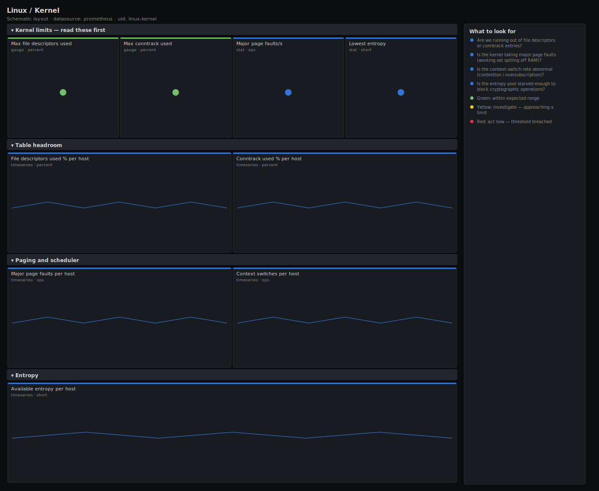

# Linux / Kernel

> Kernel-level resource limits and internals for Linux hosts scraped by node_exporter: file-descriptor and conntrack table headroom, major page faults, context switches, available entropy and vmstat paging counters. Answers "are we about to hit a kernel limit?" — the exhaustion modes that take down a host without touching CPU, memory or disk graphs.

**Primary search phrase:** Node Exporter kernel Grafana dashboard  
**Category:** `linux` · **UID:** `linux-kernel` · **Datasource:** Prometheus



## Questions this dashboard answers

- Are we running out of file descriptors or conntrack entries?
- Is the kernel taking major page faults (working set spilling off RAM)?
- Is the context-switch rate abnormal (contention / oversubscription)?
- Is the entropy pool starved enough to block cryptographic operations?

## Production lessons — why this dashboard exists

The outages that confuse people most are the ones where CPU, memory and disk all look fine and the host still refuses to work — because a **kernel table filled up**. This dashboard collects those limits in one place: file descriptors (`filefd`), connection tracking (`nf_conntrack`), and the paging/scheduler counters from `vmstat`/`stat`. The two that page you are fd and conntrack utilisation, so they lead. Entropy starvation (`node_entropy_available_bits` near zero) is rarer on modern kernels but still stalls `/dev/random`-backed crypto on some appliances and VMs without a hardware RNG. Treating these as percent-of-limit gauges — not raw counts — is what makes "70% and climbing" legible before it becomes "100% and broken".

## Data source requirements

- **Prometheus** datasource (selected at import time via `${DS_PROMETHEUS}`).
- `node_exporter` `filefd` (`node_filefd_allocated`, `node_filefd_maximum`), `conntrack` (`node_nf_conntrack_entries`, `node_nf_conntrack_entries_limit`), `vmstat` (`node_vmstat_pgmajfault`), `stat` (`node_context_switches_total`) and `entropy` (`node_entropy_available_bits`, where present) collectors.

## Template variables

| Variable | Label | Type | Purpose |
|----------|-------|------|---------|
| `${job}` | Job | query | Prometheus scrape job for your node_exporter targets. |
| `${instance}` | Instance | query | Host(s) to display; supports multi-select. |

## Panels

### Kernel limits — read these first

- **Max file descriptors used** (gauge, `percent`) — Highest system-wide file-descriptor utilisation. At 100% every open()/accept() fails with ENFILE.
- **Max conntrack used** (gauge, `percent`) — Highest connection-tracking table utilisation. At 100% the kernel drops new connections.
- **Major page faults/s** (stat, `ops`) — Fleet major-fault rate. Sustained values mean the working set no longer fits in RAM.
- **Lowest entropy** (stat, `short`) — Smallest available entropy pool across hosts. Below ~200 bits, /dev/random-backed crypto can block.

### Table headroom

- **File descriptors used % per host** (timeseries, `percent`) — Per-host allocated ÷ maximum file descriptors. A steady climb is an fd leak.
- **Conntrack used % per host** (timeseries, `percent`) — Per-host tracked connections ÷ table limit. Climbs under connection floods or leaks.

### Paging and scheduler

- **Major page faults per host** (timeseries, `ops`) — Per-host major fault rate — isolates which box is paging from disk.
- **Context switches per host** (timeseries, `ops`) — Per-host context-switch rate — spikes mean lock contention or CPU oversubscription.

### Entropy

- **Available entropy per host** (timeseries, `short`) — Kernel entropy pool in bits. Persistent low values stall blocking crypto on hosts without a hardware RNG.

## Import

**Grafana UI** — *Dashboards → New → Import*, upload `dashboards/linux/kernel.json`, then pick your datasource when prompted.

**API:**

```bash
scripts/import-dashboard.sh dashboards/linux/kernel.json
```

**Provisioning** — drop the JSON into a provisioned folder (see [provisioning guide](../../provisioning.md)).

## Recommended alerts

Ready-to-use rules ship in `alerts/linux.rules.yml`.

### HostFileDescriptorsExhausting (`critical`)

```promql
100 * node_filefd_allocated / clamp_min(node_filefd_maximum, 1) > 90
```

- **Fires after:** `10m`
- **Why it matters:** Near the file-max limit, opens, sockets and accepts fail with ENFILE/EMFILE and services refuse work while CPU and memory look fine.
- **Investigate:** Find the top fd holders (lsof / counting /proc/*/fd); a steady climb on the per-host panel is a leak.
- **Recovery:** Clears when fd utilisation falls below 90% for 5m.
- **False positives:** Hosts with large legitimate connection pools — size file-max for them and tune the threshold.

### HostConntrackTableNearLimit (`critical`)

```promql
100 * node_nf_conntrack_entries / clamp_min(node_nf_conntrack_entries_limit, 1) > 90
```

- **Fires after:** `5m`
- **Why it matters:** A full conntrack table makes the kernel drop new connections and log an nf_conntrack table-full message — the host refuses traffic while looking idle.
- **Investigate:** Check for a connection flood or leak (conntrack -L, ss -s) and correlate with new-connection spikes.
- **Recovery:** Clears when utilisation falls below 90% for 5m.
- **False positives:** Load balancers that legitimately track many flows — size the table and raise the threshold for them.

### HostEntropyLow (`warning`)

```promql
node_entropy_available_bits < 200
```

- **Fires after:** `15m`
- **Why it matters:** A starved entropy pool can block /dev/random-backed crypto, stalling TLS handshakes and key generation on hosts without a hardware RNG.
- **Investigate:** Check whether the host is a VM without virtio-rng and which process is draining entropy (rngd status, /proc/sys/kernel/random/entropy_avail).
- **Recovery:** Clears when available entropy stays above 200 bits for 5m.
- **False positives:** Kernels using the modern non-blocking CSPRNG report low pool sizes without any functional impact — verify before acting.

## Troubleshooting

| Symptom | Likely cause | First action |
|---------|--------------|--------------|
| Conntrack or entropy panels show "No data" | The relevant collector is disabled, or netfilter conntrack/HW-RNG is not present. | Enable the conntrack/entropy collectors; the gauges fall back to safe defaults so empty headline stats are expected on such hosts. |
| fd usage climbs forever then the host breaks | A file-descriptor leak in a long-running process. | Restart the process to confirm, then fix the leak; do not just raise the limit. |
| Entropy looks dangerously low but nothing is broken | Modern kernels expose a small pool while using a non-blocking CSPRNG. | Treat the entropy alert as informational on 5.6+ kernels; it matters mainly on appliances/old VMs. |

## Performance considerations

All ratios are instant reads guarded with `clamp_min(...,1)` to avoid NaN; rate panels use a 5m window (≥4× a 15s scrape). The headline gauges aggregate to a single value with `max`/`min`. Entropy and conntrack series are low cardinality (one per host), so this dashboard stays cheap even on large fleets.

## Customization

Tune the 90% fd/conntrack thresholds and the 200-bit entropy floor to your platform — drop the entropy row entirely on modern non-blocking kernels. Scope `$instance` by role to separate connection-heavy gateways from ordinary application hosts.

## Related resources

- [Advanced observability guides](https://devopsaitoolkit.com/guides/)
- [Grafana & Prometheus tutorials](https://devopsaitoolkit.com/blog/)
- [AI Incident Response Assistant](https://devopsaitoolkit.com/dashboard/incident-response)
- [PromQL cookbook](../../../promql/README.md) · [Alerting guide](../../alerting.md) · [Dashboard catalog](../../catalog.md)
