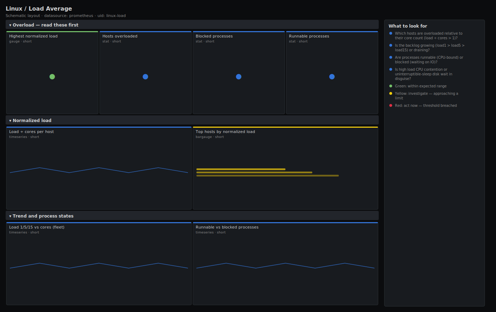

# Linux / Load Average

> Load average interpreted against core count for Linux hosts scraped by node_exporter: normalized load (load ÷ cores), runnable vs blocked processes, and the 1/5/15-minute trend. Answers "is this host actually overloaded for its size?" rather than showing a raw load number with no context.

**Primary search phrase:** Node Exporter load average Grafana dashboard  
**Category:** `linux` · **UID:** `linux-load` · **Datasource:** Prometheus



## Questions this dashboard answers

- Which hosts are overloaded relative to their core count (load ÷ cores > 1)?
- Is the backlog growing (load1 > load5 > load15) or draining?
- Are processes runnable (CPU-bound) or blocked (waiting on IO)?
- Is high load CPU contention or uninterruptible-sleep disk wait in disguise?

## Production lessons — why this dashboard exists

"Load average 16" means nothing until you know the core count — it is a disaster on a 4-core box and idle on a 64-core box. So this dashboard's headline is **normalized load** (load1 ÷ cores), where 1.0 is the saturation line regardless of machine size. The second trap is reading load as a pure CPU metric: Linux counts processes in **uninterruptible sleep** (D state, usually disk IO) toward load, so a host can show load 30 with idle CPUs because everything is blocked on a slow disk or NFS mount. The runnable-vs-blocked split here is what tells you whether to chase CPU or storage. Compare load1/load5/load15 to see if the spike is arriving or receding.

## Data source requirements

- **Prometheus** datasource (selected at import time via `${DS_PROMETHEUS}`).
- `node_exporter` `loadavg` collector (`node_load1`, `node_load5`, `node_load15`).
- `node_exporter` `stat`/`processes` collectors (`node_procs_running`, `node_procs_blocked`) and `node_cpu_seconds_total` for the core count.

## Template variables

| Variable | Label | Type | Purpose |
|----------|-------|------|---------|
| `${job}` | Job | query | Prometheus scrape job for your node_exporter targets. |
| `${instance}` | Instance | query | Host(s) to display; supports multi-select. |

## Panels

### Overload — read these first

- **Highest normalized load** (gauge, `short`) — Max of load1 ÷ core count across hosts. 1.0 is full saturation; above 1.0 means a scheduling backlog.
- **Hosts overloaded** (stat, `short`) — Count of hosts whose 1m load exceeds their core count.
- **Blocked processes** (stat, `short`) — Total processes in uninterruptible sleep (usually disk/NFS IO) across the fleet.
- **Runnable processes** (stat, `short`) — Total processes ready to run (competing for CPU) across the fleet.

### Normalized load

- **Load ÷ cores per host** (timeseries, `short`) — Per-host normalized load. The dashed line at 1.0 is the saturation threshold for any machine size.
- **Top hosts by normalized load** (bargauge, `short`) — Ranked load1 ÷ cores — the most overloaded hosts first.

### Trend and process states

- **Load 1/5/15 vs cores (fleet)** (timeseries, `short`) — Averaged load averages with the core line. load1 above load15 means the backlog is growing.
- **Runnable vs blocked processes** (timeseries, `short`) — Runnable (CPU-bound) vs blocked (IO-bound) process counts. The split decides whether to chase CPU or storage.

## Import

**Grafana UI** — *Dashboards → New → Import*, upload `dashboards/linux/load.json`, then pick your datasource when prompted.

**API:**

```bash
scripts/import-dashboard.sh dashboards/linux/load.json
```

**Provisioning** — drop the JSON into a provisioned folder (see [provisioning guide](../../provisioning.md)).

## Recommended alerts

Ready-to-use rules ship in `alerts/linux.rules.yml`.

### HostLoadExceedsCores (`warning`)

```promql
node_load1 / count without (cpu, mode) (node_cpu_seconds_total{mode="idle"}) > 1.5
```

- **Fires after:** `15m`
- **Why it matters:** Sustained load above 1.5× cores means processes are spending significant time waiting for a CPU or IO slot, adding queueing latency to everything.
- **Investigate:** Open Linux / Load Average and check the runnable-vs-blocked split: runnable points at CPU, blocked points at storage/NFS.
- **Recovery:** Clears when normalized load falls below 1.5 for 5m.
- **False positives:** Batch/CI hosts intentionally run hot — scope the rule by role or raise the multiplier for them.

### HostBlockedProcessesHigh (`warning`)

```promql
node_procs_blocked > 10
```

- **Fires after:** `10m`
- **Why it matters:** Many processes stuck in uninterruptible sleep inflate load while CPUs sit idle — the bottleneck is storage or a stuck mount, not compute.
- **Investigate:** Identify the D-state processes (ps -eo state,pid,cmd | grep '^D') and the device/mount they wait on; correlate with disk latency.
- **Recovery:** Clears when blocked processes drop below 10 for 5m.
- **False positives:** Brief spikes during heavy IO bursts or backups; sustained counts indicate a real stall.

## Troubleshooting

| Symptom | Likely cause | First action |
|---------|--------------|--------------|
| cores line is flat at 1 | node_cpu_seconds_total collapsed by a recording rule that dropped the cpu label. | Point the dashboard at raw node_exporter series so the per-CPU count is intact. |
| High load but CPU dashboard shows idle | Load is dominated by blocked (D-state) processes waiting on IO, which count toward load but not CPU. | Read the runnable-vs-blocked panel; if blocked is high, investigate storage, not CPU. |
| Normalized load looks too low on hyperthreaded hosts | The core count includes logical (HT) CPUs, so the saturation point is optimistic. | Treat 0.7–0.8 normalized as the practical ceiling on hyperthreaded machines. |

## Performance considerations

Load and process gauges are instant reads of cheap counters, so this dashboard is light even on large fleets. The core count is computed once per panel with `count without (cpu, mode)(node_cpu_seconds_total{mode="idle"})`; on fleets above ~500 hosts, materialise that as a recording rule and reference it to cut per-render work.

## Customization

Tune the 1.5× normalized-load and 10-blocked thresholds to your tier — latency-sensitive services should alert closer to 1.0. On hyperthreaded fleets, lower the saturation line to ~0.8. Scope `$instance` by role to separate batch hosts from request-serving ones.

## Related resources

- [Advanced observability guides](https://devopsaitoolkit.com/guides/)
- [Grafana & Prometheus tutorials](https://devopsaitoolkit.com/blog/)
- [AI Incident Response Assistant](https://devopsaitoolkit.com/dashboard/incident-response)
- [PromQL cookbook](../../../promql/README.md) · [Alerting guide](../../alerting.md) · [Dashboard catalog](../../catalog.md)
