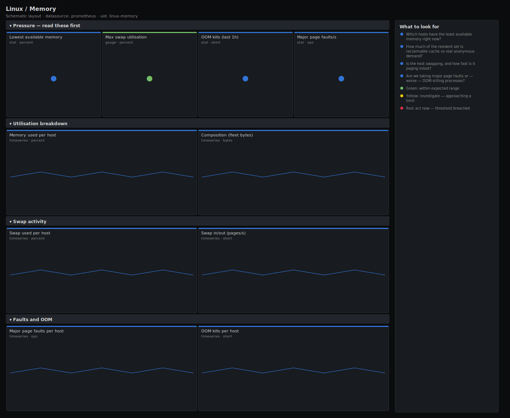

# Linux / Memory

> Memory pressure for Linux hosts scraped by node_exporter: available headroom, the used breakdown (anonymous vs reclaimable cache/buffers), swap utilisation and swap traffic, major page faults and OOM kills. Answers "is this host about to start reclaiming, swapping or OOM-killing?" rather than drawing raw counters.

**Primary search phrase:** Node Exporter memory Grafana dashboard  
**Category:** `linux` · **UID:** `linux-memory` · **Datasource:** Prometheus



## Questions this dashboard answers

- Which hosts have the least available memory right now?
- How much of the resident set is reclaimable cache vs real anonymous demand?
- Is the host swapping, and how fast is it paging in/out?
- Are we taking major page faults or — worse — OOM-killing processes?

## Production lessons — why this dashboard exists

The number that pages you is **MemAvailable**, not MemFree: Linux deliberately uses almost all RAM for page cache, so a box at "1% free" can be perfectly healthy while a box at "20% free" is about to thrash. This dashboard leads with available percent and swap, then separates reclaimable cache/buffers from genuine anonymous demand so you can tell a cache-warm host from one that is one allocation away from the OOM killer. In practice the earliest reliable signal of trouble is **major page faults climbing together with swap-in** — by the time `oom_kill` increments you have already lost a process, so the alerts here fire on the leading indicators first.

## Data source requirements

- **Prometheus** datasource (selected at import time via `${DS_PROMETHEUS}`).
- `node_exporter` `meminfo` collector (`node_memory_MemAvailable_bytes`, `node_memory_MemTotal_bytes`, `node_memory_Cached_bytes`, `node_memory_Buffers_bytes`, `node_memory_SwapTotal_bytes`, `node_memory_SwapFree_bytes`).
- `node_exporter` `vmstat` collector (`node_vmstat_pgmajfault`, `node_vmstat_oom_kill`, `node_vmstat_pswpin`, `node_vmstat_pswpout`).

## Template variables

| Variable | Label | Type | Purpose |
|----------|-------|------|---------|
| `${job}` | Job | query | Prometheus scrape job for your node_exporter targets. |
| `${instance}` | Instance | query | Host(s) to display; supports multi-select. |

## Panels

### Pressure — read these first

- **Lowest available memory** (stat, `percent`) — Minimum MemAvailable as a percentage of MemTotal across selected hosts. Low is bad.
- **Max swap utilisation** (gauge, `percent`) — Highest swap usage across hosts that have swap configured.
- **OOM kills (last 1h)** (stat, `short`) — Processes terminated by the kernel OOM killer across the fleet in the last hour.
- **Major page faults/s** (stat, `ops`) — Fleet rate of major (disk-backed) page faults — sustained values mean the working set no longer fits in RAM.

### Utilisation breakdown

- **Memory used per host** (timeseries, `percent`) — Real memory pressure — 100 × (1 − MemAvailable/MemTotal). Spot the outlier before it swaps.
- **Composition (fleet bytes)** (timeseries, `bytes`) — Total vs available, with reclaimable cache and buffers. The gap between Total and Available is genuine anonymous demand.

### Swap activity

- **Swap used per host** (timeseries, `percent`) — Per-host swap utilisation. Steady swap use under memory pressure is normal; growing swap with paging is not.
- **Swap in/out (pages/s)** (timeseries, `short`) — Pages read from and written to swap. Sustained swap-in is the symptom that correlates with latency spikes.

### Faults and OOM

- **Major page faults per host** (timeseries, `ops`) — Per-host major fault rate — isolates which box lost its cache working set.
- **OOM kills per host** (timeseries, `short`) — Per-host OOM-kill rate. Any non-zero value means the kernel reclaimed memory by killing a process.

## Import

**Grafana UI** — *Dashboards → New → Import*, upload `dashboards/linux/memory.json`, then pick your datasource when prompted.

**API:**

```bash
scripts/import-dashboard.sh dashboards/linux/memory.json
```

**Provisioning** — drop the JSON into a provisioned folder (see [provisioning guide](../../provisioning.md)).

## Recommended alerts

Ready-to-use rules ship in `alerts/linux.rules.yml`.

### HostMemoryAvailableLow (`warning`)

```promql
100 * node_memory_MemAvailable_bytes / node_memory_MemTotal_bytes < 10
```

- **Fires after:** `10m`
- **Why it matters:** Below ~10% available the kernel starts aggressive reclaim, which evicts page cache and pushes the host toward swapping and OOM.
- **Investigate:** Open Linux / Memory, scope to the instance, and compare the Total/Available gap against Cached+Buffers to see whether the demand is anonymous (real) or reclaimable.
- **Recovery:** Clears when available memory rises above 10% for 5m.
- **False positives:** Databases and caches (Redis, JVM heaps) that intentionally pin most of RAM — scope the rule with a role label or raise the threshold for those hosts.

### HostSwapUtilisationHigh (`warning`)

```promql
100 * (node_memory_SwapTotal_bytes - node_memory_SwapFree_bytes) / (node_memory_SwapTotal_bytes > 0) > 75
```

- **Fires after:** `15m`
- **Why it matters:** Heavy swap use means the working set no longer fits in RAM; latency becomes dominated by disk paging and gets dramatically worse under load.
- **Investigate:** Check the Swap in/out panel — sustained swap-in confirms active thrashing rather than stale pages parked in swap.
- **Recovery:** Clears when swap utilisation falls below 75% for 5m.
- **False positives:** Hosts that filled swap during a past spike and never paged it back in — correlate with the swap-in rate before acting.

### HostOOMKilled (`critical`)

```promql
increase(node_vmstat_oom_kill[10m]) > 0
```

- **Fires after:** `0m`
- **Why it matters:** The kernel killed a process to reclaim memory — something on the host already lost work, and it will recur until demand drops.
- **Investigate:** Check dmesg / journalctl -k for the 'Out of memory: Killed process' line to identify the victim, then correlate with the per-host used-memory panel.
- **Recovery:** Resolves once 10m pass with no further oom_kill increments.
- **False positives:** cgroup-local OOM kills from container memory limits show here too but may be expected for batch jobs — confirm the victim before escalating.

## Troubleshooting

| Symptom | Likely cause | First action |
|---------|--------------|--------------|
| Available memory looks low but the host is fine | Confusing MemFree with MemAvailable; cache counts as used in MemFree but is reclaimable. | Trust the available-percent panel (MemAvailable based); large Cached/Buffers with healthy available is normal. |
| Swap panels show "No data" | Host has no swap configured, so SwapTotal is 0 and the ratio is filtered out. | Expected on swapless hosts; the guard `SwapTotal > 0` intentionally drops them. |
| oom_kill panel is always empty | Older kernels or node_exporter builds without the oom_kill vmstat field. | Verify `node_vmstat_oom_kill` exists in Explore; if absent, alert on memory-available and major faults instead. |

## Performance considerations

All rates use a 5m window (≥4× a 15s scrape) so vmstat counters stay smooth across a reset. Gauges aggregate with `min`/`max` to one value, and the per-host panels return one series per instance. The swap ratio guards division by zero with `> 0`, which both avoids NaN and drops swapless hosts from the panel.

## Customization

Tune the 10% available and 75% swap thresholds to your workload — pin databases lower. To watch a single tier, add a `nodename`/`role` selector to `$instance`. For very large fleets, back the per-host used-memory panel with a recording rule and widen the time range gradually.

## Related resources

- [Advanced observability guides](https://devopsaitoolkit.com/guides/)
- [Grafana & Prometheus tutorials](https://devopsaitoolkit.com/blog/)
- [AI Incident Response Assistant](https://devopsaitoolkit.com/dashboard/incident-response)
- [PromQL cookbook](../../../promql/README.md) · [Alerting guide](../../alerting.md) · [Dashboard catalog](../../catalog.md)
