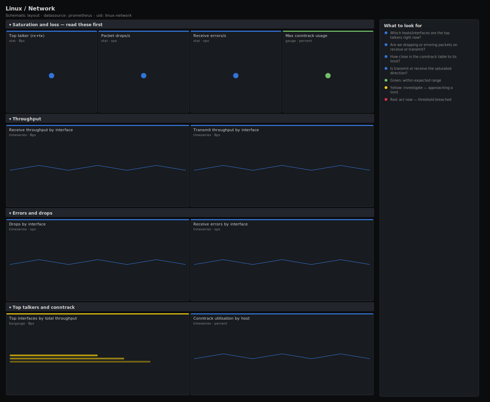

# Linux / Network

> Network interface health for Linux hosts scraped by node_exporter: receive/transmit throughput, error and drop rates, and conntrack table saturation. Answers "is the NIC the bottleneck, are we dropping packets, and is the connection-tracking table about to overflow?" rather than drawing raw byte counters.

**Primary search phrase:** Node Exporter network Grafana dashboard  
**Category:** `linux` · **UID:** `linux-network` · **Datasource:** Prometheus



## Questions this dashboard answers

- Which hosts/interfaces are the top talkers right now?
- Are we dropping or erroring packets on receive or transmit?
- How close is the conntrack table to its limit?
- Is transmit or receive the saturated direction?

## Production lessons — why this dashboard exists

Network incidents split cleanly into two failure modes, and this dashboard leads with both. The first is **bandwidth saturation** — easy to see as Bps near the link ceiling. The second, far nastier, is **silent packet loss**: drops and errors that never show up in throughput graphs but quietly murder TCP throughput and tail latency. The single most overlooked panel here is **conntrack utilisation**: when `nf_conntrack_entries` reaches its limit the kernel starts dropping *new* connections with no obvious CPU or bandwidth symptom, so a host that "looks idle" refuses connections. Watch drops and conntrack before you watch bytes.

## Data source requirements

- **Prometheus** datasource (selected at import time via `${DS_PROMETHEUS}`).
- `node_exporter` `netdev` collector (`node_network_receive_bytes_total`, `node_network_transmit_bytes_total`, `node_network_receive_errs_total`, `node_network_receive_drop_total`, `node_network_transmit_drop_total`).
- `node_exporter` `conntrack` collector (`node_nf_conntrack_entries`, `node_nf_conntrack_entries_limit`).

## Template variables

| Variable | Label | Type | Purpose |
|----------|-------|------|---------|
| `${job}` | Job | query | Prometheus scrape job for your node_exporter targets. |
| `${instance}` | Instance | query | Host(s) to display; supports multi-select. |

## Panels

### Saturation and loss — read these first

- **Top talker (rx+tx)** (stat, `Bps`) — Highest combined receive + transmit throughput on any single interface.
- **Packet drops/s** (stat, `ops`) — Total receive + transmit packet drops per second across selected interfaces. Should be zero on a healthy fleet.
- **Receive errors/s** (stat, `ops`) — Total receive errors per second — CRC/frame/FIFO errors point at cabling, NICs or driver issues.
- **Max conntrack usage** (gauge, `percent`) — Highest connection-tracking table utilisation across hosts. At 100% the kernel drops new connections.

### Throughput

- **Receive throughput by interface** (timeseries, `Bps`) — Per-interface inbound bytes per second. Compare against the link ceiling.
- **Transmit throughput by interface** (timeseries, `Bps`) — Per-interface outbound bytes per second. Egress is often the first link to saturate.

### Errors and drops

- **Drops by interface** (timeseries, `ops`) — Receive and transmit drops per interface. Persistent drops mean ring-buffer or qdisc overrun.
- **Receive errors by interface** (timeseries, `ops`) — Hardware/driver receive errors per interface — a steady rate is a failing NIC or cable.

### Top talkers and conntrack

- **Top interfaces by total throughput** (bargauge, `Bps`) — Ranked rx+tx throughput — find the busy links at a glance.
- **Conntrack utilisation by host** (timeseries, `percent`) — Tracked connections as a percentage of the table limit. Approaching 100% drops new connections.

## Import

**Grafana UI** — *Dashboards → New → Import*, upload `dashboards/linux/network.json`, then pick your datasource when prompted.

**API:**

```bash
scripts/import-dashboard.sh dashboards/linux/network.json
```

**Provisioning** — drop the JSON into a provisioned folder (see [provisioning guide](../../provisioning.md)).

## Recommended alerts

Ready-to-use rules ship in `alerts/linux.rules.yml`.

### HostNetworkPacketDrops (`warning`)

```promql
rate(node_network_receive_drop_total{device!~"lo"}[5m]) + rate(node_network_transmit_drop_total{device!~"lo"}[5m]) > 1
```

- **Fires after:** `10m`
- **Why it matters:** Packet drops trigger TCP retransmits and collapse effective throughput long before bandwidth graphs look full.
- **Investigate:** Check whether throughput is near the link ceiling (saturation) or low (ring-buffer/qdisc overrun); inspect `ethtool -S` for the drop counters.
- **Recovery:** Clears when the drop rate falls below 1 pkt/s for 5m.
- **False positives:** Brief drops during traffic bursts or interface flaps; the 10m `for` filters most transients.

### HostNetworkReceiveErrors (`warning`)

```promql
rate(node_network_receive_errs_total{device!~"lo"}[5m]) > 1
```

- **Fires after:** `10m`
- **Why it matters:** Receive errors (CRC/frame/FIFO) indicate a physical-layer or driver fault that silently corrupts and discards frames.
- **Investigate:** Inspect `ethtool -S` error counters and the switch port; on bare metal, suspect the cable, SFP or NIC.
- **Recovery:** Clears when the error rate falls below 1/s for 5m.
- **False positives:** A one-off burst after a link renegotiation; sustained errors are real hardware faults.

### HostConntrackTableNearLimit (`critical`)

```promql
100 * node_nf_conntrack_entries / clamp_min(node_nf_conntrack_entries_limit, 1) > 90
```

- **Fires after:** `5m`
- **Why it matters:** When the connection-tracking table fills, the kernel drops new connections and logs an nf_conntrack table-full message — the host refuses traffic while looking otherwise healthy.
- **Investigate:** Check for a connection flood or leak (ss -s, conntrack -L); correlate with a spike in new connections on the throughput panels.
- **Recovery:** Clears when utilisation falls below 90% for 5m.
- **False positives:** Hosts that legitimately hold many connections (load balancers) — size the table for them and raise the threshold.

## Troubleshooting

| Symptom | Likely cause | First action |
|---------|--------------|--------------|
| Throughput panels are noisy with hundreds of veth series | Container virtual interfaces are being scraped. | The `device!~"veth.*\|docker.*\|br-.*\|cni.*\|flannel.*"` filter trims them; extend the regex for your CNI. |
| Conntrack panels show "No data" | The conntrack collector is disabled or netfilter conntrack is not loaded. | Enable the node_exporter conntrack collector; confirm `node_nf_conntrack_entries` exists in Explore. |
| Negative or spiky rates after reboot | Counter reset on interface re-creation. | rate() handles resets; ignore the first window after boot or interface flap. |

## Performance considerations

Rates use a 5m window (≥4× a 15s scrape). Per-interface panels can explode in cardinality on container hosts; the device regex filter is essential. Conntrack ratios guard the denominator with `clamp_min(...,1)`. For large fleets, pre-compute top-talker rankings with a recording rule rather than `topk` over raw series at render time.

## Customization

Tune the device regex to your interface naming (bond/eno/ens/CNI). Adjust the drop/error thresholds to your tolerance — strict zero-drop SLOs should lower them. Raise the conntrack threshold for load balancers that legitimately hold many flows.

## Related resources

- [Advanced observability guides](https://devopsaitoolkit.com/guides/)
- [Grafana & Prometheus tutorials](https://devopsaitoolkit.com/blog/)
- [AI Incident Response Assistant](https://devopsaitoolkit.com/dashboard/incident-response)
- [PromQL cookbook](../../../promql/README.md) · [Alerting guide](../../alerting.md) · [Dashboard catalog](../../catalog.md)
