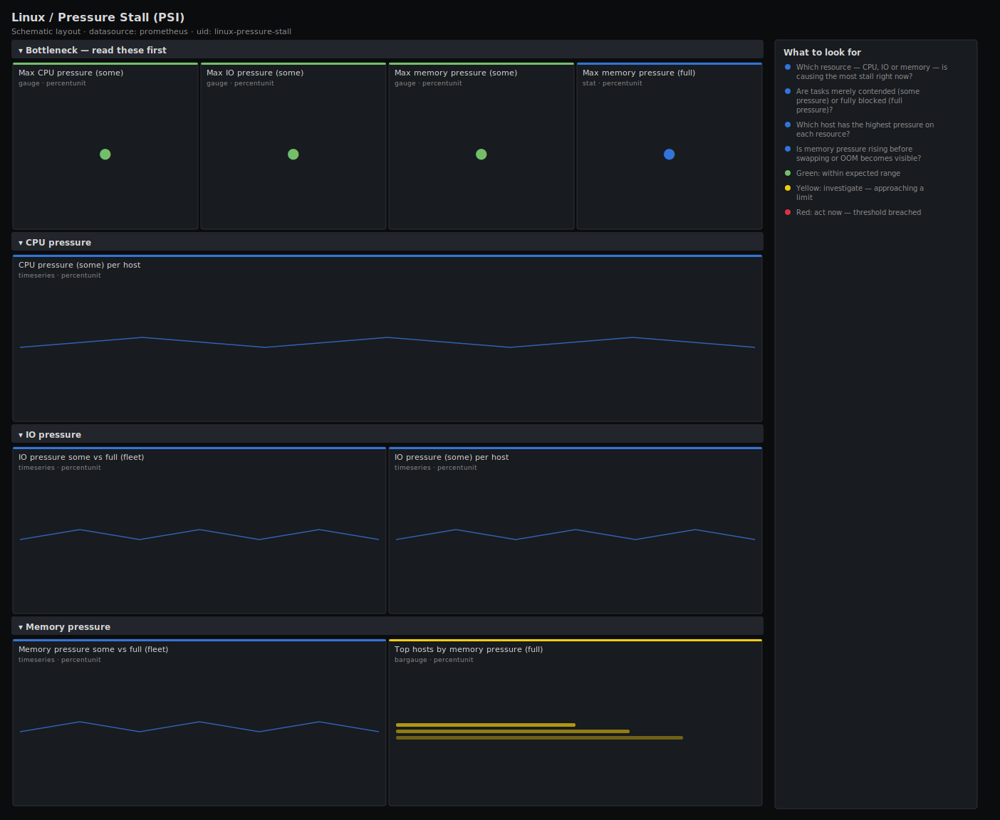

# Linux / Pressure Stall (PSI)

> Pressure Stall Information (PSI) for Linux hosts scraped by node_exporter: the fraction of time tasks stalled waiting on CPU, IO and memory, split into "some" (any task waiting) and "full" (every task waiting). Answers "which resource is the real bottleneck?" with a single normalised signal that utilisation graphs miss.

**Primary search phrase:** Node Exporter PSI pressure Grafana dashboard  
**Category:** `linux` · **UID:** `linux-pressure-stall` · **Datasource:** Prometheus



## Questions this dashboard answers

- Which resource — CPU, IO or memory — is causing the most stall right now?
- Are tasks merely contended (some pressure) or fully blocked (full pressure)?
- Which host has the highest pressure on each resource?
- Is memory pressure rising before swapping or OOM becomes visible?

## Production lessons — why this dashboard exists

Utilisation lies about saturation: a host can sit at 60% CPU and still stall constantly if work arrives in bursts, and a disk can show modest throughput while tasks queue for it. Linux PSI fixes this by measuring the thing you actually care about — **how much time tasks spent waiting** for a resource — as a clean 0–100% signal per resource. This dashboard leads with one gauge per resource so on-call can point at the bottleneck in five seconds instead of cross-reading CPU, disk and memory dashboards. The key distinction is **some vs full**: "some" pressure means at least one task is waiting (contention, expected under load), while "full" pressure means *every* runnable task is blocked and the host is doing no useful work — full memory pressure in particular is the earliest reliable warning of impending thrash and OOM, firing well before swap or oom_kill move. PSI needs a 4.20+ kernel with PSI enabled, and CPU exposes "some" only.

## Data source requirements

- **Prometheus** datasource (selected at import time via `${DS_PROMETHEUS}`).
- `node_exporter` `pressure` collector (`node_pressure_cpu_waiting_seconds_total`, `node_pressure_io_waiting_seconds_total`, `node_pressure_io_stalled_seconds_total`, `node_pressure_memory_waiting_seconds_total`, `node_pressure_memory_stalled_seconds_total`). Requires a 4.20+ kernel with PSI enabled.

## Template variables

| Variable | Label | Type | Purpose |
|----------|-------|------|---------|
| `${job}` | Job | query | Prometheus scrape job for your node_exporter targets. |
| `${instance}` | Instance | query | Host(s) to display; supports multi-select. |

## Panels

### Bottleneck — read these first

- **Max CPU pressure (some)** (gauge, `percentunit`) — Highest fraction of time any host had at least one task waiting on CPU.
- **Max IO pressure (some)** (gauge, `percentunit`) — Highest fraction of time any host had at least one task waiting on IO.
- **Max memory pressure (some)** (gauge, `percentunit`) — Highest fraction of time any host had at least one task waiting on memory. The earliest thrash warning.
- **Max memory pressure (full)** (stat, `percentunit`) — Highest fraction of time every task on a host was blocked on memory. Non-trivial values mean active thrashing.

### CPU pressure

- **CPU pressure (some) per host** (timeseries, `percentunit`) — Per-host fraction of time at least one task waited for CPU. Rises with run-queue contention.

### IO pressure

- **IO pressure some vs full (fleet)** (timeseries, `percentunit`) — Some (any task waiting) vs full (all tasks blocked) IO pressure. A growing gap toward full means the disk is the bottleneck.
- **IO pressure (some) per host** (timeseries, `percentunit`) — Per-host IO stall fraction — find the box whose tasks are waiting on storage.

### Memory pressure

- **Memory pressure some vs full (fleet)** (timeseries, `percentunit`) — Some vs full memory pressure. Full memory pressure is the leading indicator of thrash and impending OOM.
- **Top hosts by memory pressure (full)** (bargauge, `percentunit`) — Ranked full memory pressure — the hosts closest to thrashing first.

## Import

**Grafana UI** — *Dashboards → New → Import*, upload `dashboards/linux/pressure-stall.json`, then pick your datasource when prompted.

**API:**

```bash
scripts/import-dashboard.sh dashboards/linux/pressure-stall.json
```

**Provisioning** — drop the JSON into a provisioned folder (see [provisioning guide](../../provisioning.md)).

## Recommended alerts

Ready-to-use rules ship in `alerts/linux.rules.yml`.

### HostMemoryPressureFull (`critical`)

```promql
rate(node_pressure_memory_stalled_seconds_total[5m]) > 0.2
```

- **Fires after:** `5m`
- **Why it matters:** Full memory pressure means every task was blocked on memory for over a fifth of the time — the host is thrashing and OOM is imminent.
- **Investigate:** Open Linux / Memory for the host and check available memory, swap-in rate and major faults; PSI moves before oom_kill does.
- **Recovery:** Clears when full memory pressure falls below 20% for 5m.
- **False positives:** A brief burst during a large allocation that the kernel satisfies quickly; the 5m `for` filters most transients.

### HostIOPressureHigh (`warning`)

```promql
rate(node_pressure_io_waiting_seconds_total[5m]) > 0.5
```

- **Fires after:** `10m`
- **Why it matters:** Tasks spent more than half the time waiting on IO — storage is the bottleneck even if disk throughput looks unremarkable.
- **Investigate:** Cross-check Linux / Disk IO for the busiest device's %util and latency to find which volume is stalling tasks.
- **Recovery:** Clears when IO some-pressure falls below 50% for 5m.
- **False positives:** Scheduled backups and bulk-IO jobs raise IO pressure by design — scope or silence during known windows.

### HostCPUPressureHigh (`warning`)

```promql
rate(node_pressure_cpu_waiting_seconds_total[5m]) > 0.5
```

- **Fires after:** `10m`
- **Why it matters:** Tasks spent more than half the time waiting for a CPU — real scheduling contention that utilisation averages can hide.
- **Investigate:** Compare with normalized load and run queue on Linux / Load Average; identify the hot processes with top/pidstat.
- **Recovery:** Clears when CPU some-pressure falls below 50% for 5m.
- **False positives:** Batch/CI hosts intentionally run CPU-bound — scope by role or raise the threshold for them.

## Troubleshooting

| Symptom | Likely cause | First action |
|---------|--------------|--------------|
| All PSI panels show "No data" | Kernel older than 4.20, PSI not enabled (`psi=1`), or the pressure collector disabled. | Enable PSI on the kernel and the node_exporter pressure collector; confirm `node_pressure_cpu_waiting_seconds_total` in Explore. |
| There is no CPU "full" line | The kernel does not report full pressure for CPU — only some. | Expected; use some-pressure for CPU and reserve the some/full split for IO and memory. |
| Pressure looks high but utilisation looks fine | That is exactly what PSI is for — bursty arrival stalls tasks without raising average utilisation. | Trust PSI as the saturation signal and use the utilisation dashboards to find the offending workload. |

## Performance considerations

PSI counters are accumulated stall-seconds, so `rate(...[5m])` yields a clean 0–1 fraction with a 5m window (≥4× a 15s scrape). Series are one per host per resource — very low cardinality — so this dashboard stays light even on large fleets. The `or vector(0)` guards keep headline gauges from going blank on hosts that lack PSI.

## Customization

Tune the some/full thresholds to your latency tolerance — latency-sensitive tiers should alert on lower full-pressure values. Pair the CPU/IO some-pressure alerts with a load or %util condition to suppress intentional batch hosts. PSI is also available per-cgroup; this dashboard uses the host-level files exposed by node_exporter.

## Related resources

- [Advanced observability guides](https://devopsaitoolkit.com/guides/)
- [Grafana & Prometheus tutorials](https://devopsaitoolkit.com/blog/)
- [AI Incident Response Assistant](https://devopsaitoolkit.com/dashboard/incident-response)
- [PromQL cookbook](../../../promql/README.md) · [Alerting guide](../../alerting.md) · [Dashboard catalog](../../catalog.md)
