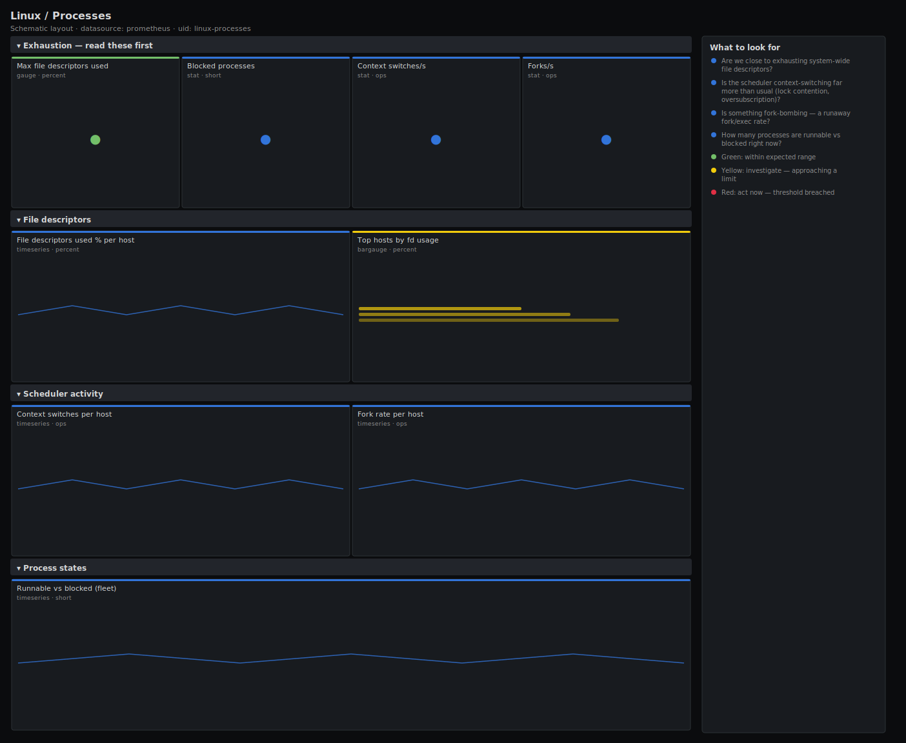

# Linux / Processes

> Process and scheduler activity for Linux hosts scraped by node_exporter: context switches and forks per second, runnable vs blocked process counts, and file-descriptor exhaustion. Answers "is the scheduler thrashing or are we running out of file descriptors?" rather than drawing raw counters.

**Primary search phrase:** Node Exporter processes Grafana dashboard  
**Category:** `linux` · **UID:** `linux-processes` · **Datasource:** Prometheus



## Questions this dashboard answers

- Are we close to exhausting system-wide file descriptors?
- Is the scheduler context-switching far more than usual (lock contention, oversubscription)?
- Is something fork-bombing — a runaway fork/exec rate?
- How many processes are runnable vs blocked right now?

## Production lessons — why this dashboard exists

Two quiet exhaustion modes take down healthy-looking hosts, and this dashboard leads with the worse one: **file-descriptor exhaustion**. When `node_filefd_allocated` approaches `node_filefd_maximum`, every `open()`/`accept()` fails with EMFILE/ENFILE and services start refusing connections while CPU and memory look fine. The second signal is the **context-switch rate**: a sudden 5–10× jump usually means lock contention, a tight spin-poll loop, or CPU oversubscription, and it burns cycles in the kernel rather than your app. A climbing **fork rate** is the fingerprint of a fork bomb or a misbehaving supervisor restarting a crashing process in a loop. None of these show up on a plain CPU graph, which is why they get their own dashboard.

## Data source requirements

- **Prometheus** datasource (selected at import time via `${DS_PROMETHEUS}`).
- `node_exporter` `stat` collector (`node_context_switches_total`, `node_forks_total`, `node_procs_running`, `node_procs_blocked`).
- `node_exporter` `filefd` collector (`node_filefd_allocated`, `node_filefd_maximum`).

## Template variables

| Variable | Label | Type | Purpose |
|----------|-------|------|---------|
| `${job}` | Job | query | Prometheus scrape job for your node_exporter targets. |
| `${instance}` | Instance | query | Host(s) to display; supports multi-select. |

## Panels

### Exhaustion — read these first

- **Max file descriptors used** (gauge, `percent`) — Highest system-wide file-descriptor utilisation across hosts. At 100% every open() fails with ENFILE.
- **Blocked processes** (stat, `short`) — Processes in uninterruptible sleep across the fleet — IO-bound backlog.
- **Context switches/s** (stat, `ops`) — Fleet context-switch rate. A sudden multiple of the baseline signals contention or oversubscription.
- **Forks/s** (stat, `ops`) — Fleet process-creation rate. A sustained climb is a fork bomb or a crash-restart loop.

### File descriptors

- **File descriptors used % per host** (timeseries, `percent`) — Per-host allocated ÷ maximum file descriptors. Watch for a steady climb (an fd leak).
- **Top hosts by fd usage** (bargauge, `percent`) — Ranked file-descriptor utilisation — the hosts closest to the limit first.

### Scheduler activity

- **Context switches per host** (timeseries, `ops`) — Per-host context-switch rate. Correlate spikes with CPU system time and lock contention.
- **Fork rate per host** (timeseries, `ops`) — Per-host process-creation rate. A flat baseline with sudden spikes points at a restart loop.

### Process states

- **Runnable vs blocked (fleet)** (timeseries, `short`) — Runnable (CPU-ready) vs blocked (IO-wait) process counts over time.

## Import

**Grafana UI** — *Dashboards → New → Import*, upload `dashboards/linux/processes.json`, then pick your datasource when prompted.

**API:**

```bash
scripts/import-dashboard.sh dashboards/linux/processes.json
```

**Provisioning** — drop the JSON into a provisioned folder (see [provisioning guide](../../provisioning.md)).

## Recommended alerts

Ready-to-use rules ship in `alerts/linux.rules.yml`.

### HostFileDescriptorsExhausting (`critical`)

```promql
100 * node_filefd_allocated / clamp_min(node_filefd_maximum, 1) > 90
```

- **Fires after:** `10m`
- **Why it matters:** Near the file-max limit, new opens, sockets and accepts fail with ENFILE/EMFILE — services refuse connections while CPU and memory look healthy.
- **Investigate:** Find the top fd holders (ls /proc/*/fd | wc / lsof | awk); a steady climb on the per-host panel is an fd leak.
- **Recovery:** Clears when fd utilisation falls below 90% for 5m.
- **False positives:** Hosts that legitimately hold many fds (large connection pools) — size file-max for them and tune the threshold.

### HostContextSwitchStorm (`warning`)

```promql
rate(node_context_switches_total[5m]) > 5 * avg_over_time(rate(node_context_switches_total[5m])[1h:5m])
```

- **Fires after:** `10m`
- **Why it matters:** A context-switch storm burns CPU in the scheduler instead of the application and usually signals lock contention or CPU oversubscription.
- **Investigate:** Correlate with CPU system time and run queue; use perf/pidstat -w to find the thrashing process.
- **Recovery:** Clears when the rate returns to within 5× of baseline for 5m.
- **False positives:** Legitimate workload ramps that raise the baseline; the self-relative comparison tolerates gradual growth.

### HostForkRateHigh (`warning`)

```promql
rate(node_forks_total[5m]) > 1000
```

- **Fires after:** `5m`
- **Why it matters:** A runaway fork rate is the signature of a fork bomb or a crash-restart loop that exhausts PIDs and CPU.
- **Investigate:** Identify the parent spawning children (ps --forest, journalctl for a flapping unit); check PID usage.
- **Recovery:** Clears when the fork rate drops below 1000/s for 5m.
- **False positives:** Build farms and CI runners that spawn many short-lived processes by design — scope by role.

## Troubleshooting

| Symptom | Likely cause | First action |
|---------|--------------|--------------|
| fd usage panel shows "No data" | The filefd collector is disabled. | Enable the node_exporter filefd collector; confirm `node_filefd_allocated` exists in Explore. |
| Context-switch baseline alert never fires | The 1h self-baseline absorbs slow, sustained growth. | Add a static ceiling alert alongside the relative one if you need an absolute cap. |
| Fork rate is always near zero | Workloads use long-lived threads, not processes. | Normal for thread-based servers; the fork panel matters most for process-per-request and supervisor patterns. |

## Performance considerations

Rates use a 5m window (≥4× a 15s scrape). The context-switch baseline alert uses a subquery (`[1h:5m]`) which is heavier than a plain rate — keep it scoped and avoid running it across thousands of hosts at once. fd and process gauges are cheap instant reads.

## Customization

Tune the 90% fd threshold and the 1000 forks/s ceiling to your workload. Replace the relative context-switch baseline with an absolute number if your fleet is homogeneous. Scope `$instance` by role to separate build/CI hosts from request-serving ones.

## Related resources

- [Advanced observability guides](https://devopsaitoolkit.com/guides/)
- [Grafana & Prometheus tutorials](https://devopsaitoolkit.com/blog/)
- [AI Incident Response Assistant](https://devopsaitoolkit.com/dashboard/incident-response)
- [PromQL cookbook](../../../promql/README.md) · [Alerting guide](../../alerting.md) · [Dashboard catalog](../../catalog.md)
