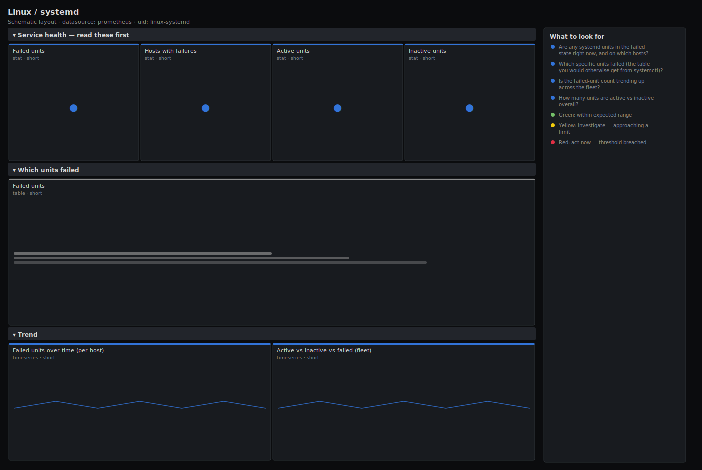

# Linux / systemd

> systemd unit health for Linux hosts scraped by node_exporter: the count of failed units, the active/inactive breakdown, and a live table of exactly which units have failed and where. Answers "is any service down on these hosts, and which one?" rather than leaving you to SSH and run systemctl.

**Primary search phrase:** Node Exporter systemd Grafana dashboard  
**Category:** `linux` · **UID:** `linux-systemd` · **Datasource:** Prometheus



## Questions this dashboard answers

- Are any systemd units in the failed state right now, and on which hosts?
- Which specific units failed (the table you would otherwise get from systemctl)?
- Is the failed-unit count trending up across the fleet?
- How many units are active vs inactive overall?

## Production lessons — why this dashboard exists

A failed systemd unit is the most direct "something is broken" signal a host can emit, yet it is invisible on CPU/memory/disk dashboards — a crashed exporter, a dead log shipper or a failed mount unit leaves the box looking perfectly healthy. So this dashboard leads with a single red **failed-unit count** and backs it with a **table of the actual unit names** so on-call can see `nginx.service on web-03` without opening a shell. The subtle gotcha is that node_exporter only reports the units it can see under its allow/deny lists; if a unit you care about never appears, it is being filtered at the collector, not magically healthy. Treat any non-zero failed count as actionable and let the table tell you who.

## Data source requirements

- **Prometheus** datasource (selected at import time via `${DS_PROMETHEUS}`).
- `node_exporter` `systemd` collector (`node_systemd_unit_state`, `node_systemd_units`). Enable it with `--collector.systemd`; it is off by default.

## Template variables

| Variable | Label | Type | Purpose |
|----------|-------|------|---------|
| `${job}` | Job | query | Prometheus scrape job for your node_exporter targets. |
| `${instance}` | Instance | query | Host(s) to display; supports multi-select. |

## Panels

### Service health — read these first

- **Failed units** (stat, `short`) — Total systemd units in the failed state across selected hosts. Any value above zero is actionable.
- **Hosts with failures** (stat, `short`) — Number of distinct hosts that have at least one failed unit.
- **Active units** (stat, `short`) — Total units currently in the active state across selected hosts.
- **Inactive units** (stat, `short`) — Total units in the inactive state — usually fine (stopped one-shots and sockets), shown for context.

### Which units failed

- **Failed units** (table, `short`) — Live list of every unit in the failed state with its host. This is the systemctl --failed view, fleet-wide.

### Trend

- **Failed units over time (per host)** (timeseries, `short`) — Per-host failed-unit count. A step up marks the moment a service died; a step down marks recovery.
- **Active vs inactive vs failed (fleet)** (timeseries, `short`) — Fleet-wide unit-state breakdown over time for context on the failed count.

## Import

**Grafana UI** — *Dashboards → New → Import*, upload `dashboards/linux/systemd.json`, then pick your datasource when prompted.

**API:**

```bash
scripts/import-dashboard.sh dashboards/linux/systemd.json
```

**Provisioning** — drop the JSON into a provisioned folder (see [provisioning guide](../../provisioning.md)).

## Recommended alerts

Ready-to-use rules ship in `alerts/linux.rules.yml`.

### HostSystemdUnitFailed (`critical`)

```promql
node_systemd_unit_state{state="failed"} == 1
```

- **Fires after:** `5m`
- **Why it matters:** A failed unit means a service the host is supposed to run is down — and it stays down until something restarts it.
- **Investigate:** On the host run `systemctl status {{ $labels.name }}` and `journalctl -u {{ $labels.name }} -e` to see the failure reason.
- **Recovery:** Clears when the unit leaves the failed state (restarted or reset).
- **False positives:** One-shot units that fail by design in some environments — exclude specific unit names or use `state="failed"` only for service units you own.

### HostManySystemdFailures (`warning`)

```promql
sum by (instance, job) (node_systemd_unit_state{state="failed"} == 1) > 3
```

- **Fires after:** `5m`
- **Why it matters:** Several units failing together usually points at a shared root cause — a full disk, a missing mount, a failed dependency, or a bad config rollout.
- **Investigate:** Open the failed-units table for the host and look for a common dependency (a mount, network target, or shared config).
- **Recovery:** Clears when the host's failed-unit count drops to 3 or fewer for 5m.
- **False positives:** A host with several intentionally-disabled one-shots — tune the threshold or exclude those units.

## Troubleshooting

| Symptom | Likely cause | First action |
|---------|--------------|--------------|
| All systemd panels show "No data" | The systemd collector is not enabled (it is off by default). | Start node_exporter with `--collector.systemd`; confirm `node_systemd_unit_state` appears in Explore. |
| A unit you care about never shows up | The collector's allow/deny lists (`--collector.systemd.unit-include/exclude`) filter it out. | Adjust the include regex so the unit is exported; absence is not the same as healthy. |
| Failed count flaps between 0 and 1 | A unit in a crash-restart loop oscillating through failed and activating. | Inspect `systemctl status` for restart counts; fix the crash rather than the symptom. |

## Performance considerations

The systemd collector can export thousands of series per host if no include/exclude filter is set, which is the main cost driver here. Scope it at the collector with `--collector.systemd.unit-include` to the units you actually run. All panels use cheap `sum`/`count` over the boolean `== 1` states, so query cost scales with that series count.

## Customization

Restrict the exported units at the collector to cut cardinality, then this dashboard needs no PromQL changes. Lower the "many failures" threshold for small hosts, or split the table by unit `type` (service/mount/timer) if you want separate views for each.

## Related resources

- [Advanced observability guides](https://devopsaitoolkit.com/guides/)
- [Grafana & Prometheus tutorials](https://devopsaitoolkit.com/blog/)
- [AI Incident Response Assistant](https://devopsaitoolkit.com/dashboard/incident-response)
- [PromQL cookbook](../../../promql/README.md) · [Alerting guide](../../alerting.md) · [Dashboard catalog](../../catalog.md)
