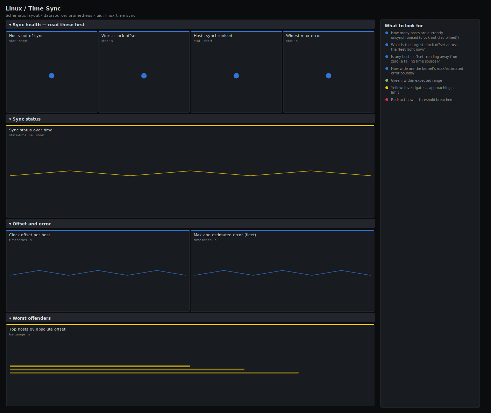

# Linux / Time Sync

> Clock synchronisation health for Linux hosts scraped by node_exporter: whether each host's clock is disciplined (timex sync status), the current offset from true time, and the kernel's maximum and estimated error bounds. Answers "are any clocks drifting or unsynchronised?" — the silent cause of auth failures, broken TLS and corrupt logs.

**Primary search phrase:** Node Exporter time sync Grafana dashboard  
**Category:** `linux` · **UID:** `linux-time-sync` · **Datasource:** Prometheus



## Questions this dashboard answers

- How many hosts are currently unsynchronised (clock not disciplined)?
- What is the largest clock offset across the fleet right now?
- Is any host's offset trending away from zero (a failing time source)?
- How wide are the kernel's max/estimated error bounds?

## Production lessons — why this dashboard exists

Clock skew is the bug that disguises itself as ten other bugs: Kerberos/JWT auth rejects "future" or "expired" tokens, TLS handshakes fail validity checks, distributed databases reorder or reject writes, and your logs stop lining up across hosts so every investigation gets harder. node_exporter exposes the kernel's own view via the `timex` collector, and the single most important signal is **`node_timex_sync_status`**: 1 means the clock is disciplined by NTP/chrony, 0 means it is free-running and will drift. So this dashboard leads with the count of unsynchronised hosts and the worst offset, then trends per-host offset so you can catch a host pulling away before it crosses your tolerance. Offsets are tiny numbers — display them in milliseconds, alert in the tens of milliseconds, and remember a single bad upstream time server can skew a whole fleet at once.

## Data source requirements

- **Prometheus** datasource (selected at import time via `${DS_PROMETHEUS}`).
- `node_exporter` `timex` collector (`node_timex_sync_status`, `node_timex_offset_seconds`, `node_timex_maxerror_seconds`, `node_timex_esterror_seconds`).

## Template variables

| Variable | Label | Type | Purpose |
|----------|-------|------|---------|
| `${job}` | Job | query | Prometheus scrape job for your node_exporter targets. |
| `${instance}` | Instance | query | Host(s) to display; supports multi-select. |

## Panels

### Sync health — read these first

- **Hosts out of sync** (stat, `short`) — Count of hosts whose clock is not currently disciplined by NTP/chrony (sync status 0).
- **Worst clock offset** (stat, `s`) — Largest absolute offset from true time across hosts. Tens of milliseconds is fine; seconds is not.
- **Hosts synchronised** (stat, `short`) — Count of hosts whose clock is currently disciplined (sync status 1).
- **Widest max error** (stat, `s`) — Largest kernel maximum-error bound across hosts — how far off the clock could be in the worst case.

### Sync status

- **Sync status over time** (state-timeline, `short`) — Per-host clock discipline. Green is synchronised; red is free-running and drifting.

### Offset and error

- **Clock offset per host** (timeseries, `s`) — Per-host offset from true time. A line trending away from zero is a host losing its time source.
- **Max and estimated error (fleet)** (timeseries, `s`) — Kernel-reported worst-case and estimated error bounds, averaged across the fleet.

### Worst offenders

- **Top hosts by absolute offset** (bargauge, `s`) — Ranked absolute clock offset — the hosts furthest from true time first.

## Import

**Grafana UI** — *Dashboards → New → Import*, upload `dashboards/linux/time-sync.json`, then pick your datasource when prompted.

**API:**

```bash
scripts/import-dashboard.sh dashboards/linux/time-sync.json
```

**Provisioning** — drop the JSON into a provisioned folder (see [provisioning guide](../../provisioning.md)).

## Recommended alerts

Ready-to-use rules ship in `alerts/linux.rules.yml`.

### HostClockNotSynchronised (`warning`)

```promql
node_timex_sync_status == 0
```

- **Fires after:** `10m`
- **Why it matters:** A free-running clock drifts and will eventually break auth tokens, TLS validity windows and log correlation across the fleet.
- **Investigate:** On the host check `chronyc tracking` / `timedatectl` and whether the NTP/chrony service is running and can reach its upstreams.
- **Recovery:** Clears when the host reports sync status 1 for 5m.
- **False positives:** A brief unsynced window right after boot or a time-service restart before the first poll completes.

### HostClockOffsetHigh (`warning`)

```promql
abs(node_timex_offset_seconds) > 0.1
```

- **Fires after:** `10m`
- **Why it matters:** An offset above 100ms is enough to fail tight TLS/Kerberos validity checks and to misorder events in distributed systems.
- **Investigate:** Compare against other hosts — if many drift together, suspect a bad upstream time source; if one drifts alone, suspect its local service or a VM clock-steal issue.
- **Recovery:** Clears when the absolute offset stays below 100ms for 5m.
- **False positives:** A short offset spike during a step correction after the service catches up from a large initial error.

## Troubleshooting

| Symptom | Likely cause | First action |
|---------|--------------|--------------|
| All time-sync panels show "No data" | The timex collector is disabled or unavailable (it is Linux-specific). | Confirm `node_timex_sync_status` appears in Explore; the timex collector is enabled by default on Linux node_exporter. |
| Offset shows as a huge number once then recovers | A step correction after the daemon disciplined a badly-wrong clock. | Expected after boot or after restoring connectivity; watch that it settles near zero. |
| Many hosts drift in lockstep | A shared upstream NTP source is itself wrong or unreachable. | Fix or replace the upstream; per-host remediation will not help a bad common source. |

## Performance considerations

All timex series are one per host and very low cardinality, so this dashboard is cheap even on large fleets. Headline stats are instant reads aggregated with `max`/`count`; the offset trend returns one series per instance. No rate windows are needed — these are gauge metrics.

## Customization

Tune the 100ms offset threshold to your strictest consumer — Kerberos defaults to a 5m skew tolerance, but databases and TLS pinning may need single-digit milliseconds. Scope `$instance` by role if some hosts (PTP-disciplined, GPS-backed) have tighter requirements than the rest.

## Related resources

- [Advanced observability guides](https://devopsaitoolkit.com/guides/)
- [Grafana & Prometheus tutorials](https://devopsaitoolkit.com/blog/)
- [AI Incident Response Assistant](https://devopsaitoolkit.com/dashboard/incident-response)
- [PromQL cookbook](../../../promql/README.md) · [Alerting guide](../../alerting.md) · [Dashboard catalog](../../catalog.md)
