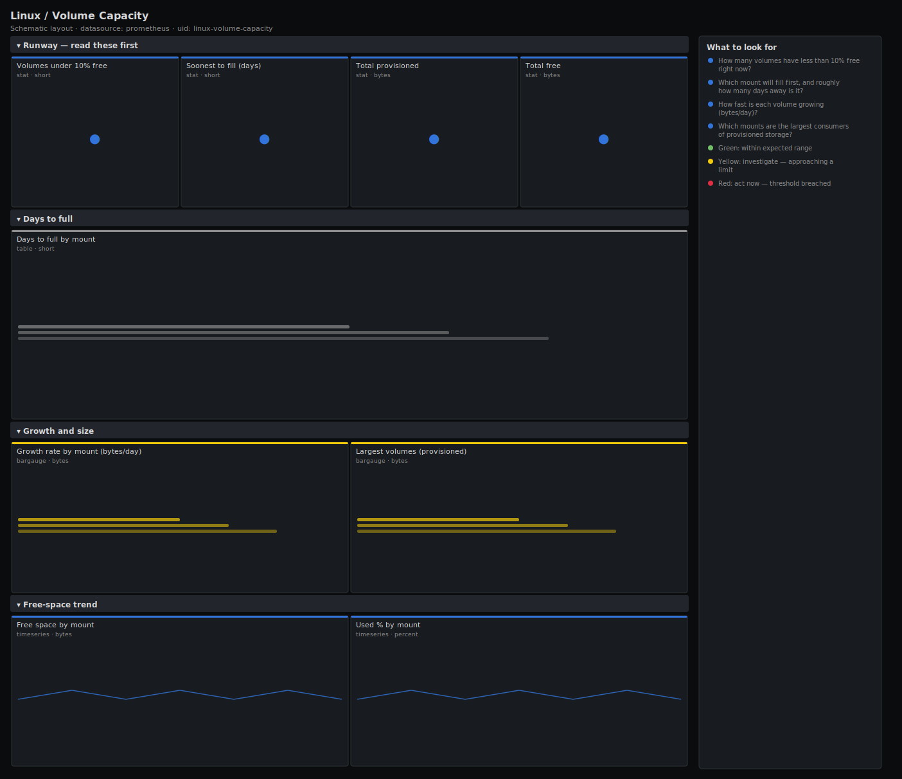

# Linux / Volume Capacity

> Storage capacity-planning view across mounted volumes for Linux hosts scraped by node_exporter: free headroom, growth rate, days-to-full per mount, and the largest volumes. Answers "which volume runs out first and how much runway do we have?" — the planning companion to the operational Filesystem dashboard.

**Primary search phrase:** Node Exporter volume capacity Grafana dashboard  
**Category:** `linux` · **UID:** `linux-volume-capacity` · **Datasource:** Prometheus



## Questions this dashboard answers

- How many volumes have less than 10% free right now?
- Which mount will fill first, and roughly how many days away is it?
- How fast is each volume growing (bytes/day)?
- Which mounts are the largest consumers of provisioned storage?

## Production lessons — why this dashboard exists

Capacity planning fails on the wrong time axis: the operational filesystem alert fires at 90% with hours to spare, but procurement and volume-expansion lead times are measured in days. So this dashboard runs on a **7-day window** and leads with **how many volumes are under 10% free** and **which one fills soonest**, computed from a linear fit of the growth trend. The most useful planning panel is days-to-full per mount, because it turns "/data is 82% full" — which sounds fine — into "/data fills in 4 days", which gets a change approved. Growth rate (the deriv) is the early-warning signal: a mount whose slope just doubled deserves attention long before it crosses any percentage threshold.

## Data source requirements

- **Prometheus** datasource (selected at import time via `${DS_PROMETHEUS}`).
- `node_exporter` `filesystem` collector (`node_filesystem_avail_bytes`, `node_filesystem_size_bytes`). Use a fit window proportional to your retention so the growth trend is stable.

## Template variables

| Variable | Label | Type | Purpose |
|----------|-------|------|---------|
| `${job}` | Job | query | Prometheus scrape job for your node_exporter targets. |
| `${instance}` | Instance | query | Host(s) to display; supports multi-select. |

## Panels

### Runway — read these first

- **Volumes under 10% free** (stat, `short`) — Count of real volumes with less than 10% free space across selected hosts.
- **Soonest to fill (days)** (stat, `short`) — Fewest days to 0 bytes free across mounts, from a 7-day linear fit. High is good.
- **Total provisioned** (stat, `bytes`) — Sum of provisioned capacity across all selected real volumes.
- **Total free** (stat, `bytes`) — Sum of free space across all selected real volumes.

### Days to full

- **Days to full by mount** (table, `short`) — Volumes whose free space is trending down, with the linear-fit days until empty. Sorted soonest first.

### Growth and size

- **Growth rate by mount (bytes/day)** (bargauge, `bytes`) — Daily growth from the 7-day fit. Positive bars are filling; the fastest growers need attention first.
- **Largest volumes (provisioned)** (bargauge, `bytes`) — Ranked provisioned capacity — where the storage spend is concentrated.

### Free-space trend

- **Free space by mount** (timeseries, `bytes`) — Free bytes per volume over the planning window. The slope is what the days-to-full fit extrapolates.
- **Used % by mount** (timeseries, `percent`) — Used percentage per volume — the planning view of how full each mount is trending.

## Import

**Grafana UI** — *Dashboards → New → Import*, upload `dashboards/linux/volume-capacity.json`, then pick your datasource when prompted.

**API:**

```bash
scripts/import-dashboard.sh dashboards/linux/volume-capacity.json
```

**Provisioning** — drop the JSON into a provisioned folder (see [provisioning guide](../../provisioning.md)).

## Recommended alerts

Ready-to-use rules ship in `alerts/linux.rules.yml`.

### VolumePredictedFullThisWeek (`warning`)

```promql
predict_linear(node_filesystem_avail_bytes{fstype!~"tmpfs|overlay|squashfs|nsfs|fuse.*"}[7d], 7 * 86400) < 0 and node_filesystem_avail_bytes{fstype!~"tmpfs|overlay|squashfs|nsfs|fuse.*"} > 0
```

- **Fires after:** `1h`
- **Why it matters:** A 7-day projection crossing zero gives enough lead time to approve and execute a volume expansion before it becomes an incident.
- **Investigate:** Open Linux / Volume Capacity, find the mount in the days-to-full table, and confirm the growth-rate bar to rule out a one-off spike.
- **Recovery:** Clears once the projection no longer reaches zero within 7 days.
- **False positives:** Cyclic mounts that fill then get cleaned (CI caches) can trip the fit — exclude them or lengthen the window.

### VolumeLowFreeSpace (`warning`)

```promql
node_filesystem_avail_bytes{fstype!~"tmpfs|overlay|squashfs|nsfs|fuse.*"} / node_filesystem_size_bytes{fstype!~"tmpfs|overlay|squashfs|nsfs|fuse.*"} < 0.10
```

- **Fires after:** `30m`
- **Why it matters:** Under 10% free a volume has little planning runway left; without action it becomes an operational disk-full page soon.
- **Investigate:** Check the growth-rate bar for the mount; a fast slope means the days-to-full clock is short.
- **Recovery:** Clears when free space rises above 10% for 5m.
- **False positives:** Volumes intentionally run near full (immutable archives) — exclude those mounts.

## Troubleshooting

| Symptom | Likely cause | First action |
|---------|--------------|--------------|
| Days-to-full table is empty | No mount has a negative free-space slope over the 7-day window. | Expected when storage is stable; check the free-space trend panel for slow growth. |
| Growth rate looks wrong right after provisioning a volume | The 7-day fit includes the step change when the volume was created or resized. | Wait for the fit window to clear the step, or shorten the window temporarily. |
| Container overlay mounts dominate the list | Ephemeral filesystems are being included. | They are excluded by the `fstype!~` filter; extend the regex for your runtime. |

## Performance considerations

This dashboard runs on a 7-day window with `deriv(...[7d])` and `predict_linear(...[7d])`, which scan a week of samples per mount — keep the variable scope tight and avoid pointing it at per-container filesystem cardinality. A 1m refresh is plenty for capacity planning; there is no need to query this as often as an operational dashboard.

## Customization

Match the `fstype!~` regex to the volumes you provision. Tune the 10%-free and 7-day prediction thresholds to your procurement/expansion lead time. Lengthen the fit window to 14d or 30d for slowly-growing archival volumes to suppress short-term noise.

## Related resources

- [Advanced observability guides](https://devopsaitoolkit.com/guides/)
- [Grafana & Prometheus tutorials](https://devopsaitoolkit.com/blog/)
- [AI Incident Response Assistant](https://devopsaitoolkit.com/dashboard/incident-response)
- [PromQL cookbook](../../../promql/README.md) · [Alerting guide](../../alerting.md) · [Dashboard catalog](../../catalog.md)
