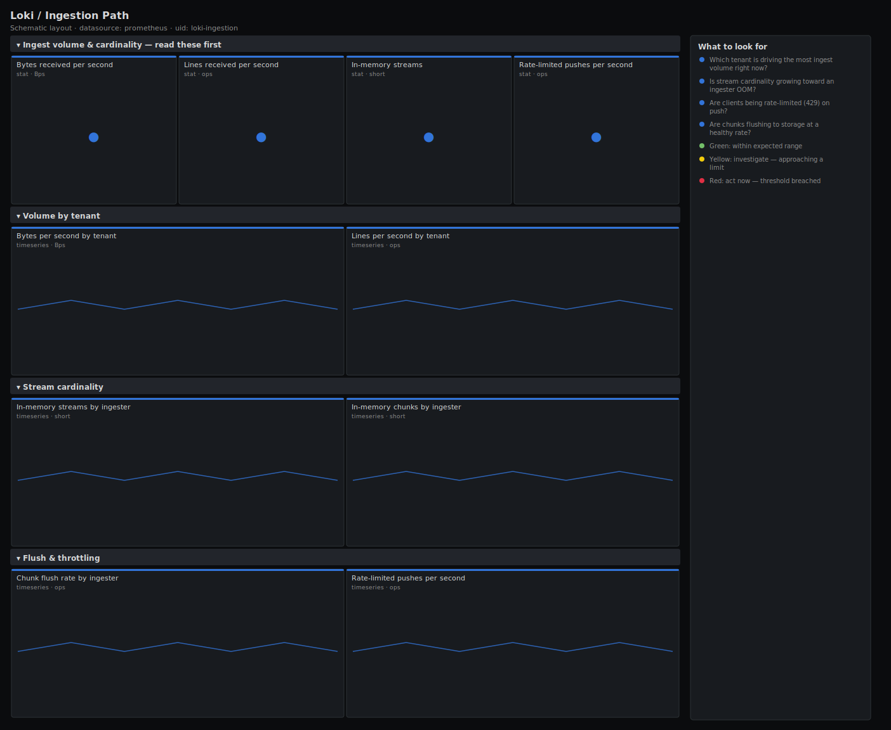

# Loki / Ingestion Path

> A focused view of Loki's write path: bytes and lines received per tenant, stream cardinality, chunk flush rate and rate-limited (429) pushes. Answers "who is sending what, is cardinality exploding, and are we throttling clients?"

**Primary search phrase:** Loki ingestion Grafana dashboard  
**Category:** `loki` · **UID:** `loki-ingestion` · **Datasource:** Prometheus



## Questions this dashboard answers

- Which tenant is driving the most ingest volume right now?
- Is stream cardinality growing toward an ingester OOM?
- Are clients being rate-limited (429) on push?
- Are chunks flushing to storage at a healthy rate?
- How many chunks and streams are held in memory per ingester?

## Production lessons — why this dashboard exists

Almost every Loki capacity incident traces back to one of two things: a single tenant flooding bytes, or a high-cardinality label exploding streams. This dashboard puts per-tenant volume next to stream cardinality so you can tell a benign traffic spike (more bytes, flat streams) from a cardinality bomb (flat bytes, exploding streams) — they have completely different fixes. Rate-limited pushes are the third signal: when you see 429s, ingest limits are protecting the cluster and a client is losing logs until it backs off or you raise the limit.

## Data source requirements

- **Prometheus** datasource (selected at import time via `${DS_PROMETHEUS}`).
- `loki` exposing `loki_distributor_lines_received_total`, `loki_distributor_bytes_received_total`, `loki_ingester_memory_streams`, `loki_ingester_memory_chunks`, `loki_ingester_chunks_flushed_total` and `loki_request_duration_seconds_count` (with the `status_code` label).

## Template variables

| Variable | Label | Type | Purpose |
|----------|-------|------|---------|
| `${job}` | Job | query | Loki component job, mainly distributor and ingester here. |

## Panels

### Ingest volume & cardinality — read these first

- **Bytes received per second** (stat, `Bps`) — Total log volume into the distributors — the bandwidth and storage-cost driver.
- **Lines received per second** (stat, `ops`) — Total log lines into the distributors — the workload's line rate.
- **In-memory streams** (stat, `short`) — Active streams in the ingesters — the cardinality figure that gates memory and triggers OOMs.
- **Rate-limited pushes per second** (stat, `ops`) — Push requests rejected with 429 — clients hitting ingest limits and shedding logs.

### Volume by tenant

- **Bytes per second by tenant** (timeseries, `Bps`) — Per-tenant byte rate — the fastest way to find who is flooding the cluster.
- **Lines per second by tenant** (timeseries, `ops`) — Per-tenant line rate — pair with bytes to spot tiny-line spam versus large payloads.

### Stream cardinality

- **In-memory streams by ingester** (timeseries, `short`) — Per-ingester stream count — a single climbing line is a cardinality bomb on its way to an OOM.
- **In-memory chunks by ingester** (timeseries, `short`) — Per-ingester chunk count — chunks held before flush; tracks streams and memory pressure.

### Flush & throttling

- **Chunk flush rate by ingester** (timeseries, `ops`) — Chunks flushed to object storage per second — a stall means data is stuck in memory and lost on a crash.
- **Rate-limited pushes per second** (timeseries, `ops`) — 429 responses over time — sustained throttling means a tenant needs a higher limit or must slow down.

## Import

**Grafana UI** — *Dashboards → New → Import*, upload `dashboards/loki/ingestion.json`, then pick your datasource when prompted.

**API:**

```bash
scripts/import-dashboard.sh dashboards/loki/ingestion.json
```

**Provisioning** — drop the JSON into a provisioned folder (see [provisioning guide](../../provisioning.md)).

## Recommended alerts

Ready-to-use rules ship in `alerts/loki.rules.yml`.

### LokiPushesRateLimited (`warning`)

```promql
sum(rate(loki_request_duration_seconds_count{status_code="429"}[5m])) > 1
```

- **Fires after:** `10m`
- **Why it matters:** Rate-limited pushes mean clients are losing logs because they exceed the configured ingest limits.
- **Investigate:** Open Loki / Ingestion Path, find the tenant driving bytes/lines, and confirm whether the spike is legitimate.
- **Recovery:** Clears when 429 rate drops below 1/s for 5m.
- **False positives:** A short burst from a noisy deploy can trip this; raise the `for` if your traffic is bursty.

### LokiStreamCardinalityHigh (`warning`)

```promql
sum(loki_ingester_memory_streams) > 500000
```

- **Fires after:** `30m`
- **Why it matters:** High stream cardinality drives ingester memory toward an OOM kill that drops in-flight logs.
- **Investigate:** Identify the tenant and the unbounded label (request_id, IP, trace_id) inflating stream count.
- **Recovery:** Clears when in-memory streams fall below 500k for 5m.
- **False positives:** Large multi-tenant clusters — set the threshold to your provisioned ingester memory.

### LokiChunkFlushStalled (`critical`)

```promql
sum(rate(loki_ingester_chunks_flushed_total[10m])) == 0 and sum(loki_ingester_memory_chunks) > 0
```

- **Fires after:** `10m`
- **Why it matters:** If chunks stop flushing while memory chunks remain, data is trapped in memory and will be lost if an ingester restarts.
- **Investigate:** Check object-storage connectivity and credentials from the ingesters, and the ingester logs for flush errors.
- **Recovery:** Clears when the flush rate returns above zero for 5m.
- **False positives:** A genuinely idle cluster with no chunks to flush — the memory-chunks guard prevents that case.

## Troubleshooting

| Symptom | Likely cause | First action |
|---------|--------------|--------------|
| Per-tenant panels show a single "fake" tenant | Auth is disabled, so all logs land under the default tenant. | Enable multi-tenancy or accept the single-tenant view; the totals are still accurate. |
| 429s with low overall volume | A per-tenant or per-stream limit is set tighter than the aggregate. | Check the specific tenant's limits, not just the global ingestion rate. |
| Streams flat but bytes spiking | A benign traffic increase, not a cardinality problem. | Scale ingest capacity; no label surgery needed. |

## Performance considerations

Volume panels use 5m rates aggregated by `tenant`; cardinality panels read the in-memory gauges per instance. The flush-stall alert pairs a zero flush rate with a non-zero memory-chunks guard so an idle cluster never false-fires.

## Customization

Tune the 500k stream and 1/s rate-limit thresholds to your limits config. If your build lacks the `tenant` label, drop the `by (tenant)` grouping. Raise the 429 alert `for` window on intentionally bursty workloads.

## Related resources

- [Advanced observability guides](https://devopsaitoolkit.com/guides/)
- [Grafana & Prometheus tutorials](https://devopsaitoolkit.com/blog/)
- [AI Incident Response Assistant](https://devopsaitoolkit.com/dashboard/incident-response)
- [PromQL cookbook](../../../promql/README.md) · [Alerting guide](../../alerting.md) · [Dashboard catalog](../../catalog.md)
