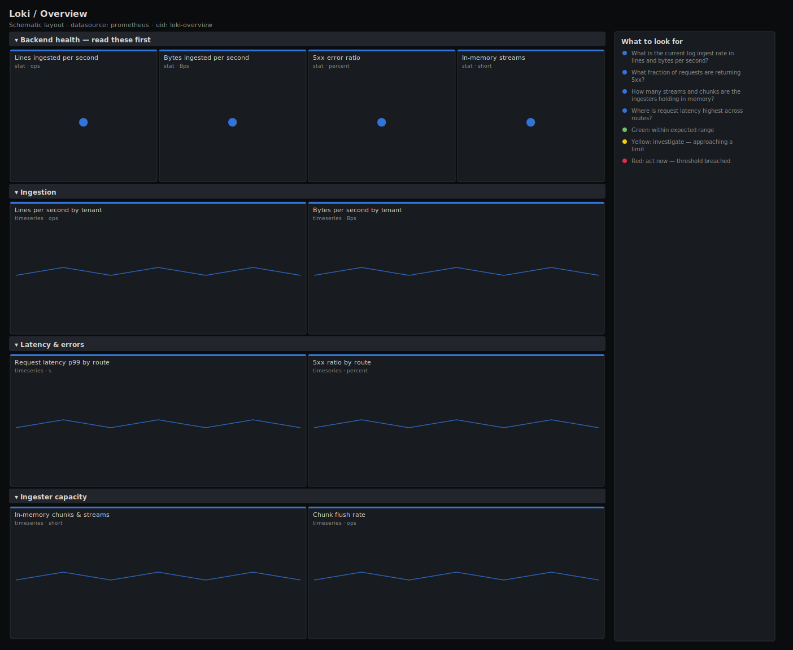

# Loki / Overview

> Top-level health of a Loki deployment: lines and bytes ingested, ingester chunks and streams in memory, request latency and error ratio by route, and chunk-flush rate. Answers "is the logging backend keeping up, and are queries healthy?"

**Primary search phrase:** Grafana Loki Grafana dashboard  
**Category:** `loki` · **UID:** `loki-overview` · **Datasource:** Prometheus



## Questions this dashboard answers

- What is the current log ingest rate in lines and bytes per second?
- What fraction of requests are returning 5xx?
- How many streams and chunks are the ingesters holding in memory?
- Where is request latency highest across routes?
- Are chunks flushing to storage at a steady rate?

## Production lessons — why this dashboard exists

Loki's pain is almost always stream cardinality, not raw byte volume — a label with unbounded values (request_id, pod IP) explodes in-memory streams and OOMs the ingesters long before bandwidth becomes the problem. So we lead with ingest rate, the 5xx ratio and memory streams together: streams is the early-warning capacity signal, the error ratio is the SLO, and the byte/line rate is the workload. Chunk flush rate then confirms data is actually reaching long-term storage rather than piling up in memory.

## Data source requirements

- **Prometheus** datasource (selected at import time via `${DS_PROMETHEUS}`).
- `loki` components exposing the `loki_distributor_*`, `loki_ingester_*` and `loki_request_duration_seconds_*` series (Loki publishes Prometheus metrics).

## Template variables

| Variable | Label | Type | Purpose |
|----------|-------|------|---------|
| `${job}` | Job | query | Loki component job (distributor, ingester, querier, ...). |

## Panels

### Backend health — read these first

- **Lines ingested per second** (stat, `ops`) — Log lines accepted by the distributors — the workload's line rate.
- **Bytes ingested per second** (stat, `Bps`) — Log volume accepted by the distributors — the bandwidth and storage-cost driver.
- **5xx error ratio** (stat, `percent`) — Share of requests returning 5xx across all routes — the reliability SLO.
- **In-memory streams** (stat, `short`) — Active streams held by the ingesters — the cardinality number that drives memory and OOMs.

### Ingestion

- **Lines per second by tenant** (timeseries, `ops`) — Per-tenant line rate — isolates which tenant is driving ingest volume.
- **Bytes per second by tenant** (timeseries, `Bps`) — Per-tenant byte rate — the storage-cost view of the same workload.

### Latency & errors

- **Request latency p99 by route** (timeseries, `s`) — 99th-percentile request duration per route — separates slow pushes from slow queries.
- **5xx ratio by route** (timeseries, `percent`) — Error share per route — pinpoints a single failing endpoint versus a cluster-wide issue.

### Ingester capacity

- **In-memory chunks & streams** (timeseries, `short`) — Chunks and streams held in memory — both climb with cardinality and gate ingester memory.
- **Chunk flush rate** (timeseries, `ops`) — Chunks flushed to storage per second — a stall here means data is stuck in memory and at risk on a crash.

## Import

**Grafana UI** — *Dashboards → New → Import*, upload `dashboards/loki/overview.json`, then pick your datasource when prompted.

**API:**

```bash
scripts/import-dashboard.sh dashboards/loki/overview.json
```

**Provisioning** — drop the JSON into a provisioned folder (see [provisioning guide](../../provisioning.md)).

## Recommended alerts

Ready-to-use rules ship in `alerts/loki.rules.yml`.

### LokiHighErrorRatio (`critical`)

```promql
100 * sum(rate(loki_request_duration_seconds_count{status_code=~"5.."}[5m])) / clamp_min(sum(rate(loki_request_duration_seconds_count[5m])), 1) > 5
```

- **Fires after:** `10m`
- **Why it matters:** A high server-error ratio means log pushes are rejected or queries fail, so you lose logs or visibility during an incident.
- **Investigate:** Open Loki / Overview, use 5xx ratio by route to find the failing path, then check that component's logs.
- **Recovery:** Clears when the 5xx ratio drops below 5% for 5m.
- **False positives:** Rollouts and rate-limit (429) pushback are normal — this rule counts only 5xx, but a restart can still spike it briefly.

### LokiStreamCardinalityHigh (`warning`)

```promql
sum(loki_ingester_memory_streams) > 500000
```

- **Fires after:** `30m`
- **Why it matters:** Excess streams come from high-cardinality labels and drive ingester memory straight toward an OOM kill.
- **Investigate:** Find the tenant and label driving stream count; check for a dynamic label like request_id or pod IP.
- **Recovery:** Clears when in-memory streams fall below 500k for 5m.
- **False positives:** Large multi-tenant clusters — tune the threshold to your ingester memory.

### LokiRequestLatencyHigh (`warning`)

```promql
histogram_quantile(0.99, sum by (le, route) (rate(loki_request_duration_seconds_bucket[5m]))) > 2
```

- **Fires after:** `10m`
- **Why it matters:** Slow requests stall log shipping or break log queries during the incidents you most need them.
- **Investigate:** Identify the route, then check the owning component's CPU, GC and object-storage latency.
- **Recovery:** Clears when p99 falls below 2s for 5m.
- **False positives:** Large backfill or expensive queries spike read-path latency briefly.

## Troubleshooting

| Symptom | Likely cause | First action |
|---------|--------------|--------------|
| Per-tenant panels are empty | This Loki build does not expose the tenant label on the distributor counters. | Drop the `by (tenant)` grouping or upgrade Loki; use the totals instead. |
| Memory streams climbing fast | A label with unbounded values (request_id, IP) is multiplying streams. | Strip the dynamic label in the pipeline_stages or client before ingest. |
| Chunk flush rate at zero with rising memory chunks | Object storage is unreachable, so chunks cannot flush. | Check storage credentials and connectivity from the ingesters. |

## Performance considerations

Latency panels read native `loki_request_duration_seconds_bucket` histograms aggregated by `le` plus `route`. Ingest and flush panels use 5m rates and aggregate per instance or tenant to bound cardinality. Error ratios guard the denominator with `clamp_min(..., 1)`.

## Customization

Tune the 500k stream and 5% error thresholds to your ingester memory and SLO. Use `$job` to scope to a single component. Lower the latency alert threshold for read-heavy clusters that depend on fast log queries.

## Related resources

- [Advanced observability guides](https://devopsaitoolkit.com/guides/)
- [Grafana & Prometheus tutorials](https://devopsaitoolkit.com/blog/)
- [AI Incident Response Assistant](https://devopsaitoolkit.com/dashboard/incident-response)
- [PromQL cookbook](../../../promql/README.md) · [Alerting guide](../../alerting.md) · [Dashboard catalog](../../catalog.md)
