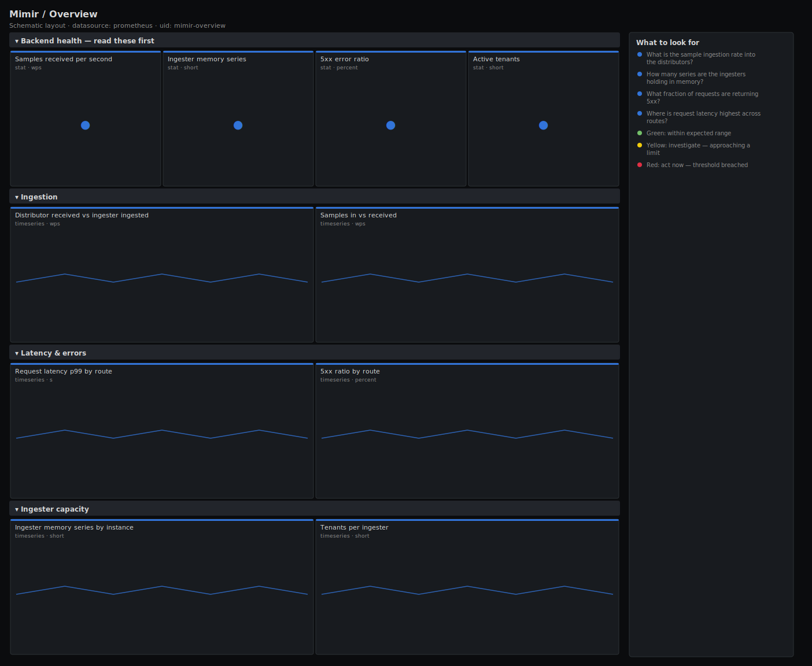

# Mimir / Overview

> Top-level health of a Mimir (or Cortex) cluster: distributor ingestion, ingester in-memory series, request latency and error ratio by route, and tenant count. Answers "is the long-term metrics backend healthy across the write and read path?"

**Primary search phrase:** Grafana Mimir Grafana dashboard  
**Category:** `mimir` · **UID:** `mimir-overview` · **Datasource:** Prometheus



## Questions this dashboard answers

- What is the sample ingestion rate into the distributors?
- How many series are the ingesters holding in memory?
- What fraction of requests are returning 5xx?
- Where is request latency highest across routes?
- How many tenants are active?

## Production lessons — why this dashboard exists

Mimir is a lot of microservices, and the failure that pages you is almost always on the ingesters or in the request error ratio, not in any single component's CPU. We lead with ingestion rate, ingester memory series and the 5xx ratio because those three answer "are we accepting data and serving it?" in one glance. Ingester memory series is the capacity number that drives replays and OOMs; the 5xx ratio is the SLO; latency by route then tells you which path (push vs query) is hurting.

## Data source requirements

- **Prometheus** datasource (selected at import time via `${DS_PROMETHEUS}`).
- `mimir` / `cortex` components exposing the `cortex_distributor_*`, `cortex_ingester_*`, `cortex_request_duration_seconds_*` and `cortex_query_frontend_*` series.

## Template variables

| Variable | Label | Type | Purpose |
|----------|-------|------|---------|
| `${cluster}` | Cluster | query | Mimir/Cortex cluster label, if your deployment sets one. |
| `${job}` | Job | query | Component job (distributor, ingester, query-frontend, ...). |

## Panels

### Backend health — read these first

- **Samples received per second** (stat, `wps`) — Samples accepted by the distributors — the cluster's effective write throughput.
- **Ingester memory series** (stat, `short`) — Active series held across all ingesters — the primary capacity and replay-cost driver.
- **5xx error ratio** (stat, `percent`) — Share of all requests returning 5xx — the cluster-wide reliability SLO.
- **Active tenants** (stat, `short`) — Tenants with series in the ingesters — sudden growth can explain a capacity jump.

### Ingestion

- **Distributor received vs ingester ingested** (timeseries, `wps`) — Samples in at the distributor versus written by ingesters — a persistent gap flags rejected or de-duplicated samples.
- **Samples in vs received** (timeseries, `wps`) — Pre-dedup samples_in versus accepted received — the gap is HA-replica de-duplication doing its job.

### Latency & errors

- **Request latency p99 by route** (timeseries, `s`) — 99th-percentile request duration per route — isolates which API path is slow.
- **5xx ratio by route** (timeseries, `percent`) — Error share per route — separates a single broken endpoint from a cluster-wide problem.

### Ingester capacity

- **Ingester memory series by instance** (timeseries, `short`) — Per-ingester series count — an outlier means uneven sharding and an OOM risk on that pod.
- **Tenants per ingester** (timeseries, `short`) — Tenant count over time — onboarding spikes here precede capacity pressure.

## Import

**Grafana UI** — *Dashboards → New → Import*, upload `dashboards/mimir/overview.json`, then pick your datasource when prompted.

**API:**

```bash
scripts/import-dashboard.sh dashboards/mimir/overview.json
```

**Provisioning** — drop the JSON into a provisioned folder (see [provisioning guide](../../provisioning.md)).

## Recommended alerts

Ready-to-use rules ship in `alerts/mimir.rules.yml`.

### MimirHighErrorRatio (`critical`)

```promql
100 * sum(rate(cortex_request_duration_seconds_count{status_code=~"5.."}[5m])) / clamp_min(sum(rate(cortex_request_duration_seconds_count[5m])), 1) > 5
```

- **Fires after:** `10m`
- **Why it matters:** A high server-error ratio means writes are being rejected or queries are failing across the backend.
- **Investigate:** Open Mimir / Overview, use 5xx ratio by route to find the failing path, then drill into that component's logs.
- **Recovery:** Clears when the 5xx ratio drops below 5% for 5m.
- **False positives:** A brief restart or rollout can spike errors transiently — the 10m for absorbs it.

### MimirIngesterSeriesHigh (`warning`)

```promql
sum(cortex_ingester_memory_series) > 25000000
```

- **Fires after:** `30m`
- **Why it matters:** High in-memory series drive ingester memory and make replays slow; unchecked growth ends in OOM kills.
- **Investigate:** Check per-ingester series for a hot shard and per-tenant series for a cardinality offender.
- **Recovery:** Clears when in-memory series drop below 25M for 5m.
- **False positives:** Large, well-provisioned clusters — tune the threshold to your ingester memory.

### MimirRequestLatencyHigh (`warning`)

```promql
histogram_quantile(0.99, sum by (le, route) (rate(cortex_request_duration_seconds_bucket[5m]))) > 2
```

- **Fires after:** `10m`
- **Why it matters:** Sustained high latency on a route degrades writes or queries and can cascade into timeouts upstream.
- **Investigate:** Identify the route, then check the owning component's CPU, GC and object-storage latency.
- **Recovery:** Clears when p99 falls below 2s for 5m.
- **False positives:** Heavy ad-hoc queries can spike read-path latency briefly.

## Troubleshooting

| Symptom | Likely cause | First action |
|---------|--------------|--------------|
| Error-ratio panels show NaN | No requests in the window, so the denominator is zero. | The clamp_min guard prevents the alert from firing; widen the time range to populate the panel. |
| Distributor received far exceeds ingester ingested | Ingesters are rejecting samples (limits, out-of-order) or are unhealthy. | Check ingester logs and per-tenant limits; look for out-of-order or sample-limit errors. |
| Latency p99 spiky on read routes | Expensive queries hitting the store-gateway / object storage. | Enable query-frontend caching and inspect slow-query logs. |

## Performance considerations

All latency panels read native `cortex_request_duration_seconds_bucket` histograms aggregated by `le` plus one grouping label, which bounds series. Error ratios use `clamp_min(..., 1)` on the denominator so empty windows never divide by zero.

## Customization

Tune the 25M ingester-series and 5% error thresholds to your provisioning and SLO. Use `$job` to scope to a single component, and `$cluster` if your labels carry one. Lower the latency alert threshold for latency-sensitive read paths.

## Related resources

- [Advanced observability guides](https://devopsaitoolkit.com/guides/)
- [Grafana & Prometheus tutorials](https://devopsaitoolkit.com/blog/)
- [AI Incident Response Assistant](https://devopsaitoolkit.com/dashboard/incident-response)
- [PromQL cookbook](../../../promql/README.md) · [Alerting guide](../../alerting.md) · [Dashboard catalog](../../catalog.md)
