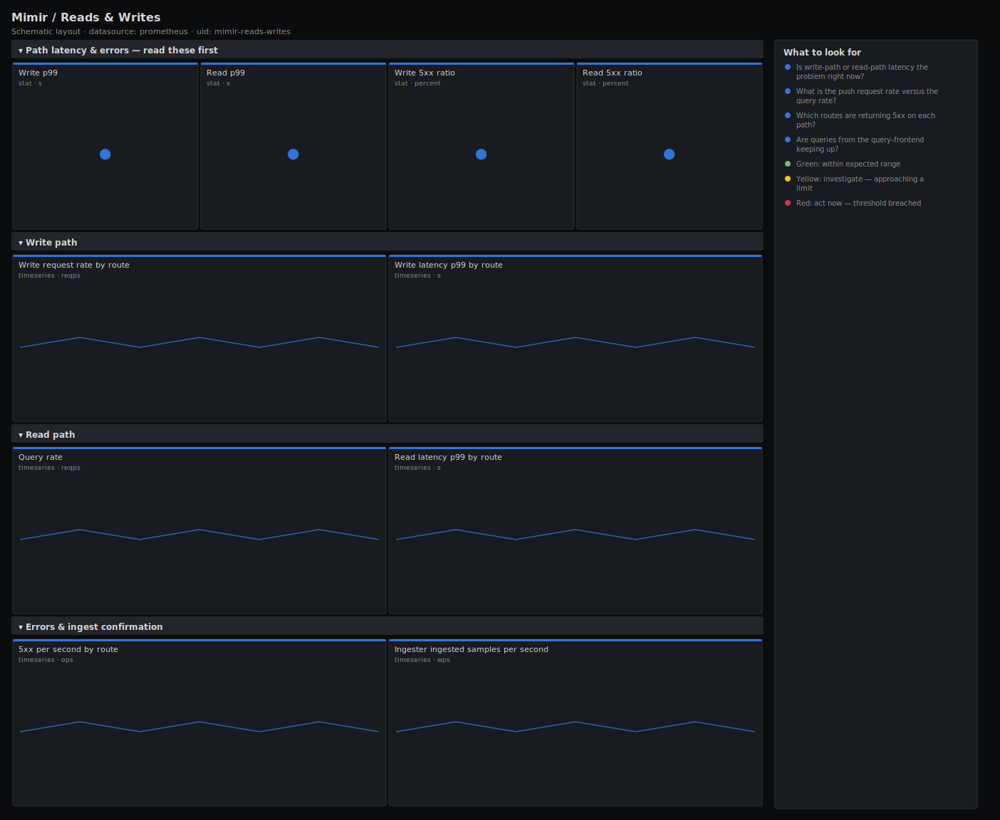

# Mimir / Reads & Writes

> The two halves of a Mimir cluster on one screen: write-path request rate and latency (distributor and ingester push) versus read-path query rate and latency (query-frontend). Answers "is it the ingest side or the query side that is hurting right now?"

**Primary search phrase:** Mimir read write path Grafana dashboard  
**Category:** `mimir` · **UID:** `mimir-reads-writes` · **Datasource:** Prometheus



## Questions this dashboard answers

- Is write-path or read-path latency the problem right now?
- What is the push request rate versus the query rate?
- Which routes are returning 5xx on each path?
- Are queries from the query-frontend keeping up?
- Is ingester write latency tracking distributor latency?

## Production lessons — why this dashboard exists

Mimir incidents almost always belong cleanly to one path: ingest is failing (writes rejected, ingesters saturated) or queries are slow (store-gateway, object storage, expensive PromQL). Mixing both on a generic dashboard wastes minutes you do not have, so this view splits them. We lead with write-vs-read p99 side by side plus each path's error share, because that one comparison tells on-call which team and which runbook to reach for before any deeper drill-down.

## Data source requirements

- **Prometheus** datasource (selected at import time via `${DS_PROMETHEUS}`).
- `mimir` / `cortex` exposing `cortex_request_duration_seconds_*` (with the `route` and `status_code` labels), `cortex_ingester_ingested_samples_total` and `cortex_query_frontend_queries_total`.

## Template variables

| Variable | Label | Type | Purpose |
|----------|-------|------|---------|
| `${job}` | Job | query | Component job to scope to (distributor, ingester, query-frontend). |

## Panels

### Path latency & errors — read these first

- **Write p99** (stat, `s`) — 99th-percentile latency on push routes — the ingest-path SLO.
- **Read p99** (stat, `s`) — 99th-percentile latency on query routes — the read-path SLO.
- **Write 5xx ratio** (stat, `percent`) — Server-error share on the push routes — rejected writes that the client must retry or lose.
- **Read 5xx ratio** (stat, `percent`) — Server-error share on the query routes — failed queries that break dashboards and alerts.

### Write path

- **Write request rate by route** (timeseries, `reqps`) — Requests per second across push/write routes — your ingest request volume.
- **Write latency p99 by route** (timeseries, `s`) — Push-route p99 over time — rising here points at saturated distributors or ingesters.

### Read path

- **Query rate** (timeseries, `reqps`) — Queries per second leaving the query-frontend — the read-path request volume.
- **Read latency p99 by route** (timeseries, `s`) — Query-route p99 over time — rising here points at store-gateway / object-storage slowness.

### Errors & ingest confirmation

- **5xx per second by route** (timeseries, `ops`) — Server errors per second across all routes — the raw failure stream behind the ratios above.
- **Ingester ingested samples per second** (timeseries, `wps`) — Samples actually written by ingesters — confirms the write path is landing data, not just accepting requests.

## Import

**Grafana UI** — *Dashboards → New → Import*, upload `dashboards/mimir/reads-writes.json`, then pick your datasource when prompted.

**API:**

```bash
scripts/import-dashboard.sh dashboards/mimir/reads-writes.json
```

**Provisioning** — drop the JSON into a provisioned folder (see [provisioning guide](../../provisioning.md)).

## Recommended alerts

Ready-to-use rules ship in `alerts/mimir.rules.yml`.

### MimirWritePathLatencyHigh (`warning`)

```promql
histogram_quantile(0.99, sum by (le, route) (rate(cortex_request_duration_seconds_bucket{route=~".*push.*|.*write.*"}[5m]))) > 2
```

- **Fires after:** `10m`
- **Why it matters:** Slow writes cause Prometheus remote_write upstreams to buffer and eventually drop samples.
- **Investigate:** Open Mimir / Reads & Writes, confirm whether distributors or ingesters are the slow tier, and check ingester CPU/GC.
- **Recovery:** Clears when write p99 drops below 2s for 5m.
- **False positives:** A rollout briefly elevates push latency — the 10m for absorbs it.

### MimirReadPathLatencyHigh (`warning`)

```promql
histogram_quantile(0.99, sum by (le, route) (rate(cortex_request_duration_seconds_bucket{route=~".*query.*|.*prom.*"}[5m]))) > 5
```

- **Fires after:** `10m`
- **Why it matters:** Slow queries break Grafana panels and recording/alerting rules that read from Mimir.
- **Investigate:** Check query-frontend queue, store-gateway latency and object-storage response times.
- **Recovery:** Clears when read p99 drops below 5s for 5m.
- **False positives:** A burst of expensive ad-hoc queries can trip this briefly.

### MimirPathErrorsHigh (`critical`)

```promql
100 * sum by (route) (rate(cortex_request_duration_seconds_count{status_code=~"5.."}[5m])) / clamp_min(sum by (route) (rate(cortex_request_duration_seconds_count[5m])), 1) > 5
```

- **Fires after:** `10m`
- **Why it matters:** A route-level error spike means a specific read or write path is failing, dropping data or breaking queries.
- **Investigate:** Identify the route's owning component and inspect its logs and saturation.
- **Recovery:** Clears when the route's 5xx ratio falls below 5% for 5m.
- **False positives:** Low-traffic routes can show a high ratio on a handful of errors — the clamp guards the denominator but consider a minimum-rate gate.

## Troubleshooting

| Symptom | Likely cause | First action |
|---------|--------------|--------------|
| Write or read p99 stat is empty | The route regex does not match your build's route names. | List route label values in Explore and adjust the regex to your Mimir version. |
| Query rate is zero but dashboards work | Queries bypass the query-frontend (direct querier access). | Route reads through the query-frontend, or use request-duration on query routes instead. |
| High write 5xx with healthy ingesters | Distributor-side rejection (per-tenant rate limits, validation errors). | Check distributor logs and per-tenant ingestion limits. |

## Performance considerations

Latency panels read native histograms aggregated by `le` plus `route`. Route selection uses regexes so the same panels work whether your build labels the path `push`, `write`, `query` or `prometheus`. Ratios guard the denominator with `clamp_min(..., 1)`.

## Customization

Adjust the route regexes to your Mimir version's route names, and the 2s/5s latency thresholds to your SLOs. Add a minimum-rate gate to the route error alert if low-traffic routes produce noisy ratios.

## Related resources

- [Advanced observability guides](https://devopsaitoolkit.com/guides/)
- [Grafana & Prometheus tutorials](https://devopsaitoolkit.com/blog/)
- [AI Incident Response Assistant](https://devopsaitoolkit.com/dashboard/incident-response)
- [PromQL cookbook](../../../promql/README.md) · [Alerting guide](../../alerting.md) · [Dashboard catalog](../../catalog.md)
